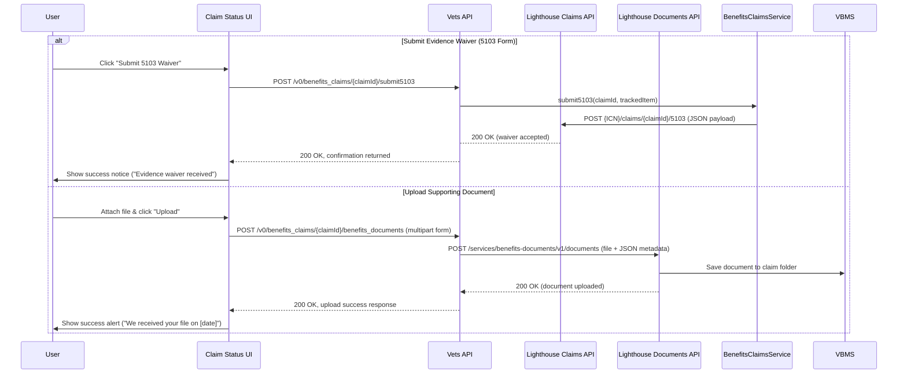

# VA Claim Status Tool Architecture and Integration Analysis

## Summary for Technical Product Management

The VA **Claim Status Tool** allows Veterans to check the status of their compensation claims, decision reviews, or appeals on VA.gov. It's implemented as a frontend application in the `vets-website` repository and relies on API endpoints from the `vets-api` backend. The frontend calls REST API endpoints under the `/v0/` path to retrieve claim and appeal status data and to perform actions like uploading evidence or submitting forms. The backend handles these requests by invoking internal service modules that interface with VA systems.

**High-level data flow:** When a signed-in Veteran opens the Claim Status Tool, the frontend makes parallel API calls to fetch claims and appeals. The backend verifies identity then calls upstream services: Lighthouse Benefits Claims API for claims and likely Caseflow Appeals API for appeals. Responses merge in the UI to display combined status. Users can also upload documents or submit forms, which the frontend sends as POST requests. The backend forwards these to appropriate services and returns status to the UI.

The integration is designed to be **secure** (requiring login and CSRF tokens), **modular** (specialized service classes), and **resilient** (using middleware for error handling). Recent development has focused on migrating from legacy services to Lighthouse APIs, improving UX for 5103 waivers and decision letters, and enhancing error handling.

## Frontend: Key API Endpoints and Integration Points

The Claim Status frontend interacts with several API endpoints:

- **Claims List:** `GET /v0/benefits_claims` – Retrieves the Veteran's benefit claims list
- **Claim Details:** `GET /v0/benefits_claims/{id}` – Gets details for a specific claim
- **Appeals Status:** `GET /v0/appeals` – Retrieves status of decision reviews or appeals
- **5103 Waiver Submission:** `POST /v0/benefits_claims/{id}/submit5103` – Submits waiver for a claim
- **Supporting Evidence Upload:** `POST /v0/benefits_claims/{id}/benefits_documents` – Uploads supporting documents
- **Download Claim Letters:** `GET /v0/claim_letters` and `GET /v0/claim_letters/{documentId}` – Access decision letters

**Miscellaneous Endpoints:**
- `GET /v0/average_days_for_claim_completion` – Returns data about claim processing times
- `GET /v0/efolder` – Possibly retrieves claim file documents
- `GET /v0/evidence_submissions` – Lists evidence submission statuses
- `POST /v0/evss_claims/{id}/request_decision` – Legacy endpoint for requesting decisions

On the **frontend code side**, the main integration points are in Redux action creators. For example, `getClaims()` dispatches a loading state then calls `apiRequest('/benefits_claims')`. For POST actions like uploading files, the frontend uses a helper called `makeAuthRequest` tailored for authenticated POSTs.

**Key frontend files and components**:
- **Manifest:** Defines the route as `/track-claims`
- **Actions:** Contains thunks for fetching data and submitting actions
- **Reducers and Selectors:** Shape state for claims and appeals
- **Components:** Dispatch actions on mount or user interaction
- **Utilities:** Helper functions for parsing status or error codes
- **Feature Flags:** Controls conditional UI elements

The frontend is essentially a React/Redux application communicating with `vets-api` through well-defined endpoints, abstracting calls in utility functions and managing loading/error states via Redux.
## Backend: Controllers, Services, and Data Flow in vets-api

On the `vets-api` side, the claim status tool’s API calls are handled by several controllers under the `app/controllers/v0/` namespace, and they leverage service classes (in `lib/`) for business logic and integration with VA backend systems. The relevant controllers and modules include:

- **BenefitsClaimsController (V0):** Handles `GET /v0/benefits_claims` and `GET /v0/benefits_claims/{id}` as well as `POST /v0/benefits_claims/{id}/submit5103`. In the routes configuration, it’s set up as `resources :benefits_claims, only: %i[index show] do ... post :submit5103, on: :member ... end` ([vets-api/config/routes.rb at master · department-of-veterans-affairs/vets-api · GitHub](https://github.com/department-of-veterans-affairs/vets-api/blob/master/config/routes.rb#:~:text=resources%20%3Abenefits_claims%2C%20only%3A%20,do)). This controller likely authenticates the request (ensuring a valid user session) and then uses the **BenefitsClaims::Service** to fetch or modify claim data. For example, `index` might call something like `claims = BenefitsClaims::Service.new(current_user.icn).get_claims` to get all claims ([
  Class: BenefitsClaims::Service
  
    — Documentation for department-of-veterans-affairs/vets-api (master)
  
](https://www.rubydoc.info/github/department-of-veterans-affairs/vets-api/master/BenefitsClaims/Service#:~:text=def%20get_claims,categorized%20by%20BGS)), and `show` might call `get_claim(claim_id)`. The `submit5103` action probably calls `BenefitsClaims::Service.new(current_user.icn).submit5103(claim_id, tracked_item_id)` ([
  Class: BenefitsClaims::Service
  
    — Documentation for department-of-veterans-affairs/vets-api (master)
  
](https://www.rubydoc.info/github/department-of-veterans-affairs/vets-api/master/BenefitsClaims/Service#:~:text=def%20submit5103,tracked_item_id%20%5D)). After getting a response from the service, the controller will render it as JSON back to the client. If an error is raised (e.g., the service throws a ServiceException for a 504 timeout or a 502 error), the controller (or a common exception handler) will catch it and render an appropriate error status (mapping to those error types the frontend checks). This controller is a central integration point connecting the HTTP layer to the service layer.

- **BenefitsDocumentsController (V0):** Handles `POST /v0/benefits_claims/{id}/benefits_documents` (as nested under benefits_claims in routes ([vets-api/config/routes.rb at master · department-of-veterans-affairs/vets-api · GitHub](https://github.com/department-of-veterans-affairs/vets-api/blob/master/config/routes.rb#:~:text=resources%20%3Abenefits_claims%2C%20only%3A%20,do))). This endpoint is responsible for file uploads. The controller’s `create` action receives the uploaded file (likely via Rack middleware handling multipart data) and metadata (like `tracked_item_id`). Instead of directly dealing with VBMS, it uses the **BenefitsDocuments service** which communicates with the Lighthouse **Benefits Documents API**. Based on the code in `lib/lighthouse/benefits_documents/configuration.rb`, the **BenefitsDocuments service** is configured with endpoints for uploading documents (base path `services/benefits-documents/v1` and a `documents` path) and even an OAuth token endpoint ([
  Class: BenefitsDocuments::Configuration
  
    — Documentation for department-of-veterans-affairs/vets-api (master)
  
](https://www.rubydoc.info/github/department-of-veterans-affairs/vets-api/master/BenefitsDocuments/Configuration#:~:text=BASE_PATH%20%3D)) ([
  Class: BenefitsDocuments::Configuration
  
    — Documentation for department-of-veterans-affairs/vets-api (master)
  
](https://www.rubydoc.info/github/department-of-veterans-affairs/vets-api/master/BenefitsDocuments/Configuration#:~:text=TOKEN_PATH%20%3D)). We can infer that when a file is uploaded, the controller will call something like `BenefitsDocuments::Service.upload_document(user, claim_id, file)` – internally, this would acquire a Lighthouse access token (the configuration has `token_service` references ([Method: BenefitsDocuments::Configuration#token_service ...](https://www.rubydoc.info/github/department-of-veterans-affairs/vets-api/master/BenefitsDocuments%2FConfiguration:token_service#:~:text=Method%3A%20BenefitsDocuments%3A%3AConfiguration,)) ([Method: BenefitsDocuments::Configuration#token_service ...](https://www.rubydoc.info/github/department-of-veterans-affairs/vets-api/master/BenefitsDocuments%2FConfiguration:token_service#:~:text=Method%3A%20BenefitsDocuments%3A%3AConfiguration,))) and POST the file to the Lighthouse “benefits documents” endpoint. The response (success or error) is then translated to an HTTP response for the frontend. If successful, the controller might simply return HTTP 200 and perhaps some confirmation ID; if failure, it could return a 502 or 500 with an error message (the frontend then displays “There was an error uploading your files. Please try again” as seen in the actions code ([vets-website/src/applications/claims-status/actions/index.js at main · department-of-veterans-affairs/vets-website · GitHub](https://github.com/department-of-veterans-affairs/vets-website/blob/main/src/applications/claims-status/actions/index.js#:~:text=setAdditionalEvidenceNotification%28))).

- **AppealsController (V0):** Handles `GET /v0/appeals` (routes file shows `resources :appeals, only: :index` ([vets-api/config/routes.rb at master · department-of-veterans-affairs/vets-api · GitHub](https://github.com/department-of-veterans-affairs/vets-api/blob/master/config/routes.rb#:~:text=resources%20%3Aappeals%2C%20only%3A%20%3Aindex))). This controller fetches the status of appeals and decision reviews. Unlike claims, this data comes from the Board of Veterans’ Appeals/Caseflow system. The implementation details are not in the excerpt, but based on VA architecture, it likely calls an **Appeals Service** or **Caseflow service** that queries Caseflow’s API for the current user’s appeals. (In vets-api’s codebase, there has been an Appeals module in the past that integrated with Caseflow’s appeals status API.) The issue comment from 2019 ([Caseflow error handling for Appeal Status · Issue #2803 · department-of-veterans-affairs/va.gov-team · GitHub](https://github.com/department-of-veterans-affairs/va.gov-team/issues/2803#:~:text=%E2%80%9CThe%20Appeals%20Status%20API%20is,uses%20a%20separate%20code%20branch%E2%80%9D)) suggests that VA.gov’s appeals status was implemented as an internal API within vets-api (distinct from the public Appeals API) and calls Caseflow directly. Therefore, `AppealsController#index` might call something like `Caseflow::Service.get_appeals(user)` or use the Appeals API engine internally. It then returns the appeals list/status in a JSON format similar to what the frontend expects. Error handling here is important – e.g., if the Caseflow API returns an error (user not found, etc.), the controller might return a 404 or 502. The frontend’s error mapping for appeals (403, 404, 422, 502) covers scenarios like a forbidden access (perhaps if the user’s SSN is missing or they’re not found in Caseflow, which could return a 403 or 422 that was previously unhandled ([Caseflow error handling for Appeal Status · Issue #2803 · department-of-veterans-affairs/va.gov-team · GitHub](https://github.com/department-of-veterans-affairs/va.gov-team/issues/2803#:~:text=Errors%20for%20Appeal%20Status%20are,this%20user%20in%20their%20system))). The controller likely ensures that known error conditions (like no SSN) are caught and a user-friendly error status is returned (so that the frontend can display “Appeals status is unavailable” gracefully instead of a generic 500).

- **ClaimLettersController (V0):** Handles `GET /v0/claim_letters` and `/v0/claim_letters/{document_id}` ([vets-api/config/routes.rb at master · department-of-veterans-affairs/vets-api · GitHub](https://github.com/department-of-veterans-affairs/vets-api/blob/master/config/routes.rb#:~:text=get%20%27claim_letters%27%2C%20to%3A%20%27claim_letters)). This controller provides the list of claim-related letters and the content of a specific letter. Under the hood, it might interact with VBMS (the Veterans Benefits Management System, which stores documents) or with a Lighthouse service if one exists for letters. It could use a service that queries the veteran’s eFolder for documents of type “Award Letter” or “5103 Notice Letter”. Given the feature flag `cst_include_ddl_5103_letters` ([Features // Flipper](https://api.va.gov/flipper/features#:~:text=enabled%2C%20claims%20status%20tool%20will,and%20a%20user%20submits%20an)), it appears they recently updated this to include **5103 letters** in addition to decision letters (DDL likely stands for “Download Decision Letter”). The controller’s `index` might compile available letters (perhaps by checking the claim’s documents in VBMS via an API) and return metadata (titles, IDs), and the `show` action might either stream the PDF or provide a URL. It may utilize the **EVSS Documents service** or a **BGS API** to retrieve the actual PDF. (In the routes, there is also an `efolder` resource which could be related to this functionality ([vets-api/config/routes.rb at master · department-of-veterans-affairs/vets-api · GitHub](https://github.com/department-of-veterans-affairs/vets-api/blob/master/config/routes.rb#:~:text=resources%20%3Aefolder%2C%20only%3A%20)); possibly `efolder#show` could fetch any document by ID. The presence of both suggests claim_letters might be a simplified wrapper specific to certain documents.)

- **EVSSClaimsController (and EVSS Documents):** These controllers exist to support the legacy EVSS claim status API. Routes show `resources :evss_claims, only: %i[index show]` with nested `post :request_decision` and `documents#create` ([vets-api/config/routes.rb at master · department-of-veterans-affairs/vets-api · GitHub](https://github.com/department-of-veterans-affairs/vets-api/blob/master/config/routes.rb#:~:text=resources%20%3Aefolder%2C%20only%3A%20)). They are likely only used in certain scenarios (the routes file even limits `evss_benefits_claims` to non-production environments ([vets-api/config/routes.rb at master · department-of-veterans-affairs/vets-api · GitHub](https://github.com/department-of-veterans-affairs/vets-api/blob/master/config/routes.rb#:~:text=resources%20%3Aevss_claims_async%2C%20only%3A%20)), possibly for testing or comparison). In production, with the Lighthouse migration, **BenefitsClaimsController** has taken over. However, it’s worth noting that vets-api still contains an `EVSS::ClaimsService` (in `lib/evss/claims_service.rb`) that talks to EVSS endpoints. If needed (e.g., if Lighthouse is down or behind a feature flag), the system could revert to EVSS. The commit history around implementing a “provider pattern” for BenefitsClaims suggests the code was structured to handle multiple backends ([Releases · department-of-veterans-affairs/vets-api · GitHub](https://github.com/department-of-veterans-affairs/vets-api/releases#:~:text=needs)) ([Releases · department-of-veterans-affairs/vets-api · GitHub](https://github.com/department-of-veterans-affairs/vets-api/releases#:~:text=,intent%20to%20file%20data)). So, BenefitsClaimsController might indirectly use EVSS service if a config flag is set (for example, in non-prod or if `Settings.claims.status_v1_bgs_enabled` is false, it might call EVSS). For our purposes, EVSS controllers are mostly legacy; the new Claim Status Tool doesn’t directly call those endpoints (the frontend calls the Lighthouse-backed ones as described above).

- **Service Modules:** The heavy lifting of integrating with external systems is done in service classes, not in controllers. Key services:
  - **BenefitsClaims::Service** – found in `lib/lighthouse/benefits_claims/service.rb`. This class is responsible for communicating with the Lighthouse Benefits Claims API on behalf of vets-api. When the controller calls `get_claims` or `get_claim`, it invokes this service. According to its documentation, `BenefitsClaims::Service` inherits from a common client base and builds requests to endpoints like `"{ICN}/claims"` ([
  Class: BenefitsClaims::Service
  
    — Documentation for department-of-veterans-affairs/vets-api (master)
  
](https://www.rubydoc.info/github/department-of-veterans-affairs/vets-api/master/BenefitsClaims/Service#:~:text=def%20get_claims,categorized%20by%20BGS)) and `"{ICN}/claims/{id}"` ([
  Class: BenefitsClaims::Service
  
    — Documentation for department-of-veterans-affairs/vets-api (master)
  
](https://www.rubydoc.info/github/department-of-veterans-affairs/vets-api/master/BenefitsClaims/Service#:~:text=def%20get_claim,id%7D%22%2C%20lighthouse_client_id%2C%20lighthouse_rsa_key_path%2C%20options%29.body)) on the Lighthouse API, using the veteran’s ICN (Integration Control Number) as an identifier. It filters out certain statuses (it removes claims with status CANCELED, ERRORED, PENDING from the data ([
  Class: BenefitsClaims::Service
  
    — Documentation for department-of-veterans-affairs/vets-api (master)
  
](https://www.rubydoc.info/github/department-of-veterans-affairs/vets-api/master/BenefitsClaims/Service#:~:text=claims%20%3D%20config.get%28%22,claims)), possibly those are internal statuses not to show) and applies a manual override for “PMR Pending” items to a different status ([
  Class: BenefitsClaims::Service
  
    — Documentation for department-of-veterans-affairs/vets-api (master)
  
](https://www.rubydoc.info/github/department-of-veterans-affairs/vets-api/master/BenefitsClaims/Service#:~:text=claims%5B%27data%27%5D%20%3D%20filter_by_status%28claims%5B%27data%27%5D%29%20,claims)) – these business rules adjust what the frontend displays. The service includes methods `get_claims`, `get_claim`, `submit5103`, and also methods not directly exposed to frontend but used internally (like `get_intent_to_file` for starting an Intent to File, and `get_power_of_attorney`) ([
  Class: BenefitsClaims::Service
  
    — Documentation for department-of-veterans-affairs/vets-api (master)
  
](https://www.rubydoc.info/github/department-of-veterans-affairs/vets-api/master/BenefitsClaims/Service#:~:text=%2A%20,%E2%87%92%20Object)) ([
  Class: BenefitsClaims::Service
  
    — Documentation for department-of-veterans-affairs/vets-api (master)
  
](https://www.rubydoc.info/github/department-of-veterans-affairs/vets-api/master/BenefitsClaims/Service#:~:text=options%20%3D%20)). For the **submit5103** functionality, `BenefitsClaims::Service#submit5103` constructs a POST request to the Lighthouse API path `"{ICN}/claims/{claimId}/5103"` with a JSON body containing the tracked item ID ([
  Class: BenefitsClaims::Service
  
    — Documentation for department-of-veterans-affairs/vets-api (master)
  
](https://www.rubydoc.info/github/department-of-veterans-affairs/vets-api/master/BenefitsClaims/Service#:~:text=def%20submit5103,type%3A%20%27form%2F5103)) ([
  Class: BenefitsClaims::Service
  
    — Documentation for department-of-veterans-affairs/vets-api (master)
  
](https://www.rubydoc.info/github/department-of-veterans-affairs/vets-api/master/BenefitsClaims/Service#:~:text=def%20submit5103,tracked_item_id%20%5D)). This corresponds exactly to the frontend’s call of `/v0/benefits_claims/{id}/submit5103`, but the backend service translates it to the Lighthouse endpoint (and handles auth via client credentials). If Lighthouse returns an error or timeout, the service catches it and raises a `ServiceException` with an appropriate status (e.g., 504 or using the Lighthouse response’s status) ([
  Class: BenefitsClaims::Service
  
    — Documentation for department-of-veterans-affairs/vets-api (master)
  
](https://www.rubydoc.info/github/department-of-veterans-affairs/vets-api/master/BenefitsClaims/Service#:~:text=claims%20rescue%20Faraday%20%3A%3ATimeoutError%20raise,response%29%2C%20%27Lighthouse%20Error)) ([
  Class: BenefitsClaims::Service
  
    — Documentation for department-of-veterans-affairs/vets-api (master)
  
](https://www.rubydoc.info/github/department-of-veterans-affairs/vets-api/master/BenefitsClaims/Service#:~:text=rescue%20Faraday%20%3A%3ATimeoutError%20raise%20,response%29%2C%20%27Lighthouse%20Error)). Those exceptions propagate up to be handled by common middleware.  
  - **BenefitsDocuments::Service** – likely in `lib/lighthouse/benefits_documents/service.rb` (and configuration in `.../benefits_documents/configuration.rb`). This handles uploading and maybe checking status of document uploads. The configuration constants show it uses `services/benefits-documents/v1/documents` as the base path for uploads ([
  Class: BenefitsDocuments::Configuration
  
    — Documentation for department-of-veterans-affairs/vets-api (master)
  
](https://www.rubydoc.info/github/department-of-veterans-affairs/vets-api/master/BenefitsDocuments/Configuration#:~:text=BASE_PATH%20%3D)), and has a separate path for upload status checks ([
  Class: BenefitsDocuments::Configuration
  
    — Documentation for department-of-veterans-affairs/vets-api (master)
  
](https://www.rubydoc.info/github/department-of-veterans-affairs/vets-api/master/BenefitsDocuments/Configuration#:~:text=%22)). It also has an OAuth token endpoint configured (`/oauth2/benefits-documents/system/v1/token`) ([
  Class: BenefitsDocuments::Configuration
  
    — Documentation for department-of-veterans-affairs/vets-api (master)
  
](https://www.rubydoc.info/github/department-of-veterans-affairs/vets-api/master/BenefitsDocuments/Configuration#:~:text=TOKEN_PATH%20%3D)), meaning the service uses client credentials to get a token to talk to the Benefits Documents API (a system-to-system call). In operation, when the BenefitsDocumentsController receives a file, it likely calls `BenefitsDocuments::Service.new.upload(claim_id, file)` which would internally call the Lighthouse service. If the upload is successful, the service might immediately return a success or, if asynchronous, return an ID which the controller could use to query status (via EvidenceSubmission). The vets-website code implies the upload is treated as completed when the HTTP response comes back (they show success notification without additional polling), so it’s likely a synchronous upload with immediate confirmation. The **BenefitsDocuments::Configuration** is set to include both `documents` and an `uploads/status` path, so there may be a mechanism to check on an upload later if needed, but in the UI it’s not currently exposed beyond possibly a note that “it may take a few minutes for your file to appear” ([vets-website/src/applications/claims-status/actions/index.js at main · department-of-veterans-affairs/vets-website · GitHub](https://github.com/department-of-veterans-affairs/vets-website/blob/main/src/applications/claims-status/actions/index.js#:~:text=)).
  - **Appeals Service** – although not explicitly shown in the snippet, vets-api presumably has a service to fetch appeals. Historically, appeals data was fetched either by calling Caseflow’s API or by a module in vets-api that mirrored Lighthouse’s Appeals API. The comment in the GitHub issue ([Caseflow error handling for Appeal Status · Issue #2803 · department-of-veterans-affairs/va.gov-team · GitHub](https://github.com/department-of-veterans-affairs/va.gov-team/issues/2803#:~:text=%E2%80%9CThe%20Appeals%20Status%20API%20is,uses%20a%20separate%20code%20branch%E2%80%9D)) suggests that *“the Appeals Status API is used on VA.gov and lives in vets-api, separate from the Lighthouse Appeals API”*. This means vets-api likely contains code (possibly under `modules/appeals/` or `lib/appeals/`) that calls Caseflow directly. It might not be a single service class but could be integrated in the controller or via an external HTTP call. (There is also an AppealsAPI engine mounted at `/services/appeals` for the public API, but VA.gov’s call to `/v0/appeals` goes through the internal logic, not that engine ([vets-api/config/routes.rb at master · department-of-veterans-affairs/vets-api · GitHub](https://github.com/department-of-veterans-affairs/vets-api/blob/master/config/routes.rb#:~:text=scope%20%27%2Fservices%27%20do)).) From a data flow perspective, when `AppealsController#index` is called, it likely uses the current user’s identifiers (file number or SSN) to query Caseflow’s **Appeal Status** endpoint and returns the resulting JSON (transformed to camelCase). Any errors (like a missing identifier or unavailable service) would be handled by returning proper status codes (403, 502, etc.) that the frontend interprets as “Appeals status is temporarily unavailable.”

- **Middleware and Helpers:** The vets-api has some general mechanisms that apply to these controllers:
  - **Authentication & Authorization:** All `/v0/` endpoints require the user to be authenticated (usually via a session cookie established through the SSOe login process). The controllers likely inherit from `ApplicationController` which includes a `before_action` to verify the `current_user`. If the user is not logged in or their session is expired, the API would return a 401 Unauthorized (which the frontend would handle by redirecting to login). There is also an `AntiCSRF` protection in place: since vets-api is a Rails app, it uses CSRF tokens for non-GET requests. The frontend sends `X-CSRF-Token` header (stored in local storage and also set as a cookie on login) with the POST requests ([vets-website/src/applications/claims-status/actions/index.js at main · department-of-veterans-affairs/vets-website · GitHub](https://github.com/department-of-veterans-affairs/vets-website/blob/main/src/applications/claims-status/actions/index.js#:~:text=%27Source)), which the Rails backend checks. Without a valid CSRF token, a 401 or 403 would result. This ensures that requests like file uploads or 5103 submissions are coming from the legitimate VA.gov site.
  - **Breakers (Circuit Breaker):** The external service calls (Lighthouse APIs, EVSS, BGS, Caseflow) are wrapped in a circuit breaker mechanism (via the `Common::Client::Configuration` and `Breakers` gem). For instance, the `BenefitsClaims::Service` has a `STATSD_KEY_PREFIX` for metrics ([
  Class: BenefitsClaims::Service
  
    — Documentation for department-of-veterans-affairs/vets-api (master)
  
](https://www.rubydoc.info/github/department-of-veterans-affairs/vets-api/master/BenefitsClaims/Service#:~:text=STATSD_KEY_PREFIX%20%3D)) and likely registers a service name for Breakers. If repeated failures occur calling Lighthouse or EVSS, Breakers can open the circuit and fail fast, which might lead to vets-api returning a 503 status for some requests until the upstream recovers. This protects the overall system and provides more graceful degradation.
  - **Error Handling:** Vets-api has a global error handling facility (often via `lib/common/exceptions` or similar). In the code we saw, the service raises a `ServiceException.new(e.response)` on HTTP client errors ([
  Class: BenefitsClaims::Service
  
    — Documentation for department-of-veterans-affairs/vets-api (master)
  
](https://www.rubydoc.info/github/department-of-veterans-affairs/vets-api/master/BenefitsClaims/Service#:~:text=raise%20BenefitsClaims%20%3A%3A%2046.new%20%28,response%29%2C%20%27Lighthouse%20Error)). That `ServiceException` is likely defined such that when it bubbles up, the framework maps it to an HTTP status code and error JSON. For example, a `ServiceException` carrying `{ status: 504 }` will be rendered as a 504 Gateway Timeout to the client. The controllers might not need explicit `rescue` blocks for those if the global exception handler (perhaps in ApplicationController or via included modules) takes care of it. Additionally, some controllers might explicitly rescue certain errors to customize messages (for instance, the appeals controller might rescue a Caseflow “no SSN” error and return 403 with a specific error message).
  - **Response Transformation:** Vets-api can automatically snake_case or camelCase keys based on the `X-Key-Inflection` header. The frontend always sends `X-Key-Inflection: camel` ([vets-website/src/applications/claims-status/actions/index.js at main · department-of-veterans-affairs/vets-website · GitHub](https://github.com/department-of-veterans-affairs/vets-website/blob/main/src/applications/claims-status/actions/index.js#:~:text=%27Source)), so the JSON response keys are converted to camelCase for the frontend. This is handled by middleware – the Rails app receives data in snake_case from upstream APIs (Lighthouse returns keys in snake_case by default), and then it converts the outgoing JSON keys to camelCase. This is why the frontend can consistently use camelCase (e.g., `claimType` or `claimDate`) without extra conversion. This middleware ensures both request payloads and response bodies conform to the desired case format.

The **data flow through the backend** for key operations can be summarized as follows (with corresponding code references and components):

 ([vets-website/src/applications/claims-status/actions/index.js at main · department-of-veterans-affairs/vets-website · GitHub](https://github.com/department-of-veterans-affairs/vets-website/blob/main/src/applications/claims-status/actions/index.js#:~:text=dispatch%28)) ([vets-website/src/applications/claims-status/actions/index.js at main · department-of-veterans-affairs/vets-website · GitHub](https://github.com/department-of-veterans-affairs/vets-website/blob/main/src/applications/claims-status/actions/index.js#:~:text=dispatch%28)) shows how the frontend calls trigger the backend logic, and the backend interacts with external services:



  
    — Documentation for department-of-veterans-affairs/vets-api (master)
  
](https://www.rubydoc.info/github/department-of-veterans-affairs/vets-api/master/BenefitsClaims/Service#:~:text=def%20get_claims,categorized%20by%20BGS))
    BenefitsClaimsService->>LighthouseAPI: GET /services/benefits-claims/v1/{ICN}/claims
    LighthouseAPI->>BGS: Retrieve all claims for Veteran (ICN lookup)
    BGS-->>LighthouseAPI: Returns claims data
    LighthouseAPI-->>VetsAPI: Responds with claims JSON (snake_case)
    VetsAPI->>Caseflow: GET appeals status for Veteran (file # or SSN)
    Caseflow-->>VetsAPI: Returns appeals JSON (including status history)
    VetsAPI-->>Frontend: 200 OK, JSON for claims and appeals (camelCase) ([vets-website/src/applications/claims-status/actions/index.js at main · department-of-veterans-affairs/vets-website · GitHub](https://github.com/department-of-veterans-affairs/vets-website/blob/main/src/applications/claims-status/actions/index.js#:~:text=dispatch%28)) ([vets-website/src/applications/claims-status/actions/index.js at main · department-of-veterans-affairs/vets-website · GitHub](https://github.com/department-of-veterans-affairs/vets-website/blob/main/src/applications/claims-status/actions/index.js#:~:text=dispatch%28))
    Frontend->>User: Render combined Claims & Appeals status list
```

*(In the above diagram, “BenefitsClaimsService” represents the `BenefitsClaims::Service` in vets-api which calls the external Lighthouse endpoint. BGS is the VA’s corporate database for claims (accessed via Lighthouse in this case). Caseflow is the system handling appeals. The diagram shows both the claims and appeals requests happening in parallel.)*

For a **file upload or 5103 submission**, the flow is a bit different:

 ([vets-website/src/applications/claims-status/actions/index.js at main · department-of-veterans-affairs/vets-website · GitHub](https://github.com/department-of-veterans-affairs/vets-website/blob/main/src/applications/claims-status/actions/index.js#:~:text=makeAuthRequest)) ([vets-website/src/applications/claims-status/actions/index.js at main · department-of-veterans-affairs/vets-website · GitHub](https://github.com/department-of-veterans-affairs/vets-website/blob/main/src/applications/claims-status/actions/index.js#:~:text=request%3A%20)) illustrate how user actions are sent to the backend and processed:

```mermaid
sequenceDiagram
    participant User
    participant Frontend as Claim Status UI
    participant VetsAPI as Vets API
    participant LighthouseAPI as Lighthouse Claims API
    participant LighthouseDocAPI as Lighthouse Documents API
    alt Submit Evidence Waiver (5103 Form)
        User->>Frontend: Click "Submit 5103 Waiver"
        Frontend->>VetsAPI: POST /v0/benefits_claims/{claimId}/submit5103 ([vets-website/src/applications/claims-status/actions/index.js at main · department-of-veterans-affairs/vets-website · GitHub](https://github.com/department-of-veterans-affairs/vets-website/blob/main/src/applications/claims-status/actions/index.js#:~:text=makeAuthRequest))
        VetsAPI->>BenefitsClaimsService: submit5103(claimId, trackedItem) ([
  Class: BenefitsClaims::Service
  
    — Documentation for department-of-veterans-affairs/vets-api (master)
  
](https://www.rubydoc.info/github/department-of-veterans-affairs/vets-api/master/BenefitsClaims/Service#:~:text=def%20submit5103,tracked_item_id%20%5D))
        BenefitsClaimsService->>LighthouseAPI: POST {ICN}/claims/{claimId}/5103 (JSON payload)
        LighthouseAPI-->VetsAPI: 200 OK (waiver accepted)
        VetsAPI-->>Frontend: 200 OK, confirmation returned
        Frontend->>User: Show success notice ("Evidence waiver received") ([vets-website/src/applications/claims-status/actions/index.js at main · department-of-veterans-affairs/vets-website · GitHub](https://github.com/department-of-veterans-affairs/vets-website/blob/main/src/applications/claims-status/actions/index.js#:~:text=dispatch%28))
    else Upload Supporting Document
        User->>Frontend: Attach file & click "Upload"
        Frontend->>VetsAPI: POST /v0/benefits_claims/{claimId}/benefits_documents (multipart form) ([vets-website/src/applications/claims-status/actions/index.js at main · department-of-veterans-affairs/vets-website · GitHub](https://github.com/department-of-veterans-affairs/vets-website/blob/main/src/applications/claims-status/actions/index.js#:~:text=request%3A%20))
        VetsAPI->>LighthouseDocAPI: POST /services/benefits-documents/v1/documents (file + JSON metadata)
        LighthouseDocAPI->>VBMS: Save document to claim folder
        LighthouseDocAPI-->>VetsAPI: 200 OK (document uploaded)
        VetsAPI-->>Frontend: 200 OK, upload success response
        Frontend->>User: Show success alert ("We received your file on [date]") ([vets-website/src/applications/claims-status/actions/index.js at main · department-of-veterans-affairs/vets-website · GitHub](https://github.com/department-of-veterans-affairs/vets-website/blob/main/src/applications/claims-status/actions/index.js#:~:text=if%20%28%21hasError%29%20))
    end
```

*(This diagram shows two alternate flows: one for the 5103 form submission, another for uploading a file. In both cases, the vets-api is acting as an intermediary, passing the request to a Lighthouse API. The **BenefitsClaimsService** handles the 5103 by calling the claims API, while the **BenefitsDocuments service** handles the file upload by calling the documents API. On success, the frontend updates the UI accordingly; on failure (not shown above), the vets-api would return an error status which the frontend catches to display an error message ([vets-website/src/applications/claims-status/actions/index.js at main · department-of-veterans-affairs/vets-website · GitHub](https://github.com/department-of-veterans-affairs/vets-website/blob/main/src/applications/claims-status/actions/index.js#:~:text=setAdditionalEvidenceNotification%28)).)*

**Controllers vs Services Summary:** To recap, the **controllers** (`BenefitsClaimsController`, `AppealsController`, etc.) handle HTTP-level concerns (auth, request/response) and delegate to **service classes or modules** for the core logic. The **service classes** (Lighthouse integration for claims and documents, EVSS for legacy, etc.) encapsulate the API calls to VA backend services. For example:
- `BenefitsClaimsController#index` -> `BenefitsClaims::Service#get_claims` -> (calls Lighthouse and returns structured data).
- `BenefitsClaimsController#submit5103` -> `BenefitsClaims::Service#submit5103` -> (calls Lighthouse to record waiver).
- `BenefitsDocumentsController#create` -> `BenefitsDocuments::Configuration.post(...file...)` -> (calls Lighthouse Documents API).
- `AppealsController#index` -> (likely) `AppealsService.get_appeals` -> (calls Caseflow and returns data).

Each layer adds its part: controllers add **Rails context** (routes, HTTP codes), services add **transformation and integration logic**, and external APIs provide the **actual data** from VA systems.

## Middleware, Authentication, and Error Handling

Throughout the request/response lifecycle, several middleware and support components ensure the integration works securely and reliably:

- **User Authentication:** The tool requires the user to be signed in. The vets-website will redirect unauthenticated users to log in. Upon login (via ID.me, Login.gov, etc.), the user gets a session cookie (often a JWT or SSOe session cookie) that vets-api uses to identify `current_user`. When the frontend calls an endpoint like `/v0/benefits_claims`, that cookie is sent automatically. The vets-api has a `SessionController` and SSOe integration that maps that cookie to a `User` object in memory. All the Claim Status endpoints are on the “authenticated” path (they’re not open to the public), and if a request comes without valid session credentials, it will receive `401 Unauthorized`. In our context, once the user is logged in, the cookie is included and vets-api knows the user’s identifiers (like their `participant_id`, `ICN`, etc.). Those identifiers are crucial: for example, the BenefitsClaims service uses the user’s **ICN (Integration Control Number)** as part of the Lighthouse API path ([
  Class: BenefitsClaims::Service
  
    — Documentation for department-of-veterans-affairs/vets-api (master)
  
](https://www.rubydoc.info/github/department-of-veterans-affairs/vets-api/master/BenefitsClaims/Service#:~:text=def%20get_claims,categorized%20by%20BGS)), and the Caseflow appeals query might use the user’s file number or SSN. Thus, authentication not only gates access but provides the data needed to call upstream services on the user’s behalf.

- **Authorization:** Beyond being logged in, vets-api might enforce that the user is a Veteran (not all users may have claims). However, typically if a user has no claims, the response is simply an empty list rather than a forbidden error. A 403 (`USER_FORBIDDEN_ERROR`) in this context usually means something like the user’s account is missing data needed for the service (for instance, Appeals could return 403 if the user’s SSN or file # isn’t found – the frontend maps a 403 from `/appeals` to a “forbidden” state, which they might treat as no access to appeals info ([vets-website/src/applications/claims-status/actions/index.js at main · department-of-veterans-affairs/vets-website · GitHub](https://github.com/department-of-veterans-affairs/vets-website/blob/main/src/applications/claims-status/actions/index.js#:~:text=switch%20%28status%29%20))). In general, vets-api uses the user’s OAuth scopes/permissions internally; but since this is first-party (VA.gov itself), the user has access to their own data by default. There are feature toggles that ensure only certain users/environments use new features (for instance, some endpoints might only be enabled in certain environments via settings).

- **CSRF Protection:** Vets-api is a Rails API with CSRF enabled for state-changing requests. The frontend obtains a CSRF token (usually via a Set-Cookie or an initial GET) and stores it. We see in the code that for file upload, they retrieve `localStorage.getItem('csrfToken')` and set it in the `X-CSRF-Token` header ([vets-website/src/applications/claims-status/actions/index.js at main · department-of-veterans-affairs/vets-website · GitHub](https://github.com/department-of-veterans-affairs/vets-website/blob/main/src/applications/claims-status/actions/index.js#:~:text=const%20csrfTokenStored%20%3D%20localStorage)) ([vets-website/src/applications/claims-status/actions/index.js at main · department-of-veterans-affairs/vets-website · GitHub](https://github.com/department-of-veterans-affairs/vets-website/blob/main/src/applications/claims-status/actions/index.js#:~:text=%27Source)). For the 5103 submission, since it’s a simple fetch POST, the `apiRequest` wrapper likely automatically includes the CSRF token from a meta tag or cookie. If the CSRF token is missing or invalid, the vets-api will reject the request (return 401 with a CSRF error). This mechanism ensures that malicious third-party sites cannot POST to the VA.gov APIs using the user’s credentials. The coordination between front and back end on CSRF is handled by vets-website platform code (usually on login, the token is set in local storage or a JS runtime variable).

- **Exception Handling and Logging:** Both frontend and backend have error handling. On the frontend, errors from the API calls are caught and dispatched as error states (with Sentry logging on the frontend for unexpected statuses) ([vets-website/src/applications/claims-status/actions/index.js at main · department-of-veterans-affairs/vets-website · GitHub](https://github.com/department-of-veterans-affairs/vets-website/blob/main/src/applications/claims-status/actions/index.js#:~:text=Sentry.withScope%28scope%20%3D)). On the backend, the service classes trap low-level HTTP errors (like timeouts or 5xx from upstream) and raise them as structured exceptions ([
  Class: BenefitsClaims::Service
  
    — Documentation for department-of-veterans-affairs/vets-api (master)
  
](https://www.rubydoc.info/github/department-of-veterans-affairs/vets-api/master/BenefitsClaims/Service#:~:text=claims%20rescue%20Faraday%20%3A%3ATimeoutError%20raise,response%29%2C%20%27Lighthouse%20Error)). Vets-api likely has an exception handling module (possibly included via `Concerns` in controllers) that catches these and logs them. Sentry is also used on the backend – for example, the appeals fetch catches an error and logs `Sentry.captureException('vets_appeals_v2_err_get_appeals …')` with a fingerprint ([vets-website/src/applications/claims-status/actions/index.js at main · department-of-veterans-affairs/vets-website · GitHub](https://github.com/department-of-veterans-affairs/vets-website/blob/main/src/applications/claims-status/actions/index.js#:~:text=Sentry.withScope%28scope%20%3D)). There are custom error classes (e.g., `BenefitsClaims::ServiceException`) which carry an HTTP status. The framework maps these to HTTP responses. So if Lighthouse returns, say, a 502 Bad Gateway while getting claims, the service will raise `ServiceException` with status 502, and the vets-api will ultimately respond to the frontend with a 502. The Redux action sees that and dispatches a `BACKEND_SERVICE_ERROR` state ([vets-website/src/applications/claims-status/actions/index.js at main · department-of-veterans-affairs/vets-website · GitHub](https://github.com/department-of-veterans-affairs/vets-website/blob/main/src/applications/claims-status/actions/index.js#:~:text=break%3B)), prompting the UI to show a generic “Some parts of this tool are currently down, please try again later” message, for instance. This flow ensures that errors are **propagated with the right context** (so the UI knows how to categorize them) and that they’re **logged for developers** to investigate (via Sentry on both ends).

- **Breakers and Caching:** The vets-api uses the **Breaker** pattern (via the `breaker_box` gem). The configuration for Lighthouse services (e.g., BenefitsClaims) defines a `service_name` for breakers and metrics ([
  Class: BenefitsDocuments::Configuration
  
    — Documentation for department-of-veterans-affairs/vets-api (master)
  
](https://www.rubydoc.info/github/department-of-veterans-affairs/vets-api/master/BenefitsDocuments/Configuration#:~:text=Overview)) ([
  Class: BenefitsDocuments::Configuration
  
    — Documentation for department-of-veterans-affairs/vets-api (master)
  
](https://www.rubydoc.info/github/department-of-veterans-affairs/vets-api/master/BenefitsDocuments/Configuration#:~:text=HTTP%20client%20configuration%20for%20the,name%20for%20breakers%20and%20metrics)). This means if the Lighthouse Benefits Claims API starts failing consistently (timeouts or 5xx), the circuit opens and subsequent calls will immediately fail (likely returning a 503 Service Unavailable to the client) until the circuit closes. This prevents overload and gives upstream a chance to recover. The user would see an error state quickly rather than waiting on repeated timeouts. Additionally, some read requests might be cached in memory or Redis if configured, but given that claim status is frequently updated and specific to a user, it’s likely not heavily cached by vets-api (maybe a short cache for average wait times or static info). The `GET /v0/average_days_for_claim_completion` might fetch data that’s cached or stored in the database (since average days might be updated weekly).

- **Serialization and Inflection:** As mentioned, vets-api uses a common serializer pattern to output JSON. The controllers likely use something like `render json: claims, serializer:`... or rely on the default rendering of the Ruby object (which, if it’s a Hash, will render as JSON). The `X-Key-Inflection: camel` header triggers a middleware to deep-transform all keys to camelCase in the JSON output ([vets-website/src/applications/claims-status/actions/index.js at main · department-of-veterans-affairs/vets-website · GitHub](https://github.com/department-of-veterans-affairs/vets-website/blob/main/src/applications/claims-status/actions/index.js#:~:text=%27Source)). This is why the frontend code and our analysis of the data model can talk in terms of camelCase fields even though VA databases are typically snake_case – the transformation is automatic. This middleware applies to all VA.gov API responses in vets-api. Likewise, if the frontend were to send JSON data (not much in Claim Status aside from uploads and 5103), it could send camelCase and the backend would transform to snake_case for internal use.

In essence, the middleware, auth, and error handling pieces work together to make the integration **robust**:
- The user’s identity is securely asserted (session + CSRF).
- Only authorized data is accessed (the API calls include the user’s identifiers and only return that user’s data).
- Failures in downstream systems are caught and turned into meaningful HTTP errors or feature toggles. 
- Logging (via Sentry and potentially server logs) captures unusual events (like a missing SSN causing appeals API to fail, or a timeout from VBMS).
- Feature toggles in `config/features.yml` allow incremental rollout of changes. For instance, `claims_status_v1_bgs_enabled` controls using BGS (via Lighthouse) vs EVSS for claims – in the code it’s **Fully Enabled** meaning all environments now use the new path ([Features // Flipper](https://api.va.gov/flipper/features#:~:text=Enabled%20%20%20%20claims_hourly_slack_error_report_enabled,FSR%20forms%20for%20VHA%20and)). The flags `cst_send_evidence_failure_emails` and similar ensure that if an evidence upload fails, an automated email to the user is triggered (this is a backend improvement to notify the user outside the UI) ([Features // Flipper](https://api.va.gov/flipper/features#:~:text=cst_override_pmr_pending_tracked_items%20When%20enabled%2C%20CST%20overrides,When%20enabled%2C%20CST%20does%20not)).

## Recent Development and Commit History Highlights

The Claim Status Tool has seen active development as the VA modernizes its backend services. Key recent changes (circa late 2022 through 2024) include:

- **Migration from EVSS to Lighthouse APIs:** The VA is transitioning from the legacy EVSS (eBenefits) SOAP services to the new Lighthouse REST APIs for claims. A series of commits in vets-api implemented a **“provider pattern”** allowing the `BenefitsClaims` controller/service to use Lighthouse by default, with EVSS as a fallback or for non-production testing ([Releases · department-of-veterans-affairs/vets-api · GitHub](https://github.com/department-of-veterans-affairs/vets-api/releases#:~:text=needs)) ([Releases · department-of-veterans-affairs/vets-api · GitHub](https://github.com/department-of-veterans-affairs/vets-api/releases#:~:text=,intent%20to%20file%20data)). Feature flags like `claims_status_v1_bgs_enabled` were introduced to toggle using BGS (via Lighthouse) versus EVSS ([Features // Flipper](https://api.va.gov/flipper/features#:~:text=Enabled%20%20%20%20claims_hourly_slack_error_report_enabled,FSR%20forms%20for%20VHA%20and)). As of now, this flag is fully enabled, meaning production calls go through Lighthouse/BGS. One specific commit (PR #12862) added the new **5103 submission endpoint** to the benefits_claims controller ([Releases · department-of-veterans-affairs/vets-api · GitHub](https://github.com/department-of-veterans-affairs/vets-api/releases#:~:text=3a80303%20Add%205103%20endpoint%20to,12862)), indicating that previously this feature might not have existed or was handled differently. After this change, the frontend was updated to call `submit5103`, and the backend routes now include `post :submit5103, on: :member` for benefits_claims ([vets-api/config/routes.rb at master · department-of-veterans-affairs/vets-api · GitHub](https://github.com/department-of-veterans-affairs/vets-api/blob/master/config/routes.rb#:~:text=resources%20%3Abenefits_claims%2C%20only%3A%20,do)). This was a major enhancement allowing Veterans to digitally submit the waiver (which historically may have required a mailed form or EVSS’s different endpoint).

- **Benefits Intake and Documents:** Another area of development is the handling of supporting documents. The **BenefitsDocuments service** integration is relatively new. In the past, uploads likely went to EVSS. A feature flag `claims_claim_uploader_use_bd` was introduced to “Use BDS (Benefits Document Service) instead of EVSS to upload to VBMS” ([Features // Flipper](https://api.va.gov/flipper/features#:~:text=to%20use%20local_bgs%20Fully%20Enabled,Feature%20gates%20the%20certificate%20of)) and is fully enabled, meaning the tool now uses the Lighthouse Benefits Document API for uploads. Commits around mid-2023 show work on this: implementing the new documents endpoint, ensuring the frontend points to `/benefits_documents` (we saw code that conditionally picks the endpoint, presumably controlled by the feature flag). The commit history also indicates improvements in error handling for uploads – flags like `cst_send_evidence_failure_emails` and `cst_send_evidence_submission_failure_emails` were added ([Features // Flipper](https://api.va.gov/flipper/features#:~:text=cst_override_pmr_pending_tracked_items%20When%20enabled%2C%20CST%20overrides,When%20enabled%2C%20CST%20does%20not)) to trigger emails if an upload fails (with or without retry), providing a safety net for important evidence submissions.

- **Appeals Integration (Appeals API v2):** The tool’s appeals portion (sometimes called Appeals Status Tool) was originally built around 2018-2019 using Caseflow’s API v1. There has been an “Appeals v2” effort, likely referring to the Lighthouse Appeals API (which would allow a unified structure for HLR, appeals, etc.). However, as noted in an internal discussion ([Caseflow error handling for Appeal Status · Issue #2803 · department-of-veterans-affairs/va.gov-team · GitHub](https://github.com/department-of-veterans-affairs/va.gov-team/issues/2803#:~:text=%E2%80%9CThe%20Appeals%20Status%20API%20is,uses%20a%20separate%20code%20branch%E2%80%9D)), VA.gov did not immediately switch to the Lighthouse Appeals API; it kept its own integration. In recent commit logs, we see references to updating descriptions for appeals APIs (#12850) and possibly error handling improvements for appeals (the issue #2803 we saw was addressed in late 2019). In 2023, there may have been efforts to ensure the appeals data includes newer review types (like Board hearing events or AMA HLR status). While not explicitly in the snippet, it’s reasonable that the appeals data integration is being maintained or gradually moved to a new source. Any changes would be behind feature flags to avoid disrupting users.

- **UX Improvements – Phase tracking and notifications:** The Claim Status Tool UI underwent changes to improve clarity around claim phases and letters:
  - A flag `cst_5103_update_enabled` was added to enable **new 5103 alert designs** and to hide the old “Ask for your claim decision” section when the new flow is used ([Features // Flipper](https://api.va.gov/flipper/features#:~:text=covid_volunteer_intake_enabled%20Fully%20Enabled%20%20,will%20be%20sent%20when%20evidence)). This suggests the UI/UX around the 5103 waiver was revamped (likely to clearly show an alert or prompt when the VA is waiting on the 5103 form, and to let the user submit it online).
  - Another flag `cst_suppress_evidence_requests_website` can hide certain “Needed from others” items on the website ([Features // Flipper](https://api.va.gov/flipper/features#:~:text=and%20retried,debts_cache_dmc_empty_response%20Enables%20caching%20of)), perhaps decluttering the UI by not showing attorney fee requests or other secondary actions that are less relevant to users.
  - The **Download Letters** feature was extended: `cst_include_ddl_5103_letters` when true means the downloadable letters section will now include 5103 notice letters, not just decision letters ([Features // Flipper](https://api.va.gov/flipper/features#:~:text=enabled%2C%20claims%20status%20tool%20will,and%20a%20user%20submits%20an)). This was likely turned on after backend support was ready to fetch those letters (since a 5103 notice letter is generated by VA when the evidence window starts).
  - The progress bar or timeline for claims was updated (there were references to “segmented progress bar” issues in the repository). This might not appear in commit messages, but community feedback and design changes were implemented to better reflect the different stages of a claim (Initial Review, Evidence Gathering, etc.). These changes are purely frontend, but tied to the data (for example, distinguishing states like “pending upload” vs “submitted waiver”).

- **Logging and Monitoring:** Developers added more logging for analytics – e.g., the frontend logs an event `api_call` with `api-name` and latency for the claims fetch ([vets-website/src/applications/claims-status/actions/index.js at main · department-of-veterans-affairs/vets-website · GitHub](https://github.com/department-of-veterans-affairs/vets-website/blob/main/src/applications/claims-status/actions/index.js#:~:text=.then%28res%20%3D)) ([vets-website/src/applications/claims-status/actions/index.js at main · department-of-veterans-affairs/vets-website · GitHub](https://github.com/department-of-veterans-affairs/vets-website/blob/main/src/applications/claims-status/actions/index.js#:~:text=error%20%3D%3D%3D%20null%20%3F%20%27504,took%20too%20long%27%20%3A%20errorCode)). Also, email notifications (via VANotify) for failures were added on the backend. These indicate a focus on monitoring the health of the tool and ensuring any failures in fetching status or uploading documents are not silent. For instance, if an evidence upload fails, not only does the frontend show an error, but an automated email is sent to the user and perhaps to support, and the event is logged for engineers (feature flags control this behavior as mentioned).

- **Documentation and Dev Tools:** The README for the claims status app (frontend) was updated (it contains instructions on running the app locally and even how to test with mock data or staging users) ([vets-website/src/applications/claims-status at main · department-of-veterans-affairs/vets-website · GitHub](https://github.com/department-of-veterans-affairs/vets-website/tree/main/src/applications/claims-status#:~:text=How%20to%20login%20into%20localhost,claim%20status%20tool%20with%20betamocks)) ([vets-website/src/applications/claims-status at main · department-of-veterans-affairs/vets-website · GitHub](https://github.com/department-of-veterans-affairs/vets-website/tree/main/src/applications/claims-status#:~:text=1.%20In%20%60vets,the%20%E2%80%98Continue%20signing%20in%E2%80%99%20button)). This shows active maintenance to help developers set up the tool. On the backend, the presence of Swagger docs and the mention of updating “swagger_spec” in commit logs ([Releases · department-of-veterans-affairs/vets-api · GitHub](https://github.com/department-of-veterans-affairs/vets-api/releases#:~:text=,tests%20to%20lighthouse%20itf%20provider)) implies they maintain API documentation for these endpoints (likely the vets-api has an internal Swagger for /v0 endpoints). Ensuring the documentation is up-to-date is part of recent work.

In summary, the recent commits reflect a transition to newer APIs (reducing reliance on the old EVSS), enhancements in user-facing features (5103, letters), and reliability improvements. The tool is under active development to improve Veteran experience – for example, a VA news release in late 2023 announced that **“VA enhances claim status tool”**, highlighting the addition of features like showing claim decision letters and estimated timelines (this aligns with the changes we see in code) ([Features // Flipper](https://api.va.gov/flipper/features#:~:text=covid_volunteer_intake_enabled%20Fully%20Enabled%20%20,will%20be%20sent%20when%20evidence)). The development is feature-flagged, allowing the VA to test changes in lower environments and do a phased rollout.

## Key Code Files and Components

For quick reference, here are the key files, classes, and integration points in both repositories:

- **vets-website (Frontend):**
  - `src/applications/claims-status/manifest.json` – defines the app entry (`entryName: "claims-status"`) and root URL (`"/track-claims"` for production) ([vets-website/src/applications/claims-status/manifest.json at main · department-of-veterans-affairs/vets-website · GitHub](https://github.com/department-of-veterans-affairs/vets-website/blob/main/src/applications/claims-status/manifest.json#:~:text=%22entryFile%22%3A%20%22.%2Fclaims)).
  - `src/applications/claims-status/claims-status-entry.jsx` – bootstraps the React app (mounting the Redux provider, routes, etc.).
  - **Actions & Thunks:** `src/applications/claims-status/actions/index.js` – contains action creators for all API calls (e.g., `getClaims`, `getAppealsV2`, `getClaim(id)`, `submit5103`, `uploadFile`) and their corresponding Redux action types (defined in `types.js`). This file is where API endpoints are invoked using `apiRequest` or `makeAuthRequest` ([vets-website/src/applications/claims-status/actions/index.js at main · department-of-veterans-affairs/vets-website · GitHub](https://github.com/department-of-veterans-affairs/vets-website/blob/main/src/applications/claims-status/actions/index.js#:~:text=dispatch%28)) ([vets-website/src/applications/claims-status/actions/index.js at main · department-of-veterans-affairs/vets-website · GitHub](https://github.com/department-of-veterans-affairs/vets-website/blob/main/src/applications/claims-status/actions/index.js#:~:text=makeAuthRequest)).
  - **Reducers:** `src/applications/claims-status/reducers/claims-list.js`, `claim-detail.js`, etc. – manage state like `claims: [], appeals: [], claimDetail: {}`, as well as loading flags and error flags (e.g., `claimsLoading`, `claimsError`, etc.).
  - **Components:** 
    - `YourClaims.jsx` – likely renders the list of claims and appeals, dispatches `getClaims()` and `getAppealsV2()` on mount.
    - `ClaimDetail.jsx` – shows details for a specific claim, dispatches `getClaim(id)` on mount and provides UI for uploading files or submitting 5103 (conditionally rendered if the claim is in the appropriate status).
    - `FileUpload.jsx` – component handling the file attachment UI and progress bar, uses the uploader set up in actions.
    - `AppealsTimeline.jsx` – possibly a component to display appeal status history.
    - Various presentational components for statuses, evidence request alerts, etc.
  - **Utilities:** 
    - `utils/appeals-v2-helpers.jsx` – functions to massage appeals data (format dates, map status codes to labels) and to determine error types from HTTP errors ([vets-website/src/applications/claims-status/actions/index.js at main · department-of-veterans-affairs/vets-website · GitHub](https://github.com/department-of-veterans-affairs/vets-website/blob/main/src/applications/claims-status/actions/index.js#:~:text=.catch%28error%20%3D)).
    - `utils/helpers.js` – might include claim-specific helpers (e.g., for phase progress calculations or sorting claims by date).
  - **Tests:** In `tests/claims-status/` we’d expect unit tests for reducers and maybe Cypress end-to-end tests ensuring that API calls and UI updates occur (the README indicates how to run Cypress with mocked API data ([vets-website/src/applications/claims-status at main · department-of-veterans-affairs/vets-website · GitHub](https://github.com/department-of-veterans-affairs/vets-website/tree/main/src/applications/claims-status#:~:text=How%20to%20login%20into%20localhost,claim%20status%20tool%20with%20betamocks))).
  
- **vets-api (Backend):**
  - `config/routes.rb` – the routes definitions for all endpoints. Relevant lines: routes for `benefits_claims`, `benefits_documents`, `claim_letters`, `appeals`, etc. ([vets-api/config/routes.rb at master · department-of-veterans-affairs/vets-api · GitHub](https://github.com/department-of-veterans-affairs/vets-api/blob/master/config/routes.rb#:~:text=resources%20%3Abenefits_claims%2C%20only%3A%20,do)) ([vets-api/config/routes.rb at master · department-of-veterans-affairs/vets-api · GitHub](https://github.com/department-of-veterans-affairs/vets-api/blob/master/config/routes.rb#:~:text=get%20%27claim_letters%27%2C%20to%3A%20%27claim_letters)).
  - **Controllers (app/controllers/v0/):**
    - `benefits_claims_controller.rb` – implements `index, show, submit5103`.
    - `benefits_documents_controller.rb` – implements `create` (file upload).
    - `claim_letters_controller.rb` – implements `index, show` for letters.
    - `appeals_controller.rb` – implements `index` for appeals.
    - Possibly `evss_claims_controller.rb` and `evss_claims/documents_controller.rb` – legacy support.
    - Each of these inherits from `ApplicationController` or `OpenidApplicationController` (which enforce authentication).
  - **Services and Helpers:**
    - `lib/lighthouse/benefits_claims/service.rb` – **BenefitsClaims::Service** class (Lighthouse client for claims) ([
  Class: BenefitsClaims::Service
  
    — Documentation for department-of-veterans-affairs/vets-api (master)
  
](https://www.rubydoc.info/github/department-of-veterans-affairs/vets-api/master/BenefitsClaims/Service#:~:text=def%20get_claims,categorized%20by%20BGS)) ([
  Class: BenefitsClaims::Service
  
    — Documentation for department-of-veterans-affairs/vets-api (master)
  
](https://www.rubydoc.info/github/department-of-veterans-affairs/vets-api/master/BenefitsClaims/Service#:~:text=def%20submit5103,tracked_item_id%20%5D)).
    - `lib/lighthouse/benefits_claims/configuration.rb` – likely defines host URLs and connection details for the Benefits Claims API (e.g., base path `services/benefits-claims/v1`, and uses the common client infrastructure).
    - `lib/lighthouse/benefits_documents/configuration.rb` – **BenefitsDocuments::Configuration** class (Lighthouse client config for document upload) ([
  Class: BenefitsDocuments::Configuration
  
    — Documentation for department-of-veterans-affairs/vets-api (master)
  
](https://www.rubydoc.info/github/department-of-veterans-affairs/vets-api/master/BenefitsDocuments/Configuration#:~:text=BASE_PATH%20%3D)).
    - `lib/lighthouse/benefits_documents/service.rb` – might contain logic to call the `Configuration.post` method with file data. (If not a separate service class, the controller could instantiate `BenefitsDocuments::Configuration.new.connection.post(...)` directly).
    - `lib/evss/claims_service.rb` – **EVSS::ClaimsService** (legacy SOAP client for claims). It has methods like `all_claims`, `find_claim(id)`, `request_decision`, `upload_document`, etc. Not used when Lighthouse is enabled, but remains in codebase.
    - `lib/bgs/claims/` or `lib/bgs/services/claims.rb` – possibly a class for BGS direct integration if needed (since Lighthouse itself might call BGS, vets-api normally wouldn’t directly call BGS unless Lighthouse isn’t used).
    - `lib/common/client/concerns/service_status.rb` – defines the mapping of upstream error statuses to vets-api error classes.
    - `lib/common/exceptions/` – contains classes like `ServiceException`, and others (like `Forbidden`, `NotFound`) which might be thrown.
    - `lib/appeals/appeals_service.rb` or similar – if exists, would handle Caseflow API calls.
    - `lib/appeals_api/` – the Appeals API engine code (though VA.gov uses internal, it’s worth noting the engine exists and is mounted at `/services/appeals` for external consumers).
    - **Serializers:** Possibly `app/serializers/` contains e.g. `ClaimsSerializer`, `AppealSerializer` that format the output JSON. If the controllers just render objects, these serializers may be implicitly used. For instance, a `BenefitsClaimSerializer` could pick specific fields to send. Given the simplicity of data (and the usage of camel inflection), they might just rely on the data coming from Lighthouse already in a JSON structure and pass it through.
  - **Feature Flag Config:** `config/features.yml` contains toggles:
    - `claims_status_v1_bgs_enabled`, `cst_5103_update_enabled`, `cst_include_ddl_5103_letters`, `cst_send_evidence_failure_emails`, etc., all of which are set to true (enabled) in prod ([Features // Flipper](https://api.va.gov/flipper/features#:~:text=covid_volunteer_intake_enabled%20Fully%20Enabled%20%20,will%20be%20sent%20when%20evidence)) ([Features // Flipper](https://api.va.gov/flipper/features#:~:text=cst_override_pmr_pending_tracked_items%20When%20enabled%2C%20CST%20overrides,When%20enabled%2C%20CST%20does%20not)). This file and corresponding Flipper UI confirm what features are active.
  - **Testing and Staging data:** Vets-api has betamocks and VCR cassettes for external services. For example, under `spec/lib/lighthouse/benefits_claims/` there would be tests hitting stubbed Lighthouse endpoints. The README’s guide to using `settings.local.yml` to enable mocks for benefits_claims suggests that in dev one can use Betamocks (which returns static sample data for claims) ([vets-website/src/applications/claims-status at main · department-of-veterans-affairs/vets-website · GitHub](https://github.com/department-of-veterans-affairs/vets-website/tree/main/src/applications/claims-status#:~:text=How%20to%20login%20into%20localhost,tool%20with%20a%20staging%20user)). This is how the development team tests the UI without calling the real BGS/Benefits API. Recent commits might have added new cassette data for 5103 or new letter types to support these features in test.

In summary, the **integration points** are: 
- **Frontend ↔ Backend:** via the REST calls (endpoints above).
- **Backend ↔ External Services:** via the service classes (Lighthouse Benefits Claims API and Benefits Documents API, and the Caseflow Appeals API). These are encapsulated in libs and triggered by controllers. 
- **Data Models:** Although not a direct file, it’s worth noting the data model flowing through: the claims data returned by Lighthouse is structured according to Lighthouse’s schema (which is similar to EVSS but not identical). The vets-api service might do minimal transformation. The appeals data comes from Caseflow’s API (likely similar to what Lighthouse Appeals API v0 provided). The tool’s logic covers both, treating them as separate lists to display. 
- **Integration with other VA.gov services:** The Claim Status Tool doesn’t operate in isolation – it ties into the Profile/Account (for sign-in), and it complements the claim submission process (Form 526EZ). There is an implicit integration where, if a Veteran submits a claim via VA.gov, that claim will show up in Claim Status Tool once processed (via the same BenefitsClaims API). There might be shared logic ensuring that a recently submitted claim (in `Pending` status) is included.

## Opportunities for Improvement or Clarification

While the Claim Status Tool is feature-rich and up-to-date, our deep dive reveals some areas that could be improved or warrant further clarification:

- **Simplification of Upload vs EVSS logic:** The frontend currently contains logic to decide between hitting the EVSS upload endpoint or the Lighthouse upload (`benefits_documents`) based on environment and a `canUseMocks()` flag ([vets-website/src/applications/claims-status/actions/index.js at main · department-of-veterans-affairs/vets-website · GitHub](https://github.com/department-of-veterans-affairs/vets-website/blob/main/src/applications/claims-status/actions/index.js#:~:text=return%20dispatch%20%3D)) ([vets-website/src/applications/claims-status/actions/index.js at main · department-of-veterans-affairs/vets-website · GitHub](https://github.com/department-of-veterans-affairs/vets-website/blob/main/src/applications/claims-status/actions/index.js#:~:text=endpoint%3A%20%60%24)). As the new Benefits Document upload is now fully enabled in production, the EVSS upload code path is likely obsolete. Removing or refactoring this conditional can simplify the code (reducing the duplicate FineUploader configuration blocks) and avoid confusion. Similarly, on the backend, the existence of both `evss_claims/documents#create` and `benefits_documents#create` is redundant in prod – consolidating to one path (and deprecating the EVSS one) would streamline maintenance.

- **Appeals Data Consistency:** The integration for appeals might benefit from unification. If VA.gov continues using its internal Caseflow integration, it should ensure parity with the Lighthouse Appeals API (which might have additional data or a slightly different schema). It’s worth clarifying what **“Appeals v2”** means for VA.gov – will the vets-api eventually just proxy the Lighthouse Appeals API (which is an external-facing service for appeals status)? If yes, aligning the data model and simplifying the code to use the engine or a common service would reduce duplicate maintenance. Currently, the code comment suggests no active consumer of the Lighthouse appeals in VA.gov ([Caseflow error handling for Appeal Status · Issue #2803 · department-of-veterans-affairs/va.gov-team · GitHub](https://github.com/department-of-veterans-affairs/va.gov-team/issues/2803#:~:text=%E2%80%9CThe%20Appeals%20Status%20API%20is,uses%20a%20separate%20code%20branch%E2%80%9D)), but as the Lighthouse APIs mature, migrating to them could reduce custom Caseflow calls. This could also unify how decision review statuses (like HLR and Supplemental Claim) are represented. An opportunity here is to leverage the **Appeals API engine** already mounted at `/services/appeals` for the internal call, rather than having separate logic under `/v0/appeals`. This might simplify future updates, since the Appeals API team would handle the integration details.

- **Error Messaging and Edge Cases:** While error handling exists, there is room to give more user-friendly feedback. For example, when an appeal returns 403 due to missing SSN (as in the earlier incident), the system now correctly avoids a 500, but the message to the user might still be generic. Perhaps the tool could detect if the Veteran’s profile is incomplete (no SSN) and prompt them to update their profile or contact support. This might be beyond the tool’s current scope, but it’s a thought. Similarly, if no claims or appeals are found, the UI currently just says none found; maybe it could also suggest next steps (“If you recently filed a claim, it may take up to a week to appear.”).

- **Performance and Caching:** Each time the user visits the tool, it calls both `/benefits_claims` and `/appeals`. If a user navigates away and back, it will refetch. This ensures up-to-date data, but possibly at the cost of repeated load on backend. Considering many claims don’t change hour-to-hour, the tool might implement a caching strategy where it reuses recently fetched data (for example, cache the data in Redux for the session and only poll for changes every X minutes). On the backend, one could cache the appeals and claims for a short duration (a minute or two) to handle quick repeated requests (like if a user refreshes rapidly). The **mobile app** and other clients also fetch this data; perhaps a shared caching layer could serve both. However, any caching must be carefully done to not show stale info when a new document is uploaded or a claim advances.

- **Consolidation of Similar Endpoints:** There are multiple endpoints providing related data: `claim_letters` and parts of the claim detail (documents list), and `efolder`. If the claim detail already includes a list of documents (some API responses do include tracked items and documents), the necessity of a separate `claim_letters` call could be reevaluated. It might simplify the frontend if the claim detail response from `/benefits_claims/{id}` included a `decisionLetters` array. Currently, it seems the frontend has to call another endpoint to get that. An improvement would be to **enrich the claims API** so that one call gets all needed info (claims + associated docs), reducing round trips.

- **Documentation & Onboarding:** For developers, the interplay between vets-website and vets-api can be complex. Improving the documentation comments in code (especially for what the service classes are doing, and what each endpoint returns exactly) would help. The README in vets-website is already helpful for setup. The vets-api could also include in-code documentation for the JSON schemas of these endpoints (some of which might be in the Swagger already). This ensures consistency and helps when updating either side. For instance, if a new field “estimatedCompletionDate” is added to the Lighthouse claims API, developers need to update vets-api to expose it and vets-website to display it. Clear pointers in code on where that mapping happens would ease the process. 

- **Further Questions / Areas to Investigate:**
  1. **Letter Retrieval Mechanism:** How exactly are claim decision letters being fetched and stored? Are they pulled from VBMS each time on-demand, or does vets-api cache them (e.g., by storing in an S3 bucket when first retrieved)? Knowing this would inform performance considerations. If a lot of users start downloading letters, hitting VBMS repeatedly could be slow. The presence of the `efolder` endpoints suggests possibly a future direction to retrieve and maybe cache claim file documents. It would be good to confirm if `ClaimLettersController` simply streams from VBMS or uses an intermediate storage.
  2. **Caseflow vs Lighthouse for Appeals:** Is there a plan to switch the `/v0/appeals` endpoint to use the Appeals API (which might also eventually include more detail or tie into the Decision Reviews API)? If so, coordination will be needed to ensure no break in the frontend. Currently, the frontend expects a certain structure (likely identical or very close to what it’s always been). Any change in source should either keep the response identical or version the endpoint.
  3. **EVSS Removal:** Can the EVSS endpoints and related code be fully retired? As of now, `evss_claims` and `evss_benefits_claims` routes exist (the latter not in prod). The EVSS integration code is extra baggage if not used. However, before removal one must ensure Lighthouse covers all scenarios (e.g., some very old claim types or special use cases EVSS had). It might be prudent to run both in parallel in production (perhaps hidden) to verify data parity. If that hasn’t been done, it’s a possible task to confirm that Lighthouse’s data matches EVSS (no missing fields, etc.). The outcome could be simplifying the code by removing EVSS paths after validation.
  4. **Mobile and Other Consumers:** The vets-api also serves a Mobile API (`/mobile` endpoints) which likely provide similar data for the VA mobile app. If the Claim Status Tool and Mobile app share the underlying services, consistency is important. We should ensure that improvements (like error handling or including 5103 letters) are mirrored in the mobile endpoints. Perhaps the mobile module already uses the same BenefitsClaims::Service and thus benefits from the changes automatically. Checking the mobile integration (in `modules/mobile/app/controllers/claims`) could be useful to ensure no divergence.
  5. **UI Enhancements:** From a product perspective, are there any additional features in backlog that would require new backend work? For example, showing **Intent to File (ITF) status**. There was a commit about migrating “post intent to file to Lighthouse” ([Releases · department-of-veterans-affairs/vets-api · GitHub](https://github.com/department-of-veterans-affairs/vets-api/releases#:~:text=d7192ab%20%20Bdex%2F57064%20migrate%20post,443)) – perhaps in the future the tool might show if the Veteran has an active Intent to File for a benefit. Currently, ITF is managed via a different part of VA.gov, but integrating a reminder or status in claim tracker might help users. The backend now can get ITF via `BenefitsClaims::Service#get_intent_to_file` ([
  Class: BenefitsClaims::Service
  
    — Documentation for department-of-veterans-affairs/vets-api (master)
  
](https://www.rubydoc.info/github/department-of-veterans-affairs/vets-api/master/BenefitsClaims/Service#:~:text=def%20get_intent_to_file,e%2C%20lighthouse_client_id%2C%20endpoint)). This is an area of potential feature extension.

Overall, the Claim Status Tool demonstrates a successful integration of multiple systems through a clear API. It has improved significantly with recent updates (reducing dependency on legacy systems and enhancing user-facing functionality). By continuing to refine the architecture – consolidating where possible, documenting the flow, and addressing edge cases – the VA can ensure this tool remains reliable and helpful for Veterans checking on their claims and appeals.

