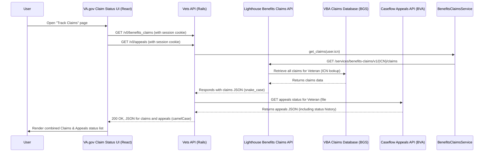
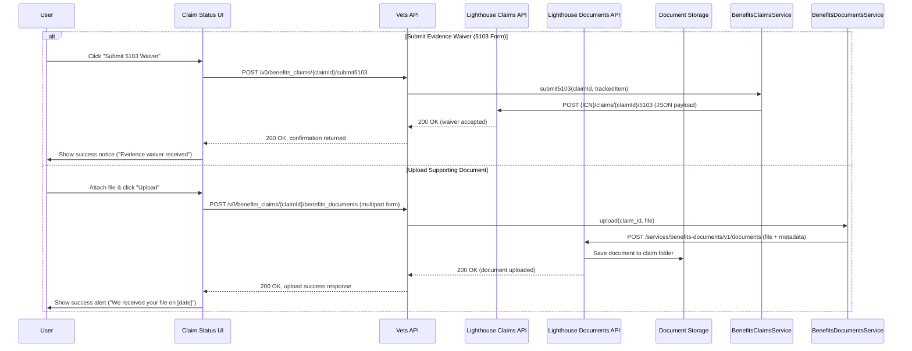

# VA Claim Status Tool Architecture and Integration Analysis

## Table of Contents

-   [Summary for Technical Product Management](#summary-for-technical-product-management)
-   [Frontend: Key API Endpoints and Integration Points](#frontend-key-api-endpoints-and-integration-points)
    -   [Key API Endpoints](#key-api-endpoints)
    -   [Frontend Code Integration](#frontend-code-integration)
    -   [Key Frontend Files and Components](#key-frontend-files-and-components)
-   [Backend: Controllers, Services, and Data Flow in vets-api](#backend-controllers-services-and-data-flow-in-vets-api)
    -   [Controllers](#controllers)
    -   [Service Modules](#service-modules)
    -   [Middleware and Helpers](#middleware-and-helpers)
    -   [Data Flow Summary](#data-flow-summary)
    -   [Controllers vs Services Summary](#controllers-vs-services-summary)
-   [Middleware, Authentication, and Error Handling](#middleware-authentication-and-error-handling)
-   [Recent Development and Commit History Highlights](#recent-development-and-commit-history-highlights)
-   [Key Code Files and Components](#key-code-files-and-components)
    -   [vets-website (Frontend)](#vets-website-frontend)
    -   [vets-api (Backend)](#vets-api-backend)
-   [Opportunities for Improvement or Clarification](#opportunities-for-improvement-or-clarification)
    -   [Further Questions / Areas to Investigate](#further-questions--areas-to-investigate)

---

## Summary for Technical Product Management

The VA **Claim Status Tool** allows Veterans to check the status of their compensation claims, decision reviews, or appeals on VA.gov ([`vets-website/src/applications/claims-status`](https://github.com/department-of-veterans-affairs/vets-website/tree/main/src/applications/claims-status)). It is implemented as a frontend application in the `vets-website` repository and relies on API endpoints provided by the `vets-api` backend. In broad terms, the frontend calls a set of **REST API endpoints** (under the `/v0/` path) to retrieve claim and appeal status data and to perform actions like uploading evidence or submitting forms. The backend (`vets-api`) handles these requests by invoking internal **service modules** (for example, a Lighthouse **Benefits Claims Service** for claim data ([`BenefitsClaims::Service`](https://www.rubydoc.info/github/department-of-veterans-affairs/vets-api/master/BenefitsClaims/Service)) and likely a Caseflow/appeals service for appeal status) that interface with VA systems (like VBA’s claims databases via Lighthouse API, and BVA’s Caseflow for appeals). Authentication is handled via the user’s login session (the user must be signed in), and data is returned in JSON with consistent camelCase formatting (enforced by headers).

**High-level data flow:** When a signed-in Veteran opens the Claim Status Tool, the frontend makes parallel API calls to fetch a list of their claims and any appeals ([`actions/index.js#dispatch`](https://github.com/department-of-veterans-affairs/vets-website/blob/main/src/applications/claims-status/actions/index.js#:~:text=dispatch%28)). The `vets-api` backend verifies the user’s identity and then calls out to upstream services: for claims, it uses the Lighthouse Benefits Claims API (which in turn queries VA claim databases) and for appeals it likely calls the Caseflow Appeals API. The responses are merged into the UI to display a combined status of claims and appeals. Users can also take actions in the tool (like uploading supporting documents or submitting a 5103 waiver form), which the frontend sends to `vets-api` as POST requests. The backend then forwards these to the appropriate internal service (e.g., the **Benefits Documents** service for file uploads ([`actions/index.js#request`](https://github.com/department-of-veterans-affairs/vets-website/blob/main/src/applications/claims-status/actions/index.js#:~:text=request%3A%20)) or the Benefits Claims service for 5103 submissions ([`BenefitsClaims::Service#submit5103`](https://www.rubydoc.info/github/department-of-veterans-affairs/vets-api/master/BenefitsClaims/Service#:~:text=def%20submit5103,tracked_item_id%20%5D))), handles any errors, and returns a success/failure status to the UI.

Overall, the integration is designed to be **secure** (requiring login and CSRF tokens for state-changing requests), **modular** (frontend calls high-level REST endpoints, and backend delegates to specialized service classes), and **resilient** (using middleware like breakers, feature toggles, and error handling to manage external service issues). Recent development efforts have focused on **migrating from legacy services (EVSS) to Lighthouse APIs**, improving the user experience for 5103 waivers and decision letters, and enhancing error handling and notifications. The following sections provide a detailed breakdown of the endpoints, code modules, data flow, and points of improvement.

---

## Frontend: Key API Endpoints and Integration Points

The Claim Status frontend (in `vets-website/src/applications/claims-status`) interacts with several API endpoints exposed by `vets-api`.

### Key API Endpoints

-   **Claims List:** `GET /v0/benefits_claims` – Retrieves the list of the Veteran’s benefit claims (disability compensation claims). This is called on initial load to populate “Your Claims” ([`actions/index.js#dispatch`](https://github.com/department-of-veterans-affairs/vets-website/blob/main/src/applications/claims-status/actions/index.js#:~:text=dispatch%28)). The frontend uses a helper `apiRequest('/benefits_claims')` to call this endpoint ([`actions/index.js#apiRequest`](https://github.com/department-of-veterans-affairs/vets-website/blob/main/src/applications/claims-status/actions/index.js#:~:text=return%20apiRequest)). The response includes an array of claim status objects in JSON (with fields like `phase`, `status`, etc., in camelCase).

-   **Claim Details:** `GET /v0/benefits_claims/{id}` – Retrieves detailed status for a specific claim ID (e.g. when the user views a particular claim). The frontend calls this via `apiRequest(\`/benefits_claims/\${id}\`)` ([`actions/index.js#dispatch`](https://github.com/department-of-veterans-affairs/vets-website/blob/main/src/applications/claims-status/actions/index.js#:~:text=dispatch%28)), and on success dispatches an action to store the detailed claim info.

-   **Appeals Status:** `GET /v0/appeals` – Retrieves the status of any decision reviews or appeals (Higher-Level Reviews, Board appeals, etc.) for the user. The frontend calls this as `apiRequest('/appeals')` ([`actions/index.js#dispatch`](https://github.com/department-of-veterans-affairs/vets-website/blob/main/src/applications/claims-status/actions/index.js#:~:text=dispatch%28)). (Notably, this is a separate endpoint from claims; the tool combines claims and appeals data in the UI.) The endpoint returns a list of appeals with their status, issues, and history.

-   **5103 Waiver Submission:** `POST /v0/benefits_claims/{id}/submit5103` – Submits a “5103 notice” waiver for a specific claim. This corresponds to the user action of requesting the claim decision without waiting for the full evidence window (sometimes called “Decision Request” on the UI). The frontend triggers this via an action that calls a helper `makeAuthRequest` to POST to `/v0/benefits_claims/{claimId}/submit5103` ([`actions/index.js#makeAuthRequest`](https://github.com/department-of-veterans-affairs/vets-website/blob/main/src/applications/claims-status/actions/index.js#:~:text=makeAuthRequest)), including a JSON body with a `trackedItemId` if applicable. On success, the UI shows a confirmation (e.g. “We received your request…”) and the claim status is updated to move to the next phase ([`actions/index.js#dispatch`](https://github.com/department-of-veterans-affairs/vets-website/blob/main/src/applications/claims-status/actions/index.js#:~:text=dispatch%28)).

-   **Supporting Evidence Upload:** `POST /v0/benefits_claims/{id}/benefits_documents` – Uploads a supporting document (e.g. additional evidence) for a specific claim. The frontend uses an uploader library (FineUploader) configured to send the file to this endpoint ([`actions/index.js#request`](https://github.com/department-of-veterans-affairs/vets-website/blob/main/src/applications/claims-status/actions/index.js#:~:text=request%3A%20)). It sets the target URL as `` `${environment.API_URL}/v0/benefits_claims/${claimId}/benefits_documents` `` and includes the file in a multipart form field `file` along with headers like `X-CSRF-Token` and `Source-App-Name` ([`actions/index.js#endpoint`](https://github.com/department-of-veterans-affairs/vets-website/blob/main/src/applications/claims-status/actions/index.js#:~:text=endpoint%3A%20%60%24)). On a successful upload, the frontend dispatches a “upload success” event and shows a notification (“We received your file…”) ([`actions/index.js#if_hasError`](https://github.com/department-of-veterans-affairs/vets-website/blob/main/src/applications/claims-status/actions/index.js#:~:text=if%20%28%21hasError%29%20)). (There is also an older endpoint `POST /v0/evss_claims/{id}/documents` which was used under the EVSS integration; the code contains logic to switch the upload URL to `/evss_claims/.../documents` for certain environments or when using mock data ([`actions/index.js#endpoint`](https://github.com/department-of-veterans-affairs/vets-website/blob/main/src/applications/claims-status/actions/index.js#:~:text=endpoint%3A%20%60%24)), but in production the new `benefits_documents` route is used under feature flag control.)

-   **Download Claim Letters:** `GET /v0/claim_letters` and `GET /v0/claim_letters/{documentId}` – These endpoints provide access to decision letters or other claim-related correspondence. The tool uses them to list available claim letters (and possibly 5103 notice letters) and to download the PDF of a selected letter. For example, if a claim decision letter is available, the frontend will call `GET /v0/claim_letters` to get a list of letters, then call `GET /v0/claim_letters/{id}` to retrieve a specific letter (likely returning a secure PDF download link or the PDF itself). In the code, `apiRequest('/claim_letters')` is present to fetch letters ([`actions/index.js#apiRequest_claim_letters`](https://github.com/department-of-veterans-affairs/vets-website/blob/main/src/applications/claims-status/actions/index.js#:~:text=match%20at%20L1780%20return%20apiRequest)). Recent feature flags indicate that the tool now includes 5103 notice letters in this list when the flag `cst_include_ddl_5103_letters` is enabled ([Features // Flipper](https://api.va.gov/flipper/features#:~:text=cst_include_ddl_5103_letters)).

-   **Miscellaneous Endpoints:** There are a few other endpoints integrated into the claim status experience:
    -   `GET /v0/average_days_for_claim_completion` – returns data about average claim processing times (perhaps shown as a contextual info on the tool).
    -   `GET /v0/efolder` (and `/efolder/{id}`) – possibly used internally or by other tools to retrieve the Veteran’s claim file documents (not directly surfaced in UI, but available routes ([`routes.rb#efolder`](https://github.com/department-of-veterans-affairs/vets-api/blob/master/config/routes.rb#:~:text=resources%20%3Aefolder%2C%20only%3A%20))).
    -   `GET /v0/evidence_submissions` – lists evidence submission statuses (the code shows an `evidence_submissions#index` route ([`routes.rb#evidence_submissions`](https://github.com/department-of-veterans-affairs/vets-api/blob/master/config/routes.rb#:~:text=resources%20%3Aevidence_submissions%2C%20only%3A%20)), possibly used if uploads are asynchronous or to poll status of an upload).
    -   `POST /v0/evss_claims/{id}/request_decision` – the legacy EVSS endpoint for requesting a claim decision (similar purpose to `submit5103`). The new tool doesn’t call this if using the Lighthouse path, but the route exists ([`routes.rb#request_decision`](https://github.com/department-of-veterans-affairs/vets-api/blob/master/config/routes.rb#:~:text=post%20%3Arequest_decision)).

### Frontend Code Integration

On the **frontend code side**, the main integration points are in the Redux action creators (`actions/index.js`). For example, `getClaims()` dispatches a loading state then calls `apiRequest('/benefits_claims')` and handles the promise ([`actions/index.js#dispatch`](https://github.com/department-of-veterans-affairs/vets-website/blob/main/src/applications/claims-status/actions/index.js#:~:text=dispatch%28)). Similarly, `getAppealsV2()` dispatches a pending action and calls `apiRequest('/appeals')` ([`actions/index.js#getAppealsV2`](https://github.com/department-of-veterans-affairs/vets-website/blob/main/src/applications/claims-status/actions/index.js#:~:text=export%20function%20getAppealsV2%28%29%20)). These use a wrapper that automatically includes the base API URL and handles JSON parsing. The actions file also defines handlers for the responses and error cases, mapping HTTP status codes to Redux state flags (e.g. a 403 yields a `USER_FORBIDDEN_ERROR`, 404 a `RECORD_NOT_FOUND_ERROR`, 502 a `BACKEND_SERVICE_ERROR`, etc.) ([`actions/index.js#switch_status`](https://github.com/department-of-veterans-affairs/vets-website/blob/main/src/applications/claims-status/actions/index.js#:~:text=switch%20%28status%29%20)). It uses Sentry to log unexpected errors with tags like `vets_appeals_v2_err_get_appeals` or `lighthouse_claims_err_get_claims` for monitoring ([`actions/index.js#Sentry_appeals`](https://github.com/department-of-veterans-affairs/vets-website/blob/main/src/applications/claims-status/actions/index.js#:~:text=Sentry.withScope%28scope%20%3D)) ([`actions/index.js#Sentry_claims`](https://github.com/department-of-veterans-affairs/vets-website/blob/main/src/applications/claims-status/actions/index.js#:~:text=Sentry.withScope%28scope%20%3D)).

For **POST actions** like uploading files or submitting form 5103, the frontend uses a helper called `makeAuthRequest` (imported from the platform utilities) which is similar to `apiRequest` but tailored for authenticated POSTs. In the `submit5103` action, for instance, `makeAuthRequest` is invoked with the endpoint `/v0/benefits_claims/{id}/submit5103`, the request options (method: 'POST', body: JSON), and success/error callbacks ([`actions/index.js#makeAuthRequest`](https://github.com/department-of-veterans-affairs/vets-website/blob/main/src/applications/claims-status/actions/index.js#:~:text=makeAuthRequest)). For file uploads, the code dynamically loads the FineUploader library and configures it with the endpoint and required headers, then handles callbacks for progress and completion ([`actions/index.js#FineUploaderBasic`](https://github.com/department-of-veterans-affairs/vets-website/blob/main/src/applications/claims-status/actions/index.js#:~:text=const%20uploader%20%3D%20new%20FineUploaderBasic%28)) ([`actions/index.js#customHeaders`](https://github.com/department-of-veterans-affairs/vets-website/blob/main/src/applications/claims-status/actions/index.js#:~:text=customHeaders%3A%20)). Notably, the uploader is set with `withCredentials: true` (sending the session cookie) and the `X-CSRF-Token` header ([`actions/index.js#Source_header`](https://github.com/department-of-veterans-affairs/vets-website/blob/main/src/applications/claims-status/actions/index.js#:~:text=%27Source)), since the API is protected against CSRF for file uploads.

### Key Frontend Files and Components

-   **Manifest and Entry Point:** `manifest.json` defines the route as `/track-claims` and the entry module as `claims-status-entry.jsx` ([`manifest.json`](https://github.com/department-of-veterans-affairs/vets-website/blob/main/src/applications/claims-status/manifest.json#:~:text=%22entryFile%22%3A%20%22.%2Fclaims)). This means the app is served at URL `https://www.va.gov/track-claims` (with sub-routes like `/your-claims` for the list and `/your-claims/{id}` for detail).
-   **Actions:** `actions/index.js` – as discussed, contains all thunks for fetching data and submitting actions (e.g., `getClaims`, `getAppealsV2`, `getClaim`, `submit5103`, `uploadFile`).
-   **Reducers and Selectors:** located in `reducers/` and `selectors/` directories. These shape the state for claims and appeals. For example, there may be a reducer handling the combined list of claims and appeals, marking a claim as in “decision requested” state after a 5103 submission, etc. Selectors likely format or filter data for UI (e.g., separating open vs closed claims).
-   **Components:** in `components/` (e.g., `YourClaimsPage`, `ClaimDetailPage`, `FileUpload` component, etc.) which dispatch the above actions on mount or on user interaction.
-   **Utilities:** `utils/appeals-v2-helpers.js` – contains helper functions for appeals, such as parsing status or error codes (the actions file imports `getErrorStatus` and `UNKNOWN_STATUS` from here ([`actions/index.js#import_helpers`](https://github.com/department-of-veterans-affairs/vets-website/blob/main/src/applications/claims-status/actions/index.js#:~:text=import%20,helpers))).
-   **Feature Flags on FE:** The frontend may check feature toggles via the global `window.settings` or use the `platform/utilities/featureFlag` utilities to conditionally show new UI elements. For example, if a new design for the 5103 alert is behind `cst_5103_update_enabled`, the UI might render one of two versions of the alert based on that flag.

In summary, the frontend is essentially a **React/Redux application** that communicates with `vets-api` through a handful of well-defined endpoints. It abstracts these calls in utility functions (`apiRequest`, etc.) and manages loading and error states via Redux. All user-facing actions (checking status, viewing details, uploading evidence, requesting decision) correspond to specific API calls as outlined above.

---

## Backend: Controllers, Services, and Data Flow in vets-api

On the `vets-api` side, the claim status tool’s API calls are handled by several controllers under the `app/controllers/v0/` namespace, and they leverage service classes (in `lib/`) for business logic and integration with VA backend systems.

### Controllers

The relevant controllers and modules include:

-   **BenefitsClaimsController (V0):** Handles `GET /v0/benefits_claims` and `GET /v0/benefits_claims/{id}` as well as `POST /v0/benefits_claims/{id}/submit5103`. In the routes configuration, it’s set up as `resources :benefits_claims, only: %i[index show] do ... post :submit5103, on: :member ... end` ([`routes.rb#benefits_claims`](https://github.com/department-of-veterans-affairs/vets-api/blob/master/config/routes.rb#:~:text=resources%20%3Abenefits_claims%2C%20only%3A%20,do)). This controller likely authenticates the request and uses the **BenefitsClaims::Service**.

-   **BenefitsDocumentsController (V0):** Handles `POST /v0/benefits_claims/{id}/benefits_documents` (as nested under `benefits_claims` in routes ([`routes.rb#benefits_claims`](https://github.com/department-of-veterans-affairs/vets-api/blob/master/config/routes.rb#:~:text=resources%20%3Abenefits_claims%2C%20only%3A%20,do))). This endpoint is responsible for file uploads, using the **BenefitsDocuments service** which communicates with the Lighthouse **Benefits Documents API**.

-   **AppealsController (V0):** Handles `GET /v0/appeals` (routes file shows `resources :appeals, only: :index` ([`routes.rb#appeals`](https://github.com/department-of-veterans-affairs/vets-api/blob/master/config/routes.rb#:~:text=resources%20%3Aappeals%2C%20only%3A%20%3Aindex))). This controller fetches the status of appeals and decision reviews, likely calling an **Appeals Service** or **Caseflow service** that queries Caseflow’s API.

-   **ClaimLettersController (V0):** Handles `GET /v0/claim_letters` and `/v0/claim_letters/{document_id}` ([`routes.rb#claim_letters`](https://github.com/department-of-veterans-affairs/vets-api/blob/master/config/routes.rb#:~:text=get%20%27claim_letters%27%2C%20to%3A%20%27claim_letters)). This controller provides the list of claim-related letters (including 5103 letters if `cst_include_ddl_5103_letters` is enabled) and the content of a specific letter, possibly interacting with VBMS or a Lighthouse service.

-   **EVSSClaimsController (and EVSS Documents):** These controllers exist to support the legacy EVSS claim status API (routes show `resources :evss_claims, only: %i[index show]` with nested `post :request_decision` and `documents#create` ([`routes.rb#evss_claims`](https://github.com/department-of-veterans-affairs/vets-api/blob/master/config/routes.rb#:~:text=resources%20%3Aevss_claims%2C%20only%3A%20))). They are likely only used in certain scenarios (e.g., non-production or if Lighthouse is down). In production, **BenefitsClaimsController** has taken over.

### Service Modules

The heavy lifting of integrating with external systems is done in service classes, not in controllers. Key services:

-   **BenefitsClaims::Service** – found in `lib/lighthouse/benefits_claims/service.rb`. This class communicates with the Lighthouse Benefits Claims API. It includes methods `get_claims`, `get_claim`, `submit5103`, and handles filtering/transforming data ([`BenefitsClaims::Service`](https://www.rubydoc.info/github/department-of-veterans-affairs/vets-api/master/BenefitsClaims/Service)). It uses the veteran’s ICN and handles errors by raising `ServiceException`.

-   **BenefitsDocuments::Service** – likely in `lib/lighthouse/benefits_documents/service.rb` (and configuration in `.../benefits_documents/configuration.rb`). This handles uploading documents via the Lighthouse Benefits Documents API (`services/benefits-documents/v1/documents`) using OAuth client credentials ([`BenefitsDocuments::Configuration`](https://www.rubydoc.info/github/department-of-veterans-affairs/vets-api/master/BenefitsDocuments/Configuration)).

-   **Appeals Service** – Presumed to exist (possibly under `modules/appeals/` or `lib/appeals/`) to handle calls to Caseflow's API for appeals status, as VA.gov's implementation is separate from the public Lighthouse Appeals API ([Issue #2803](https://github.com/department-of-veterans-affairs/va.gov-team/issues/2803#:~:text=%E2%80%9CThe%20Appeals%20Status%20API%20is,uses%20a%20separate%20code%20branch%E2%80%9D)).

-   **EVSS::ClaimsService** – located in `lib/evss/claims_service.rb`. Provides legacy integration with EVSS SOAP services. Used only if the Lighthouse path is disabled via feature flags.

### Middleware and Helpers

The `vets-api` has general mechanisms that apply:

-   **Authentication & Authorization:** Endpoints require authenticated users (`current_user` identified via session cookie). User identifiers (ICN, file number) are used for upstream calls.
-   **AntiCSRF Protection:** Non-GET requests require a valid `X-CSRF-Token` header, sent by the frontend ([`actions/index.js#Source_header`](https://github.com/department-of-veterans-affairs/vets-website/blob/main/src/applications/claims-status/actions/index.js#:~:text=%27Source)).
-   **Breakers (Circuit Breaker):** External service calls are wrapped in circuit breakers (via `breaker_box` gem) to handle failures gracefully ([`BenefitsDocuments::Configuration`](https://www.rubydoc.info/github/department-of-veterans-affairs/vets-api/master/BenefitsDocuments/Configuration)).
-   **Error Handling:** Global exception handlers catch service errors (e.g., `ServiceException`) and map them to appropriate HTTP status codes (4xx, 5xx). Errors are logged (e.g., via Sentry).
-   **Response Transformation:** Middleware converts response keys to camelCase based on the `X-Key-Inflection: camel` header sent by the frontend ([`actions/index.js#Source_header`](https://github.com/department-of-veterans-affairs/vets-website/blob/main/src/applications/claims-status/actions/index.js#:~:text=%27Source)).

### Data Flow Summary

The data flow through the backend for key operations:

**Fetching Claim/Appeal Status:**

**Submitting 5103 Waiver or Uploading Document:**

### Controllers vs Services Summary

-   **Controllers** (`BenefitsClaimsController`, `AppealsController`, etc.) handle HTTP-level concerns (auth, request/response) and delegate to service classes.
-   **Service classes** (`BenefitsClaims::Service`, `BenefitsDocuments::Service`, Appeals Service) encapsulate the API calls to VA backend services (Lighthouse, Caseflow) and contain integration logic.

---

## Middleware, Authentication, and Error Handling

Key components ensuring secure and reliable integration:

-   **User Authentication:** Requires sign-in via SSOe. Session cookie identifies `current_user` in `vets-api`, providing necessary identifiers (ICN, file #) for upstream calls. Unauthorized requests receive `401`.
-   **Authorization:** Generally, logged-in users can access their own data. `403` might occur if user data is incomplete (e.g., missing SSN for appeals). Feature toggles control access to new features/endpoints.
-   **CSRF Protection:** Rails CSRF protection is enabled. Frontend sends `X-CSRF-Token` with POST requests. Missing/invalid tokens result in `401`/`403`.
-   **Exception Handling and Logging:** Frontend catches API errors, updates Redux state, and logs to Sentry. Backend services catch upstream errors (timeouts, 5xx), raise structured exceptions (e.g., `ServiceException`), which are mapped to HTTP statuses by global handlers and logged (Sentry, server logs).
-   **Breakers and Caching:** Circuit breakers (via `breaker_box`) wrap external calls (Lighthouse, Caseflow). If upstream fails repeatedly, the circuit opens, returning `503` quickly. Caching is likely minimal for user-specific status but might apply to static data like average processing times.
-   **Serialization and Inflection:** Middleware automatically converts JSON keys between snake_case (internal/upstream) and camelCase (frontend) based on the `X-Key-Inflection` header.

These components work together for robustness: secure identity assertion, authorized data access, meaningful error propagation, failure logging, and graceful degradation via breakers and feature toggles.

---

## Recent Development and Commit History Highlights

Key changes (circa late 2022 - 2024):

-   **Migration from EVSS to Lighthouse APIs:** Transitioned claim status (`/v0/benefits_claims`) and 5103 submission (`/v0/benefits_claims/{id}/submit5103`) from EVSS to Lighthouse Benefits Claims API, controlled by feature flag `claims_status_v1_bgs_enabled` (now fully enabled) ([Releases](https://github.com/department-of-veterans-affairs/vets-api/releases), [PR #12862](https://github.com/department-of-veterans-affairs/vets-api/pull/12862)).
-   **Benefits Intake and Documents:** Migrated file uploads from EVSS to Lighthouse Benefits Documents API (`/v0/benefits_claims/{id}/benefits_documents`), controlled by `claims_claim_uploader_use_bd` (now fully enabled). Added email notifications for upload failures (`cst_send_evidence_failure_emails`).
-   **Appeals Integration (Appeals API v2):** Ongoing maintenance of the internal Caseflow integration for `/v0/appeals`. While a Lighthouse Appeals API exists, VA.gov's tool seems to still use its separate integration ([Issue #2803](https://github.com/department-of-veterans-affairs/va.gov-team/issues/2803)). Potential future alignment with Lighthouse API.
-   **UX Improvements – Phase tracking and notifications:**
    -   Updated UI for 5103 waiver alert/submission (`cst_5103_update_enabled`).
    -   Option to hide certain "Needed from others" items (`cst_suppress_evidence_requests_website`).
    -   Included 5103 notice letters in downloadable letters (`cst_include_ddl_5103_letters`).
    -   UI enhancements for claim phase visualization (e.g., segmented progress bar).
-   **Logging and Monitoring:** Added frontend analytics logging (`api_call` events) and backend email notifications for failures. Increased Sentry logging on both ends.
-   **Documentation and Dev Tools:** Updated READMEs with setup/testing instructions ([`claims-status/README.md`](https://github.com/department-of-veterans-affairs/vets-website/tree/main/src/applications/claims-status)). Maintained API documentation (e.g., Swagger).

Recent work reflects modernization (Lighthouse adoption), feature enhancements (5103, letters), and improved reliability/monitoring, aligning with VA announcements about enhancing the tool.

---

## Key Code Files and Components

### vets-website (Frontend)

-   `src/applications/claims-status/manifest.json`: App definition, entry point (`claims-status-entry.jsx`), root URL (`/track-claims`).
-   `src/applications/claims-status/actions/index.js`: Redux actions/thunks for API calls (`getClaims`, `getAppealsV2`, `submit5103`, `uploadFile`) using `apiRequest`/`makeAuthRequest`.
-   `src/applications/claims-status/reducers/`: Redux reducers managing state (`claims`, `appeals`, loading/error flags).
-   `src/applications/claims-status/components/`: React components (`YourClaims.jsx`, `ClaimDetail.jsx`, `FileUpload.jsx`, `AppealsTimeline.jsx`).
-   `src/applications/claims-status/utils/`: Helper functions (`appeals-v2-helpers.jsx`, `helpers.js`).
-   `tests/claims-status/`: Unit and end-to-end (Cypress) tests.

### vets-api (Backend)

-   `config/routes.rb`: Route definitions for `/v0/benefits_claims`, `/v0/appeals`, etc.
-   `app/controllers/v0/`: Controllers (`benefits_claims_controller.rb`, `benefits_documents_controller.rb`, `appeals_controller.rb`, `claim_letters_controller.rb`).
-   `lib/lighthouse/benefits_claims/service.rb`: `BenefitsClaims::Service` class (Lighthouse client).
-   `lib/lighthouse/benefits_documents/configuration.rb`: `BenefitsDocuments::Configuration` class (Lighthouse client config).
-   `lib/evss/claims_service.rb`: `EVSS::ClaimsService` (legacy client).
-   `lib/appeals/` (or similar): Code handling Caseflow API calls for appeals.
-   `lib/common/client/`, `lib/common/exceptions/`: Shared client infrastructure, error handling, breakers.
-   `app/serializers/`: Potentially serializers for formatting JSON output (though inflection middleware handles casing).
-   `config/features.yml`: Feature flag definitions (controlled via Flipper UI).
-   `spec/lib/lighthouse/`: Tests for Lighthouse service integrations (using VCR/mocks).

**Integration Points:**
-   Frontend ↔ Backend: REST API calls over HTTP/S.
-   Backend ↔ External Services: Via service classes calling Lighthouse APIs (Claims, Documents) and Caseflow API.
-   Data Models: Defined by Lighthouse/Caseflow schemas, transformed by `vets-api` (inflection), consumed by `vets-website`.
-   Other VA.gov Services: Implicit integration with Profile (auth) and Form Submission (claims appear after filing).

---

## Opportunities for Improvement or Clarification

-   **Simplification of Upload vs EVSS logic:** Remove obsolete EVSS upload code paths in frontend (`actions/index.js`) and backend (`routes.rb`, controllers) now that Lighthouse (`benefits_documents`) is fully enabled.
-   **Appeals Data Consistency:** Clarify the plan for `/v0/appeals`. Consider migrating the internal Caseflow integration to use the standard Lighthouse Appeals API (via the existing Appeals API engine) for unification and reduced maintenance.
-   **Error Messaging and Edge Cases:** Enhance user-facing error messages for specific scenarios (e.g., 403 on appeals due to missing profile data) instead of generic messages. Provide clearer guidance when no claims/appeals are found.
-   **Performance and Caching:** Explore short-term caching strategies (frontend Redux session cache, backend Redis cache for 1-2 mins) for claims/appeals data to reduce load from repeated fetches, balancing freshness needs.
-   **Consolidation of Similar Endpoints:** Investigate enriching the `GET /v0/benefits_claims/{id}` response to include associated documents/letters, potentially reducing the need for separate `GET /v0/claim_letters` calls.
-   **Documentation & Onboarding:** Improve in-code documentation for `vets-api` service classes and endpoint schemas (beyond Swagger) to clarify data flow and transformations for developers.

### Further Questions / Areas to Investigate

1.  **Letter Retrieval Mechanism:** How are claim letters fetched by `ClaimLettersController`? Is it direct from VBMS on-demand, or is there caching/intermediate storage (e.g., S3)? Understand performance implications.
2.  **Caseflow vs Lighthouse for Appeals:** Confirm the long-term strategy for `/v0/appeals`. Is migration to the Lighthouse Appeals API planned? What are the data parity considerations?
3.  **EVSS Removal:** Can the remaining EVSS code (`EVSS::ClaimsService`, related routes/controllers) be fully retired after confirming data parity with Lighthouse?
4.  **Mobile and Other Consumers:** Ensure consistency between Claim Status Tool endpoints (`/v0/`) and Mobile API endpoints (`/mobile/`) if they share backend services. Are improvements mirrored?
5.  **UI Enhancements / Future Features:** Are there planned features (e.g., showing Intent to File status using `BenefitsClaims::Service#get_intent_to_file`) that require backend changes?

Overall, the Claim Status Tool is a well-integrated system that has benefited from recent modernization. Continued refinement can further improve its reliability, maintainability, and user experience.
