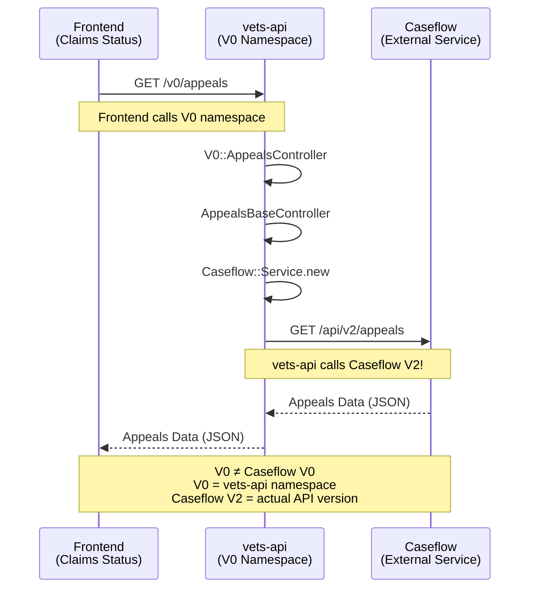

# VA Appeals Architecture Deep Dive

## Overview

This document provides a comprehensive analysis of the VA Appeals system architecture, specifically focusing on how the frontend claims status tool connects to backend appeals services and the API routing structure that causes the "V0" naming confusion.

## High-Level Architecture

```
┌─────────────────────────────────┐       ┌─────────────────────────────────┐       ┌─────────────────────────────────┐
│          Frontend               │       │         vets-api                │       │        Caseflow                 │
│     (vets-website)              │       │       (Rails API)               │       │     (External Service)          │
│                                 │       │                                 │       │                                 │
│  Claims Status Tool             │ HTTP  │  V0::AppealsController          │ HTTP  │  Caseflow API                   │
│  - Appeals Section              │──────▶│  ↓                              │──────▶│  - /api/v2/appeals              │
│  - Actions/index.js             │       │  AppealsBaseController          │       │  - /api/v3/decision_reviews     │
│  - getAppealsV2() function      │       │  ↓                              │       │                                 │
│                                 │       │  Caseflow::Service              │       │                                 │
└─────────────────────────────────┘       └─────────────────────────────────┘       └─────────────────────────────────┘
```

## The "V0" Naming Mystery Explained

### Why Frontend Calls "V0" But Not Caseflow V0

The confusion stems from understanding that **V0 refers to the vets-api version namespace, NOT the Caseflow API version**.

#### Frontend API Calls
**File**: `src/applications/claims-status/actions/index.js`
- **Function**: `getAppealsV2()`
- **API Call**: `apiRequest('/appeals')`
- **Actual URL**: `https://api.va.gov/v0/appeals`

The key insight: The frontend calls the `/appeals` endpoint under the `v0` namespace of vets-api, but this endpoint internally proxies to Caseflow's V2 API.

## Detailed Architecture Breakdown

### 1. Frontend Layer (vets-website)

#### Main Appeals Action
```javascript
// src/applications/claims-status/actions/index.js

export function getAppealsV2() {
  return dispatch => {
    dispatch({ type: FETCH_APPEALS_PENDING });
    return apiRequest('/appeals')  // This becomes /v0/appeals
      .then(appeals => dispatch(fetchAppealsSuccess(appeals)))
      .catch(error => {
        // Error handling for different status codes
      });
  };
}
```

#### API Request Flow
1. **Frontend calls**: `apiRequest('/appeals')`
2. **Platform utilities prefix**: `/v0/appeals`
3. **Full URL**: `https://api.va.gov/v0/appeals`

### 2. Backend Layer (vets-api)

#### Routing Configuration
The Rails routes are configured in a namespace structure:

```ruby
# config/routes.rb (conceptual structure based on controller hierarchy)
namespace :v0 do
  resources :appeals, only: [:index]
  # Other V0 endpoints...
end
```

#### Controller Hierarchy

**1. V0::AppealsController**
```ruby
# app/controllers/v0/appeals_controller.rb
module V0
  class AppealsController < AppealsBaseController
    service_tag 'appeal-status'

    def index
      appeals_response = appeals_service.get_appeals(current_user)
      render json: appeals_response.body
    end
  end
end
```

**Key Points:**
- Inherits from `AppealsBaseController`
- Single `index` action that delegates to `appeals_service`
- No complex logic - pure proxy pattern

**2. AppealsBaseController**
```ruby
# app/controllers/appeals_base_controller.rb
require 'caseflow/service'

class AppealsBaseController < ApplicationController
  include FailedRequestLoggable
  before_action { authorize :appeals, :access? }

  private

  def appeals_service
    Caseflow::Service.new
  end

  def request_body_debug_data
    {
      request_body_class_name: request.try(:body).class.name,
      request_body_string: request.try(:body).try(:string)
    }
  end
end
```

**Key Points:**
- Provides `appeals_service` method that returns `Caseflow::Service.new`
- Handles authorization with Pundit
- Includes logging capabilities for failed requests

**3. ApplicationController**
```ruby
# app/controllers/application_controller.rb
class ApplicationController < ActionController::API
  include AuthenticationAndSSOConcerns
  include ActionController::RequestForgeryProtection
  include ExceptionHandling
  include Headers
  include Instrumentation
  include Pundit::Authorization
  # ... other concerns
end
```

### 3. Caseflow Service Layer

#### Service Implementation
```ruby
# lib/caseflow/service.rb
module Caseflow
  class Service < Common::Client::Base
    include SentryLogging
    include Common::Client::Concerns::Monitoring

    configuration Caseflow::Configuration

    STATSД_KEY_PREFIX = 'api.appeals'
    CASEFLOW_V2_API_PATH = '/api/v2/appeals'          # ← THIS IS THE KEY!
    CASEFLOW_V3_API_PATH = '/api/v3/decision_reviews'
    DEFAULT_HEADERS = { 'Authorization' => "Token token=#{Settings.caseflow.app_token}" }.freeze

    def get_appeals(user, additional_headers = {})
      with_monitoring do
        response = authorized_perform(
          :get,
          CASEFLOW_V2_API_PATH,  # ← Calls Caseflow V2, not V0!
          {},
          additional_headers.merge('ssn' => user.ssn)
        )
        Caseflow::Responses::Caseflow.new(response.body, response.status)
      end
    end

    # Other methods...
  end
end
```

**Critical Insight**: The service calls `CASEFLOW_V2_API_PATH = '/api/v2/appeals'`, which means:
- Frontend → vets-api V0 namespace
- vets-api → Caseflow V2 API

### 4. External Caseflow API

#### API Endpoints
- **Base URL**: Configured in `Caseflow::Configuration`
- **Appeals Endpoint**: `/api/v2/appeals`
- **Decision Reviews**: `/api/v3/decision_reviews`
- **Authentication**: Token-based with app_token

## API Call Flow Diagram



## Configuration and Authentication

### Caseflow Configuration
```ruby
# lib/caseflow/configuration.rb (conceptual)
module Caseflow
  class Configuration < Common::Client::Configuration::REST
    self.base_request_headers = {
      'Authorization' => "Token token=#{Settings.caseflow.app_token}",
      'Content-Type' => 'application/json'
    }
    
    # Base URL configured per environment
    self.base_path = Settings.caseflow.host
  end
end
```

## Key Architectural Patterns

### 1. Namespace Separation
- **V0**: vets-api internal versioning (Rails namespace)
- **V2**: Caseflow API versioning (external service)
- **No direct relationship** between these version numbers

### 2. Proxy Pattern
The appeals controller acts as a pure proxy:
```
Frontend Request → V0::AppealsController → AppealsBaseController → Caseflow::Service → External Caseflow API
```

### 3. Service Abstraction
- `Caseflow::Service` encapsulates all external API communication
- Uses `Common::Client::Base` for HTTP client functionality
- Provides monitoring, logging, and error handling

### 4. Authorization Chain
- Frontend: Session-based authentication
- vets-api: Pundit authorization policies
- Caseflow: Token-based authentication

## Error Handling Strategy

### Frontend Error Handling
```javascript
.catch(error => {
  const status = getErrorStatus(error);
  const action = { type: '' };
  switch (status) {
    case '403':
      action.type = USER_FORBIDDEN_ERROR;
      break;
    case '404':
      action.type = RECORD_NOT_FOUND_ERROR;
      break;
    case '422':
      action.type = VALIDATION_ERROR;
      break;
    case '502':
      action.type = BACKEND_SERVICE_ERROR;
      break;
    default:
      action.type = FETCH_APPEALS_ERROR;
      break;
  }
  return dispatch(action);
});
```

### Backend Error Handling
- Sentry logging for exceptions
- Monitoring with `Common::Client::Concerns::Monitoring`
- Custom error responses through `Caseflow::Responses::Caseflow`

## Integration Points

### 1. Authentication Flow
1. User authenticates with VA.gov (ID.me/Login.gov)
2. Session established in vets-api
3. SSN extracted for Caseflow API calls
4. Token-based auth to Caseflow

### 2. Data Transformation
- **Input**: User SSN from session
- **Output**: Normalized appeals data
- **Processing**: Done in `Caseflow::Responses::Caseflow`

### 3. Monitoring and Observability
- **Frontend**: Google Analytics events
- **Backend**: StatsD metrics, Sentry error tracking
- **External**: Caseflow service monitoring

## Conclusion

The "V0" naming confusion arises because:

1. **Frontend perspective**: Calls `/v0/appeals` (vets-api namespace)
2. **Backend reality**: Proxies to Caseflow `/api/v2/appeals`
3. **No V0 Caseflow service**: The external service uses V2/V3 versioning

The architecture follows a clean separation of concerns with proper abstraction layers, allowing the internal VA.gov API versioning (V0) to be independent from external service versioning (Caseflow V2/V3).

This design enables:
- **Independent versioning** between VA.gov and Caseflow
- **Service abstraction** for easier maintenance
- **Consistent frontend interface** regardless of backend changes
- **Proper authentication chaining** through multiple systems
