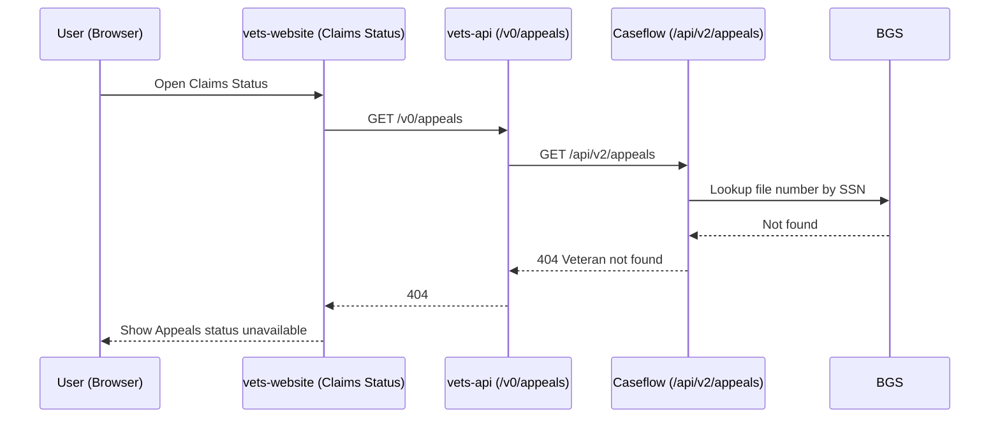

## Claims Status Tool 404 Flow (Appeals status unavailable)

This documents what happens when a user visits the Claims Status Tool and the appeals portion returns a 404, resulting in an “Appeals status unavailable” message.

### End-to-end sequence
1. User opens Claims Status Tool in the frontend
   - Routes and entry:
     - Frontend routes: https://github.com/department-of-veterans-affairs/vets-website/blob/037403e2fd6f867a2eb13beb797ffcccc790aa79/src/applications/claims-status/routes.jsx
     - App container: https://github.com/department-of-veterans-affairs/vets-website/blob/037403e2fd6f867a2eb13beb797ffcccc790aa79/src/applications/claims-status/containers/ClaimsStatusApp.jsx
     - Page containers: 
       - Your claims page (v2): https://github.com/department-of-veterans-affairs/vets-website/blob/037403e2fd6f867a2eb13beb797ffcccc790aa79/src/applications/claims-status/containers/YourClaimsPageV2.jsx 
       - Claim page: https://github.com/department-of-veterans-affairs/vets-website/blob/037403e2fd6f867a2eb13beb797ffcccc790aa79/src/applications/claims-status/containers/ClaimPage.jsx

2. Frontend requests appeals data via vets-api
   - Action creators (fetch calls, error handling):
     - Actions index: https://github.com/department-of-veterans-affairs/vets-website/blob/037403e2fd6f867a2eb13beb797ffcccc790aa79/src/applications/claims-status/actions/index.js
     - Action types: https://github.com/department-of-veterans-affairs/vets-website/blob/037403e2fd6f867a2eb13beb797ffcccc790aa79/src/applications/claims-status/actions/types.js
   - State handling:
     - Reducer (appeals/claims v2): https://github.com/department-of-veterans-affairs/vets-website/blob/037403e2fd6f867a2eb13beb797ffcccc790aa79/src/applications/claims-status/reducers/claimsV2.js
   - Helpers for appeals v2 shaping and flags:
     - Helpers: https://github.com/department-of-veterans-affairs/vets-website/blob/037403e2fd6f867a2eb13beb797ffcccc790aa79/src/applications/claims-status/utils/appeals-v2-helpers.jsx

3. vets-api receives GET /v0/appeals and calls Caseflow
   - vets-api controller (V0::AppealsController):
     - https://github.com/department-of-veterans-affairs/vets-api/blob/76c98a21f2ba00ce1cea4ded13f004f75a8cf483/app/controllers/v0/appeals_controller.rb
   - Appeals API module (additional internal routing/versions under vets-api):
     - v0 controller: https://github.com/department-of-veterans-affairs/vets-api/blob/76c98a21f2ba00ce1cea4ded13f004f75a8cf483/modules/appeals_api/app/controllers/appeals_api/v0/appeals_controller.rb
     - v1 controller: https://github.com/department-of-veterans-affairs/vets-api/blob/76c98a21f2ba00ce1cea4ded13f004f75a8cf483/modules/appeals_api/app/controllers/appeals_api/v1/appeals_controller.rb
     - module routes: https://github.com/department-of-veterans-affairs/vets-api/blob/76c98a21f2ba00ce1cea4ded13f004f75a8cf483/modules/appeals_api/config/routes.rb

4. Caseflow handles /api/v2/appeals and performs BGS lookup
   - Caseflow routes show `api/v2/appeals` exists:
     - config/routes.rb: https://github.com/department-of-veterans-affairs/caseflow/blob/main/config/routes.rb
   - Controller (Api::V2::AppealsController#index):
     - app/controllers/api/v2/appeals_controller.rb: https://github.com/department-of-veterans-affairs/caseflow/blob/main/app/controllers/api/v2/appeals_controller.rb
   - Behavior (summarized):
     - Validates SSN; calls BGS to fetch a veteran file number; when not found, raises `ActiveRecord::RecordNotFound` and renders 404 via `veteran_not_found`.
   - BGS integration (Caseflow service layer):
     - bgs_service.rb: https://github.com/department-of-veterans-affairs/caseflow/blob/abc7a34cfe6b624b93866c428e079b57888d7461/app/services/external_api/bgs_service.rb

5. Caseflow returns 404 to vets-api, then frontend
   - Caseflow renders a 404 payload with title “Veteran not found”. vets-api forwards the 404 response to the frontend requestor.

6. Frontend shows “Appeals status unavailable”
   - Components used to present the unavailable state:
     - AppealsUnavailable: https://github.com/department-of-veterans-affairs/vets-website/blob/037403e2fd6f867a2eb13beb797ffcccc790aa79/src/applications/claims-status/components/AppealsUnavailable.jsx
     - ClaimsAppealsUnavailable: https://github.com/department-of-veterans-affairs/vets-website/blob/037403e2fd6f867a2eb13beb797ffcccc790aa79/src/applications/claims-status/components/ClaimsAppealsUnavailable.jsx
     - General claims unavailable (may be referenced by flows sharing error UI): https://github.com/department-of-veterans-affairs/vets-website/blob/037403e2fd6f867a2eb13beb797ffcccc790aa79/src/applications/claims-status/components/ClaimsUnavailable.jsx

### What 404 means in this flow
- 404 indicates “Veteran not found” at the Caseflow/BGS lookup layer. It is not an infrastructure outage; it reflects data not present in BGS for the SSN provided.

### Key code touchpoints (by layer)
- Frontend (vets-website):
  - Routes: src/applications/claims-status/routes.jsx
  - Containers: YourClaimsPageV2.jsx, ClaimPage.jsx
  - Actions: actions/index.js; action types in actions/types.js
  - State: reducers/claimsV2.js
  - UI for unavailable status: AppealsUnavailable.jsx, ClaimsAppealsUnavailable.jsx
- API gateway (vets-api):
  - V0::AppealsController: app/controllers/v0/appeals_controller.rb
  - Appeals API module (v0/v1 controllers, routes) for internal docs/tests
- Caseflow:
  - routes.rb (shows /api/v2/appeals)
  - Api::V2::AppealsController#index (404 rescue path for missing veteran)
  - BGS service integration (bgs_service.rb)

### Optional: sequence diagram

### Triage tips
- If 404 rates increase, confirm that the SSN input and veteran status are correct; verify Caseflow health; spot-check BGS availability (though 404 is expected for genuinely missing veterans).
