# Why Veterans Get "Not Found" Errors Despite Successful Login

## The Simple Story: Two Different Systems

When veterans use the Claims Status Tool, they interact with **two separate systems**:
1. **Login System** - checks if you're allowed to use VA.gov
2. **Benefits System** - checks if you have VA benefits records

**The Problem**: You can pass the first check but fail the second check.

## 📊 The Flow (In Simple Terms)

```mermaid
flowchart TD
    A["👤 Veteran visits<br/>Claims Status Tool"] --> B["🔐 Login Screen<br/>(ID.me or Login.gov)"]
    
    B --> C["✅ Login Successful<br/>Welcome to VA.gov!"]
    
    C --> D["📋 Click 'Check Appeals Status'"]
    
    D --> E["🔍 System searches for<br/>your benefits records"]
    
    E --> F{"🤔 Do you have<br/>VA benefits records?"}
    
    F -->|"✅ YES"| G["📄 Show your appeals<br/>Everything works!"]
    
    F -->|"❌ NO"| H["🚫 Error: 'Veteran Not Found'<br/>Even though you logged in"]
    
    H --> I["😕 Confused veteran:<br/>'But I just logged in successfully!'"]
    
    style C fill:#90EE90
    style G fill:#90EE90
    style H fill:#FFB6C1
    style I fill:#FFB6C1
```

## 🧩 Why This Happens: The Missing Piece

### ✅ **Login System Says**: 
*"Yes, this person is allowed to use VA.gov"*

This system is **very inclusive** and allows:
- Veterans
- Military family members
- Survivors
- Dependents
- Anyone with a valid military connection

### ❌ **Benefits System Says**: 
*"No, this person doesn't have benefits records"*

This system is **much more specific** and only includes:
- Veterans who have **applied for VA benefits**
- Veterans who have **filed claims**
- Veterans who **receive VA healthcare**
- Veterans who **use education benefits**

## 📝 Who Gets the "Not Found" Error?

### Common Scenarios:

#### 1. **Recently Separated Veterans**
- **Situation**: Just left military, haven't applied for benefits yet
- **Login**: ✅ Works (military service qualifies them)
- **Benefits Search**: ❌ Fails (no benefits applications filed)

#### 2. **Veterans Who Never Applied for Benefits**
- **Situation**: Served years ago, never used VA services
- **Login**: ✅ Works (veteran status confirmed)
- **Benefits Search**: ❌ Fails (never entered benefits system)

#### 3. **Military Family Members**
- **Situation**: Spouse checking for veteran's appeals
- **Login**: ✅ Works (family member access)
- **Benefits Search**: ❌ Fails (they're not the veteran)

#### 4. **Veterans with Data Issues**
- **Situation**: Information doesn't match between systems
- **Login**: ✅ Works (close enough match)
- **Benefits Search**: ❌ Fails (exact match required)

## 🎯 The Key Point

**This is NOT a broken system** - it's working exactly as designed.

The error message should really say:
> *"You're logged in successfully, but we can't find any VA benefits records for you. This might mean you haven't applied for VA benefits yet."*

Instead of the confusing:
> *"Veteran not found"* (which makes you think the login was wrong)

## 🛠️ What Can Veterans Do?

### If You Get This Error:

1. **Don't panic** - your login is working fine
2. **Check if you've applied for benefits**:
   - Disability compensation
   - VA healthcare
   - Education benefits (GI Bill)
   - Home loans
   - Pension benefits

3. **If you haven't applied for benefits**:
   - This error is normal and expected
   - Consider applying for benefits you may be eligible for
   - Contact VA to learn about available benefits

4. **If you have applied for benefits**:
   - There may be a data mismatch
   - Contact VA support for help
   - Verify your information is correct in both systems

## 💡 Bottom Line

**The "Veteran Not Found" error usually means**:
*"You're a legitimate user, but you don't have benefits records yet"*

**NOT**:
*"The system is broken"* or *"You're not allowed here"*

This is a **communication problem**, not a **technical problem**. The systems are working correctly, but the error message is confusing for users.
