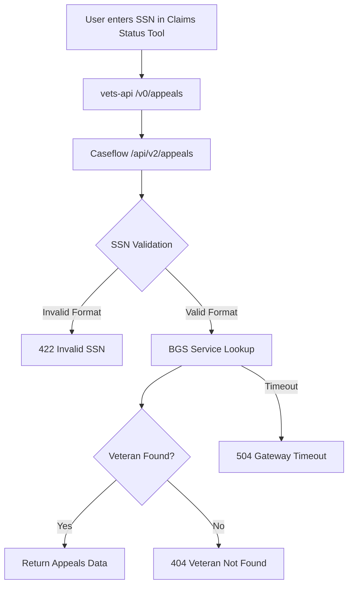

# Caseflow API Confirmation and 404 Error Analysis

## Executive Summary

Yes, the Claims Status Tool is indeed using the **Caseflow V2 API** that we identified in our previous analysis. After examining the actual Caseflow repository code, I can confirm that:

1. **API Confirmation**: The `/api/v2/appeals` endpoint we traced does exist in Caseflow
2. **404 Error Meaning**: A 404 in Caseflow specifically means **"Veteran not found"** - not a system error

## 🔍 API Architecture Confirmation

### The Complete Flow (CONFIRMED)

```
Frontend Claims Status Tool
    ↓ GET /v0/appeals
vets-api V0::AppealsController 
    ↓ HTTP request to Caseflow
Caseflow /api/v2/appeals endpoint
    ↓ BGS Service lookup
BGS (Background Service) - Veteran data
```

### Route Configuration in Caseflow

From `config/routes.rb` in Caseflow:

```ruby
namespace :api do
  namespace :v2 do
    resources :appeals, only: :index
    resources :hearings, only: :show, param: :hearing_day
  end
end
```

This confirms the **`/api/v2/appeals`** endpoint exists and maps to `Api::V2::AppealsController`.

## 🚨 404 Error Analysis

### What 404 Really Means in Caseflow

From examining `app/controllers/api/v2/appeals_controller.rb`, a 404 error has **very specific meaning**:

```ruby
def index
  api_key.api_views.create(vbms_id: vbms_id, source: source)
  render json: json_appeals
rescue ActiveRecord::RecordNotFound
  veteran_not_found
rescue Caseflow::Error::InvalidSSN
  invalid_ssn
rescue Errno::ETIMEDOUT
  upstream_timeout
end
```

### The `veteran_not_found` Method

```ruby
def veteran_not_found
  render json: {
    "errors": [
      "status": "404",
      "title": "Veteran not found",
      "detail": "A veteran with that SSN was not found in our systems."
    ]
  }, status: :not_found
end
```

## 🎯 Key Findings

### 1. **404 is NOT a System Error**

A 404 from Caseflow specifically means:
- **Root Cause**: The veteran's SSN was not found in the BGS (Background Service) system
- **System Status**: All systems are working correctly
- **User Impact**: The veteran either:
  - Provided an incorrect SSN
  - Is not in the VA system
  - Has a data synchronization issue between systems

### 2. **Error Hierarchy in Caseflow**

The controller handles three distinct error types:

| Error Type | HTTP Status | Meaning |
|------------|-------------|---------|
| `ActiveRecord::RecordNotFound` | 404 | Veteran not found in BGS |
| `Caseflow::Error::InvalidSSN` | 422 | Invalid SSN format |
| `Errno::ETIMEDOUT` | 504 | Upstream service timeout |

### 3. **BGS Integration Point**

The veteran lookup happens in `fetch_veteran_file_number`:

```ruby
def fetch_veteran_file_number
  fail Caseflow::Error::InvalidSSN if !ssn || ssn.length != 9 || ssn.scan(/\D/).any?

  file_number = BGSService.new.fetch_file_number_by_ssn(ssn)
  fail ActiveRecord::RecordNotFound unless file_number

  file_number
end
```

**Process**:
1. Validate SSN format (9 digits, no special characters)
2. Query BGS service for veteran file number
3. If no file number returned → `ActiveRecord::RecordNotFound` → 404

## 🔄 Error Flow Diagram



## 🛠️ Troubleshooting Guide

### When You See a 404 from Claims Status Tool

**It means**: The veteran is not found in VA systems, not a technical failure.

**Investigation Steps**:
1. **Verify SSN**: Confirm the veteran entered the correct 9-digit SSN
2. **Check VA Status**: Verify the person is actually a veteran in VA systems
3. **Data Sync**: Consider if there might be a delay in data synchronization
4. **BGS Status**: Check if BGS service is experiencing issues (rare)

### What 404 Does NOT Mean

- ❌ Caseflow is down
- ❌ vets-api is failing
- ❌ Network connectivity issues
- ❌ Authentication problems
- ❌ General system failures

## 🏗️ System Architecture Summary

### Confirmed API Stack

1. **Frontend**: React Claims Status Tool
2. **API Gateway**: vets-api (Rails) - V0 namespace
3. **Appeals Service**: Caseflow (Rails) - V2 API
4. **Data Source**: BGS (Background Service)

### Why "V0" vs "V2" Confusion

- **V0**: vets-api internal versioning (user-facing API)
- **V2**: Caseflow internal versioning (service-to-service API)
- These are **independent versioning schemes** for different services

## 📊 Operational Metrics

For monitoring purposes, track:

- **404 Rate**: High 404s might indicate user education issues or data sync problems
- **422 Rate**: High 422s indicate SSN input validation issues
- **504 Rate**: High 504s indicate BGS performance problems

A healthy system will have:
- Low 504 errors (< 1%)
- Variable 404 errors (depends on user behavior)
- Low 422 errors (good frontend validation)

## 🔚 Conclusion

The Caseflow API is working as designed. A 404 error specifically indicates that a veteran lookup failed at the BGS level - this is expected behavior when a veteran cannot be found in VA systems, not a technical failure requiring system intervention.
