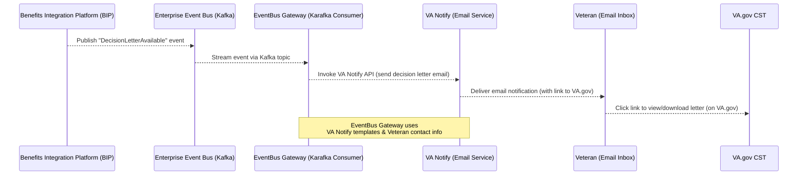

```markdown
# Event-Driven Claim Status Notifications for Decision Letters (VA CST)

## Table of Contents

- [Executive Summary](#executive-summary)
- [Background and Requirements](#background-and-requirements)
  - [Event-Driven Architecture Overview](#event-driven-architecture-overview)
- [Implementation Workstreams and GitHub Traceability](#implementation-workstreams-and-github-traceability)
  - [Infrastructure Setup and EventBus Gateway Deployment](#infrastructure-setup-and-eventbus-gateway-deployment)
  - [Backend Application Changes (vets-api and EventBus Gateway)](#backend-application-changes-vets-api-and-eventbus-gateway)
  - [Frontend Integration (vets-website)](#frontend-integration-vets-website)
- [External Systems Integration](#external-systems-integration)
  - [Mocking and Testing Considerations](#mocking-and-testing-considerations)
  - [Operational Considerations](#operational-considerations)
- [Outstanding Work, Risks, and Recommendations](#outstanding-work-risks-and-recommendations)
  - [Open Questions](#open-questions)
  - [Risks](#risks)
- [References](#references)

---

## Executive Summary

The VA’s Claim Status Tool (CST) team is implementing an event-driven architecture to notify Veterans when a disability **decision letter** becomes available online. This initiative – tracked under Epic **#77622** – introduces a **VA Enterprise Event Bus** integration and **VA Notify** email alerts for new decision letters[^1][^2]. Key back-end work includes building a new **EventBus Gateway** service (a Kafka consumer using the Karafka framework) to consume “Decision Letter Available” events and trigger notification emails[^3][^4]. Front-end updates in VA.gov ensure the CST UI can surface decision letter availability (e.g. showing a **“Get your decision letters”** link) under feature flags[^5][^6].

**Progress:** The infrastructure for the EventBus Gateway has been established (new repository, Kubernetes/Helm setup on VA’s platform) and initial code is in development[^7][^8]. Several related GitHub issues and PRs cover onboarding the service to the platform, creating Helm charts, and planning CI/CD. The VA Notify integration is planned to send real-time emails via templates when the event is received. As of this report, major milestones – repository creation, dev environment setup, and back-end feature toggles for decision letters – are completed. Remaining work includes finalizing the event consumption logic, end-to-end testing in staging, and deploying the notification service to production. Potential risks involve coordination with external systems (Lighthouse event publishing, VA Notify templates) and ensuring Veteran contact preferences are respected. Overall, this event-driven approach aims to improve Veterans’ experience by reducing the need to manually check for letters and speeding their awareness of claim decisions[^9].

---

## Background and Requirements

**Epic #77622 – “Decision Letter Notification via Event Bus”:** This epic defines the goal of **notifying Veterans** when a new decision letter is ready in the Claim Status Tool[^1]. The user story envisions that *“as a Veteran who has a new decision letter available to download in CST, I need to receive a notification through some medium that reaches me, so I know it's available and don’t need to keep checking the CST page”*[^1]. The team’s hypothesis was that providing a timely digital notification will prompt Veterans to click the link and download the letter (via VA.gov or the VA Mobile app) promptly[^10]. This should increase user satisfaction and task completion, and reduce delays in Veterans taking next steps (e.g. filing an appeal)[^9].

### Event-Driven Architecture Overview

The solution leverages the **VA Enterprise Event Bus (EEB)** – an asynchronous event streaming platform (built on Apache Kafka) that connects VA systems[^3]. A specific **“Decision Letter Availability”** event stream exists on the Event Bus, which receives events from the Benefits Integration Platform (BIP) or other VBA systems whenever a claim is decided and a letter is generated[^3]. The CST team is developing an **EventBus Gateway** service, a Ruby on Rails application using the Karafka Kafka framework, to act as a **consumer** of these events[^4]. When a “decision letter available” event is consumed, the EventBus Gateway will execute logic to **notify the Veteran**, for example by sending an email via **VA Notify**[^4]. VA Notify is the VA’s enterprise notification service (powered by GovDelivery), providing an API to send emails, SMS, or push notifications to Veterans according to predefined templates and contact preferences[^11]. The EventBus Gateway will be deployed on the VA.gov platform (Veteran-facing Services Platform, VSP) alongside `vets-api`, making it one of the first VFS-team-built applications on that platform[^12].

In summary, the event-driven flow for decision letter notifications will be:


*Figure: Sequence of decision letter notification via VA Event Bus and VA Notify.* In this flow, when BIP (or another VBA system) marks a claim as **closed with a decision letter**, an event is published to the **Enterprise Event Bus**. The **EventBus Gateway** service (maintained by the CST team) listens on the appropriate Kafka topic and, on receiving the event, calls **VA Notify’s REST API** to send an email (using a pre-configured template for decision letter notifications) to the Veteran[^4][^11]. The email directs the Veteran to VA.gov to download their decision letter. This decoupled architecture ensures Veterans get real-time updates without needing to log in repeatedly to check their claim status.

---

## Implementation Workstreams and GitHub Traceability

The development effort has spanned multiple repositories and workstreams. The primary Epic (#77622) is labeled as an **Epic** under the Benefits Management Tools team, covering the Claim Status Tool and notifications[^13]. Under this epic, the team created several child issues and tasks in the **`va.gov-team`** repo and implemented code changes in **`vets-api`**, **`vets-website`**, and new infrastructure repos. Below is a mapping of key workstreams, with references to GitHub issues (by number) and related code components:

```mermaid
flowchart TB
    subgraph "Planning & Infrastructure"
      direction TB
      epic["Epic 77622:<br/>Decision Letter Notification"]:::epic
      subgraph Infra[""]
        direction TB
        epic -- "Onboard new service to VSP" --> i90484["#90484: Onboard eventbus-gateway to platform"]:::issue
        i90484 --> repo[(New **eventbus-gateway** GitHub repo)]:::repo
        i90484 --> argocdPR[(VSP ArgoCD config PR)]:::pr
        epic -- "Dev environment questions" --> i96083["#96083: Questions on infra setup"]:::issue
        epic -- "Helm chart for deployment" --> i95680["#95680: Basic Helm chart for Gateway"]:::issue
        i95680 --> manifests[(VSP application manifests repo<br/>(Helm configs))]:::repo
        epic -- "Infra & CI/CD roadmap" --> i95689["#95689: CI/CD roadmap planning"]:::issue
      end
    end
    subgraph "Backend Implementation"
      direction TB
      vetsAPI[(vets-api code)]:::repo
      gateway[(eventbus-gateway code)]:::repo
      epic -- "Publish event or trigger notify" --> vetsAPI
      epic -- "Consume event & send email" --> gateway
      gateway -- "Uses Karafka (Kafka consumer)" --> EEBTopic[(Kafka Topic<br/>\"DecisionLetterAvailable\")]
      vetsAPI -- "Claim status & letter download APIs" --> BIPAPI[(BIP / EVSS APIs)]
    end
    subgraph "Frontend & Feature Flags"
      direction TB
      vetsWeb[(vets-website code)]:::repo
      epic -- "UI: show decision letters link" --> vetsWeb
      vetsWeb -- "Feature toggles" --> flipper[(Flipper flags<br/>cst_include_ddl_*)]
    end
    classDef epic fill:#ffd,stroke:#333,stroke-width:1px;
    classDef issue fill:#e0f7ff,stroke:#0277BD,stroke-width:1px;
    classDef repo fill:#fff,stroke:#666,stroke-dasharray: 2 2;
    classDef pr fill:#ffe0b3,stroke:#CC6600,stroke-width:1px;
```

*Figure: Epic #77622 and related tasks mapped to repositories and components.* The **Planning & Infrastructure** workstream includes Issue #90484 to create and onboard the new **`eventbus-gateway`** service into the VSP platform (triggering an automated Argo CD config PR)[^7], Issue #96083 for discussions on setting up the dev environment (Slack thread consultation)[^14], Issue #95680 to create a Helm chart and deployment manifest for the service[^8], and Issue #95689 to draft a development roadmap for infrastructure/CI-CD which was later closed once the roadmap was documented[^15]. The **Backend Implementation** stream covers changes in **`vets-api`** (ensuring that when a decision letter is available, the event is recognized or logged, and providing the API endpoints for the front-end to download letters) and the development of the **EventBus Gateway** service which consumes the Kafka topic and calls VA Notify[^4]. The **Frontend & Feature Flags** stream covers the **`vets-website`** updates to display decision letter information to users when enabled, controlled by feature flags like `cst_include_ddl_5103_letters`, `cst_include_ddl_boa_letters`, etc., in the Flipper feature toggle system[^5][^6].

### Infrastructure Setup and EventBus Gateway Deployment

From the outset, the CST team recognized that deploying a new Kafka-consuming service on the VA.gov platform would require significant DevOps work. They coordinated closely with the VSP (platform) team to provision the **EventBus Gateway**. Key steps included:

-   **Repository Creation and Onboarding:** A new GitHub repository **`department-of-veterans-affairs/eventbus-gateway`** was created to house the service’s source code[^16]. The team then filed **Issue #90484 “Application to Onboard: eventbus-gateway”** in `va.gov-team` to integrate this app with VSP infrastructure[^7]. Onboarding triggers an automated process in which an **Argo CD** application is generated for the new service on all environments (Dev, Staging, etc.) via the **`vsp-infra-argocd`** configs[^17]. Indeed, opening #90484 kicked off an automated Argo PR in the `vsp-infra-argocd` repo to create the initial deployment configuration for `eventbus-gateway`[^17].

-   **Development Environment (Argo CD Setup):** There were challenges in setting up a dev environment because this was the first non-Platform-owned app on VSP. The team opened **Issue #96083** (“Hey y’all, I have some questions about how to get started…”) to discuss infrastructure questions[^14]. In parallel, a VSP platform engineer helped create a **development Argo CD application** exclusively for the BMT team’s use during initial development[^18]. This included provisioning a separate Kubernetes namespace and Argo CD config where the team’s iterative Helm chart changes could sync without impacting other apps[^18]. Several platform PRs were merged to set this up (e.g. creating the dev Argo app, creating an additional K8s namespace, documentation updates)[^18].

-   **Helm Chart and Manifests:** The EventBus Gateway, like other VSP apps, uses a **Helm chart** to define its Kubernetes deployment (deployments, services, etc.). The team opened **Issue #95680** (“[EventBus Gateway] Create a basic helm chart with a sample Deployment…”) to track writing this chart[^8]. They created a long-lived branch (`eventbus-gateway-init-dev`) in the **`vsp-infra-application-manifests`** repository to iterate on Helm configs for dev[^8]. Notably, because each environment requires a separate set of manifests, they aimed to keep the configuration DRY by possibly referencing a single chart source (similar to how `vets-api`’s chart is handled via a separate branch)[^19][^20]. Work on the Helm chart progressed, but at one point was paused to consolidate knowledge into a roadmap.

-   **Development Roadmap:** To manage the complexity, the team drafted a **development roadmap** for infrastructure and CI/CD. This was captured in **Issue #95689**, which outlined the sequence of steps from dev to production deployment[^15]. Once the roadmap was documented (including parallelization of some tasks), that issue was closed[^15]. The roadmap emphasized tasks like containerization (Dockerfile creation), GitHub Actions CI pipelines for the new service, and how to promote images to higher environments[^20][^21]. For example, the plan is to build and push Docker images to AWS ECR on each merge, tag images by commit SHA for dev deploys, and later use versioned tags for production releases[^22].

Overall, by late 2024 the infrastructure groundwork was largely in place: the **`eventbus-gateway` repository** existed, a dev instance of the service could be deployed via Argo in a controlled namespace, and Helm charts/CI scripts were under development. This foundational work enables the team to focus on the application logic of consuming events and sending notifications.

### Backend Application Changes (`vets-api` and EventBus Gateway)

On the **`vets-api`** side (the existing VA.gov back-end API), changes related to decision letters have been moderate, since the heavy lifting is intended to occur in the new Gateway service. `vets-api` already provides the **Claim Status API** and the **Download Letters API** (used by the front-end to fetch decision letter PDFs). However, a few updates were made to support the event-driven approach and ensure a smooth integration:

-   **Feature Flags for Decision Letters:** `vets-api` introduced feature toggles to govern the new decision letter features. For example, `cst_include_ddl_5103_letters`, `cst_include_ddl_boa_letters`, and `cst_include_ddl_sqd_letters` were added to conditionally include certain types of decision letters (5103 notice letters, Board of Appeals letters, Subsequent Development Letters) in the CST UI[^23][^24]. These flags allowed incremental rollout of the “Download Letters” feature by letter type. All three flags are currently enabled in all environments (fully enabled)[^25], indicating that the CST now supports downloading all those decision letter categories.

-   **Logging and Event Hooks:** To aid in monitoring and debugging, a feature flag was noted in configuration with description “Logs decision letter info on both claims and decision letter endpoint.” (seen in the Flipper UI). This suggests that `vets-api` may have added extra logging when a letter becomes available or when those endpoints are hit, possibly to double-check if an event was missed. While the exact implementation isn’t shown here, it likely logs whenever a new letter is fetched from upstream (BIP/EVSS) – information that could be used to manually trigger events if needed or verify the event bus is working.

-   **Event Publishing (if applicable):** Ideally, the **source of truth** for a new letter is an upstream system (like BIP) which emits the event. If, however, that integration were delayed, `vets-api` could serve as a fallback by publishing an event to the Event Bus when it detects a new letter. There is no clear evidence in public commits that `vets-api` is currently acting as a **Kafka producer** for decision letter events – the architecture leans towards using the upstream events. The CST team’s engineering notes indicate the EventBus *consumes events from other systems within BIP*[^3], not from `vets-api`. Therefore, `vets-api`’s role is mostly **consumption and exposure** of claim data. We did not find specific commits in `vets-api` referencing Kafka or Karafka, which supports the idea that event production is handled by BIP (and thus out-of-scope for `vets-api` code).

The primary application development is happening in the **EventBus Gateway** service (which will run separately from `vets-api`). In that service, the team is implementing:

-   **Kafka Consumer Setup:** Using Karafka, the gateway subscribes to the **`DecisionLetterAvailable`** topic on the Event Bus[^4]. This involves configuration of the Kafka broker (pointing to Lighthouse’s infrastructure) and defining a consumer worker (likely in Ruby) that will handle incoming messages. The Karafka framework would manage the polling and ensure reliable consumption. This service is likely configured to deserialize event messages (which might contain Veteran identifiers, claim ID, etc., but not actual PII beyond IDs) needed to trigger the notification.

-   **Notification Trigger Logic:** Upon receiving an event, the gateway needs to **send an email via VA Notify**. VA Notify provides a REST API and a Ruby client library (`VaNotify` module) which is already used in `vets-api` for other notifications (e.g. form submission confirmations). The gateway service can either reuse that library or make direct HTTP calls. The content of the email is template-driven: the Notify service expects a template ID and personalisation data. The CST team would have created a template in VA Notify’s system (likely via their self-service portal) for “Claim Decision Letter Available” with placeholders for Veteran name, maybe a link to the VA.gov letters page, etc. When the event is processed, the gateway calls VA Notify with the Veteran’s email address (retrieved via MPI/VA Profile or possibly included in the event) and the template ID to send the message. VA Notify is **designed as a pass-through** service – it does not itself decide when to send notifications, it only sends when instructed[^26][^27]. Thus, the onus is on our gateway to call it every time an event occurs. The Notify platform will, however, honor the Veteran’s communication preferences (checking if the Veteran opted out of email, in which case it might not send)[^28]. This ensures we don’t send emails to Veterans who prefer paper mail only, for example.

-   **VA Profile / Contact Data:** A crucial integration is obtaining the Veteran’s email address (and ensuring it’s up to date). Likely, the EventBus event payload contains the Veteran’s identifiers (like EDIPI or ICN). The gateway service may need to call **VA Profile** (the source of contact info) or leverage an existing cache in `vets-api` to get the email. It’s also possible that the event bus could forward contact info, but passing PII via events is usually avoided. So, implementing a lookup to VA Profile service is a probable step for the gateway. (This detail is not explicitly in the issues, but is an important part of the design.)

-   **Feature Flag / Toggle for Notifications:** It’s worth noting that because the EventBus Gateway runs separately, the typical Flipper flags in `vets-api`/`vets-website` don’t directly control it. The team might implement an **internal toggle** or configuration setting (perhaps an environment variable or a setting in the gateway) to enable/disable actually sending notifications, especially during testing. For example, they might run the consumer in a “dry-run” mode initially, logging events without calling Notify, until they are confident in production.

-   **Error Handling and Retries:** Using Kafka and Notify introduces new points of failure – e.g., what if Notify API is down or email delivery fails. The gateway service should include error handling: Karafka can be configured with at-least-once processing (it can retry processing or leave the message in the queue if an error occurs). The `VANotify::NotificationEmail` utility in `vets-api` logs metrics for delivery success/failure[^29] which the gateway could also utilize. It’s likely the team will implement similar monitoring in the gateway to track notification outcomes (perhaps emitting StatsD metrics or log entries for successes and failures).

To date, because the EventBus Gateway code repository is not public, we rely on the issue descriptions to infer progress. The creation of the repo and manifest indicates coding has started. When the gateway is closer to completion, we expect to see a pull request linking it to this epic or commits referencing “decision letter event consumption.” The **event-driven notification feature is still in progress** as of early 2025 – once the gateway service is fully deployed, the epic #77622 can be closed.

### Frontend Integration (`vets-website`)

On the front-end, the Claim Status Tool needed updates to inform users about decision letters and guide them to the downloads. Much of this front-end work was actually done earlier when the CST first introduced online decision letters (as a feature in 2021–2022). That initial implementation provided a UI page where Veterans can **view and download their decision letters** (PDFs) for completed claims. The current event-driven project doesn’t drastically change the UI, but a few conditional enhancements were made or confirmed:

-   **“Get your decision letters” Link and Alert:** In the claim status UI, after a claim is marked complete, the interface now can show a message prompting the user that they can download their decision letter online. For example, for appeals, once a Board of Appeals decision is ready, the UI displays: *“You can download your decision letter online now. You can also get other letters related to your claims and appeals.”* with a link labeled **“Get your decision letters”** pointing to the letters download page[^5][^6]. This is only shown if the feature toggle for decision letters is on. The code uses a `<Toggler>` component tied to `cstIncludeDdlBoaLetters` (and similarly for other letter types) to conditionally render this snippet[^5]. As of now, those toggles are enabled for all users, so everyone with a decided claim should see the link.

-   **Letters Download Page:** The link `/your-claim-letters` leads to a dedicated page (in `vets-website`) where all available decision letters are listed for the user to download. This page calls the `vets-api` endpoint (likely `/v0/claims/letters`) to fetch metadata and provides download buttons for each PDF. The existence of this page predates the event bus project, but ensuring it works for all letter types and is easily discoverable was part of enabling the feature flags. No additional changes were needed here except possibly UI copy tweaks or ensuring new letter types (5103, etc.) are labeled appropriately.

-   **No Real-Time UI Notifications (yet):** It’s important to note that **the CST web app itself does not receive push events** from the backend. The notification to the Veteran is done via email (or potentially SMS in the future) through external channels. When the Veteran visits the site, the information is there, but if they are actively viewing their claim at the moment it closes, the page isn’t automatically updating in real-time. A potential enhancement (not currently in scope) could be using websockets or server-sent events to push a notification on the site, but this would add complexity. For now, the **email is the primary notification**, and the front-end just needs to correctly reflect that a letter is available upon refresh.

-   **Mobile App Integration:** Although not explicitly asked, it’s worth mentioning the VA Mobile app also utilizes the same `vets-api`. The Mobile team can leverage the event bus too. In fact, the user story mentioned veterans might download via **the Mobile App** as well[^10]. Likely, the mobile app will also get a push notification via a similar mechanism (possibly VA Notify can trigger a push notification to the flagship mobile app, since VA Notify supports push channels[^30]). This would parallel the email workflow. The mobile app uses Lighthouse’s claims API in some cases (feature flag `mobile_lighthouse_claims`[^31]), but for decision letters it may still rely on the same event triggers and `vets-api` for the actual document. Coordination with mobile is implied but not detailed in the epic.

In summary, the front-end changes ensure that if a user comes to VA.gov after their claim is decided, they will clearly see that their letter is ready and can be downloaded. The **feature toggles** that once limited this to pilot users or specific letter types have been turned on broadly[^25], making the feature generally available. The **notification itself is out-of-band** (email), so front-end work was relatively limited in this phase.

---

## External Systems Integration

Implementing this feature required understanding and integrating with several VA enterprise systems:

-   **VA Enterprise Event Bus (EEB):** The EEB is an asynchronous messaging platform using Apache Kafka, managed under the Lighthouse program[^3]. It acts as a **broker for events** across VA systems. For this project, the relevant component is the *Decision Letter Availability* event producer within VBA’s BIP. Whenever a claim is completed and a decision letter is generated in VA systems (for example, in VBMS or BIP’s data store), an event message is published to the Event Bus indicating that a decision letter is available for a particular Veteran[^3]. The CST team’s EventBus Gateway subscribes to this. The **Event Bus Developer Portal** (`ves-event-bus`) provides documentation for topics and schemas, ensuring the team knows how to parse the event. Since the Event Bus is a shared resource, the team had to get appropriate **access credentials, topic names, and possibly VPN connectivity** to the Lighthouse Kafka brokers (especially for dev/staging which might be firewalled). These details would have been coordinated internally. The Event Bus is in production and fairly stable as per Lighthouse documentation, so it’s a reliable backbone[^32].

-   **EventBus Gateway Service (CST-owned):** Though part of our architecture, this service is essentially a **bridge** between the Event Bus and VA Notify. It lives in the VA.gov ecosystem (VSP EKS cluster) but communicates with Lighthouse’s Kafka and OIT’s VA Notify. Being the first VFS-team-managed app on VSP, the gateway set precedents for how tenant apps can operate on the platform[^12]. The team had to work through **DevOps “firsts”** (like new Helm charts, Argo config) and this experience is documented as “growing pains” for the initial deployment[^12]. Once deployed, the gateway continuously runs consumers for the needed topics.

-   **VA Notify (Enterprise Notification Platform):** VA Notify is a centrally managed service for sending out notifications (email, SMS, push) to Veterans[^11]. It provides REST APIs, and requires **onboarding** any new notification use case. The CST team would have needed to register their service/notifications with VA Notify, obtain an API key or OAuth credentials to call the API, and create notification templates. The template defines the content of the decision letter email. Likely, the email includes a friendly message such as “Your VA claim decision letter is now available online. Please log in to VA.gov to view or download your letter.” and possibly instructions or a direct deep link. VA Notify ensures compliance with Veteran communication preferences by checking a Veteran’s contact info and consent before sending[^28]. In staging or dev, Notify can be configured to send to a **“fake” email (sink)** or a limited list of test accounts so as not to accidentally email real users. It’s not explicitly stated, but presumably the team worked with the Notify team (`#va-notify` Slack channel) to set this up. In production, once turned on, Notify will actually deliver the emails to Veterans. (A success criteria for the epic will be verifying that Veterans indeed receive these emails when their claims close.)

-   **Lighthouse APIs and BIP:** The CST historically used an API from EVSS for claim status, but in recent times the VA Lighthouse team has built a modern Claims API. It’s noted that the Event Bus is part of Lighthouse’s delivery infrastructure[^33], which means Lighthouse is facilitating the transfer of BIP events out to other consumers. The **Benefits Integration Platform (BIP)** is internal to VBA and likely where the events originate. There might also be dependency on BIP to ensure each decision letter event is unique and contains needed data. If any mismatch occurs (e.g., an event published but `vets-api` hasn’t yet updated the claim status), the team might need to handle that gracefully (maybe a slight delay in sending the email until the letter PDF is actually accessible). Coordination with BIP is probably handled by the platform team who manages the event bus pipeline.

### Mocking and Testing Considerations

In lower environments (development, CI, unit tests), direct integration with these external systems can be challenging, so the team likely employed some strategies:

-   For **Kafka/Event Bus**: In local development, engineers can run a local Kafka broker or use Karafka’s testing features to simulate receiving an event. The EventBus Gateway could have a configuration to connect to a **local Kafka** topic when running in Docker-compose, for example. Alternatively, the team may use a **sandbox Kafka cluster** provided by Lighthouse for testing. The issues hint that Lighthouse uses a GitHub Container Registry for some environments[^34], but on VSP they use AWS ECR; this suggests separation of environments. It’s likely that in dev/staging, the EventBus Gateway is pointed at a **test topic** or a dummy event stream to test end-to-end without impacting real users.

-   For **VA Notify**: VA Notify has a staging environment (with a separate API key and endpoint) where emails can be sent to test addresses. The team can configure the gateway with the staging API key in dev/staging. Additionally, Notify offers a feature to *not actually send* emails in lower env (or send all to a fixed address) which can be used to validate the payloads. During unit testing of the gateway, the Notify API calls would be stubbed out (e.g., using `webmock` in Ruby to simulate a success response).

-   For **VA Profile**: If the gateway needs to look up contact info, it would call an internal API (perhaps `vets-api` or a directly the VA Profile SOAP service). In a test environment, they might skip this by using a known test email or include it in the event for simplicity. Ensuring tests don’t call production services is standard practice.

### Operational Considerations

The integration points also pose some **operational considerations**: The team must monitor the system in production – e.g., ensure the Kafka consumer stays connected (if it crashes or lags behind, alerts should fire), and track notification delivery metrics. They likely will collaborate with DevOps to set up logging, alerts (perhaps using CloudWatch or Grafana via StatsD metrics). For instance, incrementing a StatsD counter for every letter notification sent (as seen in `VANotify::NotificationEmail` module) can feed into Grafana dashboards[^29].

---

## Outstanding Work, Risks, and Recommendations

As of the latest updates (early 2025), the event-driven notification feature is **nearing completion** but a few steps remain:

-   **Full Deployment to Production:** The EventBus Gateway service needs to be thoroughly tested in lower environments and then rolled out to Production. Deployment will involve coordination – turning it on likely requires confidence that the events are flowing. A risk is if the service is deployed but Kafka events are not coming through (or if the gateway isn’t authorized correctly to the Kafka topic). It might be wise to do a soft launch: e.g., deploy the gateway in prod but initially have it only log events for a period, cross-check that for every event logged an actual letter was available, and then enable the Notify calls. This mitigates the risk of false notifications.

-   **Ensuring No Missing Notifications:** If for any reason an event is not processed (service downtime, etc.), the team should consider fallback mechanisms. One idea is to run a periodic job (maybe in `vets-api`) to find any recently closed claims that did not trigger an email and send it late. However, over time if the pipeline is stable, this may not be needed. Initially, though, such a safety net could be useful to catch any that slip through.

-   **Veteran Experience Considerations:** Now Veterans will get an email as soon as their letter is ready. One risk is if the letter is posted late at night – the Veteran might get an email at 2 AM, which is fine, but the content should reassure that this is an expected communication (to not alarm them). The template should be clear and concise. Another consideration: If a Veteran has multiple claims that close around the same time, will they get multiple emails? The system should handle that (likely yes, one email per claim’s letter). This is fine, but just a UX note.

-   **Opt-Out and Preferences:** Some Veterans might prefer physical mail only. VA Notify, as noted, checks **communication preferences**[^28]. The team should verify how this works: VA.gov profile settings allow Veterans to opt out of certain notifications. If a Veteran has turned off “Claims updates” emails, then we should respect that. It’s likely VA Notify’s integration with VA Profile will automatically *not send* if the preference is off, but testing this scenario is important. Similarly, if an email bounces or fails (because the email on file is outdated), Notify will log that. The CST team might want to get access to those failure logs to follow up (perhaps update contact info prompts).

-   **Scaling and Performance:** The volume of claims decisions per day can be high (hundreds or thousands). Kafka can handle this scale easily, but the gateway and Notify need to as well. Notify is built for scale and the email throughput is high, so not a major issue. The gateway service will likely be deployed with at least a couple of pods/instances for redundancy. Kafka consumers in a consumer group will naturally load-balance events, which is good. The team should ensure the consumer group is configured properly so that if they scale the pods, events are evenly consumed.

-   **Future Enhancements:** Once this framework is in place, the VA can extend it. For example, sending an SMS in addition to email (if the Veteran has a mobile number and opted in). The EventBus Gateway could call Notify for SMS or push notifications concurrently. Or the team could integrate other event types. For instance, if a claim moves to a new phase, an event could trigger a notification (though currently they chose specifically the decision letter event as it’s a clear win). Another idea is to feed these events into an on-site notification center – e.g., showing a notification on VA.gov when the user logs in. Currently, VA.gov does not have a user inbox/notification center, but such a feature could re-use these events in the future.

### Open Questions

A few aspects might still be being worked out:

-   *What is the exact content and template of the notification?* Has the content team reviewed the email for clarity and tone?
-   *How does the system handle letters that are updated or corrected?* (Unlikely scenario: if a letter is pulled and reissued, would there be a second event? Would we send a second email? Probably out-of-scope.)
-   *Are there any security/PII concerns?* The email should not contain sensitive info beyond maybe the claim type or a generic statement, since email isn’t secure. It should just prompt the user to log in to see details.
-   *Monitoring success:* How will the team measure success of this feature? Likely by Medallia survey improvements (as mentioned in OKRs) and by tracking email click-through rates (Notify can provide open/click metrics via UTM links[^35]). They might also monitor if there’s a drop in the average time between decision date and letter download date.

### Risks

Aside from those already mentioned (missed events, preference mismatches), another risk is **dependencies** – if the upstream event is not sent consistently. The CST team should collaborate with BIP to ensure every type of claim closure they care about does emit the event. For example, original compensation claims vs supplemental claims vs appeals might have different systems. The epic labels include **Claim Status Tool** and not specifically appeals, so it’s probably focused on VBA claims (which BIP covers). Appeals (AMA appeals) might be handled in a different way (the code toggle `cst_include_ddl_boa_letters` suggests they do get Board of Veterans’ Appeals letters too). As long as those also result in events on the bus, the gateway can unify the handling.

---

In conclusion, the **event-driven notification architecture** for the Claim Status Tool is a significant enhancement that modernizes how Veterans are informed of claim decisions. It combines **Lighthouse’s Enterprise Event Bus** for cross-system messaging[^3] with **VA Notify’s multi-channel outreach** capabilities[^11]. The CST team has navigated novel engineering territory (deploying a custom Kafka consumer service on the VA.gov platform) and put in place the necessary pieces (infrastructure, feature flags, and backend logic) to support this. Once fully launched, Veterans will no longer need to repeatedly check VA.gov for a status update – they will be proactively **notified** the moment their decision letter is ready, aligning with the VA’s goal of improving the Veteran experience through timely and convenient digital services[^9].

---

## References

[^1]: [Event Bus: Creating notification for when decision letter is available · Issue #77622 · department-of-veterans-affairs/va.gov-team](https://github.com/department-of-veterans-affairs/va.gov-team/issues/77622#:~:text=As%20a%20veteran%20who%20has,excessively%20and%20refresh%20the%20page) - Epic definition, user story.
[^2]: [Event Bus: Creating notification for when decision letter is available · Issue #77622 · department-of-veterans-affairs/va.gov-team](https://github.com/department-of-veterans-affairs/va.gov-team/issues/77622#:~:text=EventBus%20Gateway%20is%20a%20Rails,a%20Veteran%20via%20VA%20Notify) - Mention of EventBus Gateway and VA Notify.
[^3]: [Event Bus: Creating notification for when decision letter is available · Issue #77622 · department-of-veterans-affairs/va.gov-team](https://github.com/department-of-veterans-affairs/va.gov-team/issues/77622#:~:text=What%20is%20EventBus%3F%20What%20is,EventBus%20Gateway) - Description of Event Bus and event source (BIP).
[^4]: [Event Bus: Creating notification for when decision letter is available · Issue #77622 · department-of-veterans-affairs/va.gov-team](https://github.com/department-of-veterans-affairs/va.gov-team/issues/77622#:~:text=EventBus%20Gateway%20is%20a%20Rails,a%20Veteran%20via%20VA%20Notify) - Description of EventBus Gateway (Rails/Karafka consumer) sending via VA Notify.
[^5]: [`vets-website/.../appeals-v2-helpers.jsx` - Decision Letter Link](https://github.com/department-of-veterans-affairs/vets-website/blob/master/src/applications/claims-status/utils/appeals-v2-helpers.jsx#:~:text=) - Example frontend code showing decision letter link.
[^6]: [`vets-website/.../appeals-v2-helpers.jsx` - Toggler Component](https://github.com/department-of-veterans-affairs/vets-website/blob/master/src/applications/claims-status/utils/appeals-v2-helpers.jsx#:~:text=) - Example frontend code using feature toggles (`<Toggler>`).
[^7]: [Event Bus: Creating notification for when decision letter is available · Issue #77622 · department-of-veterans-affairs/va.gov-team](https://github.com/department-of-veterans-affairs/va.gov-team/issues/77622#:~:text=%2A%20Jerek%20created%20the%20eventbus,setting%20up%20a%20development%20environment) - Mention of repo creation and onboarding issue #90484.
[^8]: [Event Bus: Creating notification for when decision letter is available · Issue #77622 · department-of-veterans-affairs/va.gov-team](https://github.com/department-of-veterans-affairs/va.gov-team/issues/77622#:~:text=,roadmap%20above%2C%20closing%20%2099) - Mention of Helm chart issue #95680 and manifests repo branch.
[^9]: [Event Bus: Creating notification for when decision letter is available · Issue #77622 · department-of-veterans-affairs/va.gov-team](https://github.com/department-of-veterans-affairs/va.gov-team/issues/77622#:~:text=Which%20Objective%20%2F%20Key%20Result,does%20this%20epic%20push%20forward) - Link to OKRs (satisfaction, task completion).
[^10]: [Event Bus: Creating notification for when decision letter is available · Issue #77622 · department-of-veterans-affairs/va.gov-team](https://github.com/department-of-veterans-affairs/va.gov-team/issues/77622#:~:text=If%20we%20provide%20a%20decision,CST%20or%20the%20Mobile%20App) - Hypothesis about prompting download via CST or Mobile App.
[^11]: [`va.gov-team/.../va-notify/README.md` - VA Notify Overview](https://github.com/department-of-veterans-affairs/va.gov-team/blob/master/products/va-notify/README.md#:~:text=a%20Veteran) - Overview of VA Notify service.
[^12]: [Event Bus: Creating notification for when decision letter is available · Issue #77622 · department-of-veterans-affairs/va.gov-team](https://github.com/department-of-veterans-affairs/va.gov-team/issues/77622#:~:text=VSP%20is%20the%20VA%20platform,and%20up%20to%20production%20launch) - Note about EventBus Gateway being first VFS app on VSP.
[^13]: [Event Bus: Creating notification for when decision letter is available · Issue #77622 · department-of-veterans-affairs/va.gov-team](https://github.com/department-of-veterans-affairs/va.gov-team/issues/77622#:~:text=benefits,68%20%20notifications) - Epic labels showing team and focus (notifications).
[^14]: [Event Bus: Creating notification for when decision letter is available · Issue #77622 · department-of-veterans-affairs/va.gov-team](https://github.com/department-of-veterans-affairs/va.gov-team/issues/77622#:~:text=repository.%20,namespace%20for%20development%20Argo%20CD) - Mention of infra setup questions issue #96083.
[^15]: [Event Bus: Creating notification for when decision letter is available · Issue #77622 · department-of-veterans-affairs/va.gov-team](https://github.com/department-of-veterans-affairs/va.gov-team/issues/77622#:~:text=application%20set%20up%20by%20the,95689) - Mention of CI/CD roadmap issue #95689.
[^16]: [Event Bus: Creating notification for when decision letter is available · Issue #77622 · department-of-veterans-affairs/va.gov-team](https://github.com/department-of-veterans-affairs/va.gov-team/issues/77622#:~:text=%2A%20Jerek%20created%20the%20eventbus,about%20how%20to%20get%20started) - Confirmation of `eventbus-gateway` repo creation.
[^17]: [Event Bus: Creating notification for when decision letter is available · Issue #77622 · department-of-veterans-affairs/va.gov-team](https://github.com/department-of-veterans-affairs/va.gov-team/issues/77622#:~:text=,team%20can%20manage%20during%20initial) - Mention of Argo CD config PR triggered by onboarding.
[^18]: [Event Bus: Creating notification for when decision letter is available · Issue #77622 · department-of-veterans-affairs/va.gov-team](https://github.com/department-of-veterans-affairs/va.gov-team/issues/77622#:~:text=wi...%20,development%20Argo%20CD%20application%20working) - Details on setting up dev Argo CD application and namespace.
[^19]: [Event Bus: Creating notification for when decision letter is available · Issue #77622 · department-of-veterans-affairs/va.gov-team](https://github.com/department-of-veterans-affairs/va.gov-team/issues/77622#:~:text=A%20note%20on%20duplication%20in,repository%2C%20a%20directory%20on%20the) - Note on avoiding Helm chart duplication.
[^20]: [Event Bus: Creating notification for when decision letter is available · Issue #77622 · department-of-veterans-affairs/va.gov-team](https://github.com/department-of-veterans-affairs/va.gov-team/issues/77622#:~:text=Once%20an%20application%20has%20a,gateway) - Mention of Helm chart source and CI/CD roadmap.
[^21]: [Event Bus: Creating notification for when decision letter is available · Issue #77622 · department-of-veterans-affairs/va.gov-team](https://github.com/department-of-veterans-affairs/va.gov-team/issues/77622#:~:text=initial%20MVP%20CD%20pipeline%20should,gateway) - Details on CI pipeline goals.
[^22]: [Event Bus: Creating notification for when decision letter is available · Issue #77622 · department-of-veterans-affairs/va.gov-team](https://github.com/department-of-veterans-affairs/va.gov-team/issues/77622#:~:text=,environments%2C%20the%20image%20tag%20is) - Details on Docker image tagging strategy.
[^23]: [`vets-api/config/features.yml` - DDL Feature Flags](https://github.com/department-of-veterans-affairs/vets-api/blob/master/config/features.yml#:~:text=cst_include_ddl_5103_letters%3A) - Example feature flag `cst_include_ddl_5103_letters`.
[^24]: [`vets-api/config/features.yml` - BOA Feature Flag](https://github.com/department-of-veterans-affairs/vets-api/blob/master/config/features.yml#:~:text=cst_include_ddl_boa_letters%3A) - Example feature flag `cst_include_ddl_boa_letters`.
[^25]: [Features // Flipper](https://api.va.gov/flipper/features#:~:text=cst_include_ddl_sqd_letters%20When%20enabled%2C%20the%20Download,debts_copay_logging%20Logs%20copay%20request) - Flipper UI showing DDL flags are fully enabled.
[^26]: [`va.gov-team/.../va-notify/README.md` - VA Notify Design](https://github.com/department-of-veterans-affairs/va.gov-team/blob/master/products/va-notify/README.md#:~:text=What%20we%20are) - Note that Notify is a pass-through service.
[^27]: [`va.gov-team/.../va-notify/README.md` - VA Notify Location](https://github.com/department-of-veterans-affairs/va.gov-team/blob/master/products/va-notify/README.md#:~:text=VA%20Notify%20is%20located%20within,so%20clicks%20can%20be%20captured) - Note that Notify handles delivery and click tracking.
[^28]: [`va.gov-team/.../va-notify/README.md` - VA Notify Preferences](https://github.com/department-of-veterans-affairs/va.gov-team/blob/master/products/va-notify/README.md#:~:text=VA%20Notify%20is%20designed%20to,preferences%20before%20notifying%20a%20Veteran) - Note that Notify checks communication preferences.
[^29]: [`VANotify::NotificationEmail` Rubydoc - Monitoring](https://www.rubydoc.info/github/department-of-veterans-affairs/vets-api/VANotify/NotificationEmail#:~:text=def%20monitor_deliver_success,statsd%3A%20metric%2C%20context%3A) - Documentation showing monitoring of email delivery via StatsD.
[^30]: [`va.gov-team/.../va-notify/README.md` - Supported Channels](https://github.com/department-of-veterans-affairs/va.gov-team/blob/master/products/va-notify/README.md#:~:text=Supported%20notification%20channels%20) - Note that VA Notify supports push notifications.
[^31]: [Features // Flipper](https://api.va.gov/flipper/features#:~:text=mobile_filter_doc_27_decision_letters_out%20filters%20out%20doc%20type,endpoints%20upstream%20service%20Fully%20Enabled) - Flipper UI showing `mobile_lighthouse_claims` flag.
[^32]: [[PDF] Enterprise Event Bus PIA](https://department.va.gov/privacy/wp-content/uploads/sites/5/2024/05/FY24EnterpriseEventBusPIA_508.pdf#:~:text=%5BPDF%5D%20Enterprise%20Event%20Bus%20,allows%20producers%20to%20publish) - Official PIA document for Enterprise Event Bus.
[^33]: [Event Bus: Creating notification for when decision letter is available · Issue #77622 · department-of-veterans-affairs/va.gov-team](https://github.com/department-of-veterans-affairs/va.gov-team/issues/77622#:~:text=EventBus%20is%20a%20set%20of,events%20along%20to%20other%20systems) - Note that Event Bus is part of Lighthouse infrastructure.
[^34]: [Event Bus: Creating notification for when decision letter is available · Issue #77622 · department-of-veterans-affairs/va.gov-team](https://github.com/department-of-veterans-affairs/va.gov-team/issues/77622#:~:text=image%2C%20push%20it%20to%20an,were%20successful%2C%20another%20workflow%20runs) - Mention of GitHub Container Registry vs ECR.
[^35]: [`va.gov-team/.../va-notify/README.md` - Click Tracking](https://github.com/department-of-veterans-affairs/va.gov-team/blob/master/products/va-notify/README.md#:~:text=service%20web%20application%2C%20which%20is,so%20clicks%20can%20be%20captured) - Note that Notify can track clicks via UTM links.

```
