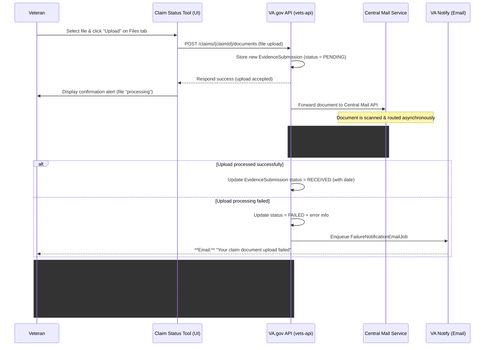

# Document Upload Status for VA Claim Status Tool (CST)

## Table of Contents

- [Background and Goals](#background-and-goals)
- [Vets-API (Backend) Implementation](#vets-api-backend-implementation)
  - [Status Updates](#status-updates)
  - [Failure Notifications](#failure-notifications)
  - [Feature Flags and Toggles](#feature-flags-and-toggles)
  - [Claim Status API Changes](#claim-status-api-changes)
  - [Edge-Case Handling](#edge-case-handling)
- [Vets-Website (Frontend) Implementation](#vets-website-frontend-implementation)
  - [Displaying Upload Status](#displaying-upload-status)
  - [Content and Design Enhancements](#content-and-design-enhancements)
  - [Feature Flag Usage](#feature-flag-usage)
  - [User Workflow Changes](#user-workflow-changes)
- [Developer Insights and Key Artifacts](#developer-insights-and-key-artifacts)
- [Sequence Diagram – Upload Journey](#sequence-diagram--upload-journey)
- [Development Artifact Flowchart](#development-artifact-flowchart)
  - [Explanation](#explanation)
- [Current Status and Future Enhancements](#current-status-and-future-enhancements)

---

## Background and Goals

The **“Document Upload Status”** feature was introduced to give Veterans immediate feedback on evidence they upload in the Claim Status Tool (CST). Previously, after uploading documents (e.g. medical records or forms) via the CST Files tab, Veterans had no visibility into whether the VA received or processed those files, leading to uncertainty and repeat submissions.

The primary goals of this initiative were to:
- **Improve transparency**
- **Reduce support calls** by showing real-time upload statuses in CST ([Features // Flipper](https://api.va.gov/flipper/features#:~:text=cst_show_document_upload_status%20When%20enabled%2C%20claims%20status,lookup%20job%20%20%20422))

In other words, Veterans should see if an upload is still processing or has been received, instead of wondering if it vanished. This work was part of the Q2 2025 CST roadmap and was tracked under the “Document Status” epic (`va.gov-team#103576`). It also encompassed related improvements like “silent failure” email notifications (alerting users if an upload fails behind the scenes) and content design updates for clarity.

---

## Vets-API (Backend) Implementation

On the backend (`vets-api`), the **`EvidenceSubmission`** model and database table were central to tracking upload state. Initial groundwork added this model and new columns for status and timestamps. Each evidence upload begins in a **“pending”** state and is recorded in the `evidence_submissions` table ([department-of-veterans-affairs/vets-api#20637](https://github.com/department-of-veterans-affairs/vets-api/pull/20637#:~:text=,upload_status_updater)). The VA.gov API (`vets-api`) then orchestrates sending the file to the VA’s **Central Mail** system (via the **Lighthouse VA Documents API**) for processing.

A feature flag `cst_show_document_upload_status` was introduced to gate these new behaviors ([`vets-api/config/features.yml`](https://github.com/department-of-veterans-affairs/vets-api/blob/master/config/features.yml#:~:text=cst_show_document_upload_status%3A)). When a Veteran uploads a file (e.g. via `POST /v0/claims/{id}/documents`), the API saves a new `EvidenceSubmission` record with status **`PENDING`** and sends the document to Central Mail.

### Status Updates

Since document processing is asynchronous, `vets-api` does not immediately mark uploads as “success.” Instead, a background **“document status polling”** job was implemented to periodically check with Central Mail (Lighthouse) for each upload’s outcome ([department-of-veterans-affairs/vets-api#20637](https://github.com/department-of-veterans-affairs/vets-api/pull/20637#:~:text=,model)). This polling service updates the `EvidenceSubmission` record when the document is either received or has failed.

- If Central Mail confirms receipt, the status is updated to **`RECEIVED`** and an acknowledgment timestamp is recorded ([department-of-veterans-affairs/vets-api#20637](https://github.com/department-of-veterans-affairs/vets-api/pull/20637#:~:text=,upload_status_updater)).
- If an error or rejection occurs (e.g. a corrupt file or virus detected), the status is set to **`FAILED`**, along with a failure timestamp and an error message for internal tracking ([department-of-veterans-affairs/vets-api#20637](https://github.com/department-of-veterans-affairs/vets-api/pull/20637#:~:text=,upload_status_updater)).

Notably, the code ensures an upload remains “pending” until an explicit success confirmation is received (an earlier bug had prematurely marked them success) ([department-of-veterans-affairs/vets-api#20637](https://github.com/department-of-veterans-affairs/vets-api/pull/20637#:~:text=,for%20regarding%20the%20upload_status)).

### Failure Notifications

To address “silent failures” (where a Veteran might not realize an upload failed), the team introduced email notifications. A new feature toggle `cst_send_evidence_submission_failure_emails` controls this behavior ([`vets-api/config/features.yml`](https://github.com/department-of-veterans-affairs/vets-api/blob/master/config/features.yml#:~:text=description%3A%20)). When enabled and an evidence upload ultimately **fails to send**, `vets-api` will trigger a **VA Notify** email to the Veteran informing them of the failure ([`vets-api/config/features.yml`](https://github.com/department-of-veterans-affairs/vets-api/blob/master/config/features.yml#:~:text=If%20enabled%20and%20a%20user,to%20the%20user%20and%20retried)).

The implementation uses a scheduled **`FailureNotificationEmailJob`** that runs periodically (cron) to find failed `EvidenceSubmissions` and send out emails ([department-of-veterans-affairs/vets-api#20637](https://github.com/department-of-veterans-affairs/vets-api/pull/20637#:~:text=,to%20test%20it)). The email content includes details like the document name and guidance to re-upload, improving the Veteran’s awareness. Importantly, the job was designed to retry or not based on configuration – when the flag is on, it will keep attempting to send the email until successful; if off, it sends once without retry ([`vets-api/config/features.yml`](https://github.com/department-of-veterans-affairs/vets-api/blob/master/config/features.yml#:~:text=If%20enabled%20and%20a%20user,to%20the%20user%20and%20retried)). These notifications close the loop for users who might otherwise never know their evidence wasn’t received. (For instance, if a PDF was blank or got corrupted in transit, the Veteran would get an “upload failed” email rather than silence.)

### Feature Flags and Toggles

Multiple feature flags were used to safely roll out this functionality:

-   **`cst_show_document_upload_status`**: The primary front-facing flag. When true, enables the exposure of upload status in the CST UI ([`vets-api/config/features.yml`](https://github.com/department-of-veterans-affairs/vets-api/blob/master/config/features.yml#:~:text=cst_show_document_upload_status%3A)). On the backend, this flag also gates adding the evidence submission status data to the API responses.
-   **`cst_send_evidence_submission_failure_emails`**: Guards the email notification feature (sometimes referenced as `upload_failure_notifications_enabled` in planning docs) ([`vets-api/config/features.yml`](https://github.com/department-of-veterans-affairs/vets-api/blob/master/config/features.yml#:~:text=description%3A%20)).
-   **`cst_synchronous_evidence_uploads`**: Controls whether uploads are handled synchronously or asynchronously ([`vets-api/config/features.yml`](https://github.com/department-of-veterans-affairs/vets-api/blob/master/config/features.yml#:~:text=cst_synchronous_evidence_uploads%3A)). In production this remains **disabled** (asynchronous mode) ([department-of-veterans-affairs/vets-api#20637](https://github.com/department-of-veterans-affairs/vets-api/pull/20637#:~:text=,acknowledgment%20dates%2C%20and%20deletion%20dates)), meaning the user isn’t blocked waiting for Central Mail – the file is accepted as pending and processed in the background.
-   **`benefits_documents_use_lighthouse`**: Determines whether to use the new Lighthouse/Central Mail route or fall back to the legacy EVSS route for document upload ([department-of-veterans-affairs/vets-api#20637](https://github.com/department-of-veterans-affairs/vets-api/pull/20637#:~:text=PR%20Changes%20for%20the%20poll,job)). The new status tracking requires the Lighthouse approach.

All these toggles allowed iterative development and safe deployment by toggling new code paths on or off as needed ([`va.gov-team#100037`](https://github.com/department-of-veterans-affairs/va.gov-team/issues/100037#:~:text=As%20a%20part%20of%20this,document_upload.rb)).

### Claim Status API Changes

The `GET /v0/claims/{id}` endpoint was enhanced to include evidence submission statuses when the feature is active. Specifically, developers added an “evidence submission section” to the claim details serializer/service so that each claim can return a list of its uploaded documents with current status ([`department-of-veterans-affairs/vets-api` Pull Requests](https://github.com/department-of-veterans-affairs/vets-api/pulls?q=document+upload+status+is%3Aclosed#:~:text=%5BCST%5D%20,passing)).

In addition, a helper boolean **`hasFailedUploads`** was added to each claim’s data ([`department-of-veterans-affairs/vets-api` Pull Requests](https://github.com/department-of-veterans-affairs/vets-api/pulls?q=document+upload+status#:~:text=match%20at%20L278%20hasFailedUploads%20for,passing)). This flag is true if any associated evidence submission for that claim has a failed status, enabling the front-end to quickly determine if the user needs to be alerted about a problem ([`department-of-veterans-affairs/vets-api` Pull Requests](https://github.com/department-of-veterans-affairs/vets-api/pulls?q=document+upload+status#:~:text=match%20at%20L278%20hasFailedUploads%20for,passing)). By March 2025, these changes were merged and available behind the feature toggle.

The backend also logs events for monitoring (a “Zero Silent Failure” logging was created to support Datadog dashboards/alerts on these upload outcomes ([`department-of-veterans-affairs/vets-api` Pull Requests](https://github.com/department-of-veterans-affairs/vets-api/pulls?q=document+upload+status+is%3Aclosed#:~:text=,passing))).

### Edge-Case Handling

-   A planned job to delete old `evidence_submissions` records once their `delete_at` date passes was identified (to prevent the database from growing indefinitely with old records) ([`va.gov-team#100037`](https://github.com/department-of-veterans-affairs/va.gov-team/issues/100037#:~:text=These%20tickets%20do%20not%20need,merged%20into%20the%20feature%20branch)). Although that cleanup task was noted as out-of-scope for the initial release, the table schema includes a deletion date for each record and the job was ticketed separately (`#94403`) ([`va.gov-team#100037`](https://github.com/department-of-veterans-affairs/va.gov-team/issues/100037#:~:text=These%20tickets%20do%20not%20need,merged%20into%20the%20feature%20branch)).
-   Another out-of-scope item was creating webhook endpoints for VA Notify (`#93324`) to update email delivery status on the `EvidenceSubmission` (e.g. to record if a notification email bounced or was received) ([`va.gov-team#100037`](https://github.com/department-of-veterans-affairs/va.gov-team/issues/100037#:~:text=These%20tickets%20do%20not%20need,merged%20into%20the%20feature%20branch)).

In summary, by mid-Q2 2025, the `vets-api` changes introduced a robust tracking system: an `EvidenceSubmission` record with **status values (`pending`/`received`/`failed`)**, timestamps for acknowledgment or failure, periodic polling of Central Mail for updates, and automated email alerts on failures ([department-of-veterans-affairs/vets-api#20637](https://github.com/department-of-veterans-affairs/vets-api/pull/20637#:~:text=,model), [department-of-veterans-affairs/vets-api#20637](https://github.com/department-of-veterans-affairs/vets-api/pull/20637#:~:text=,to%20test%20it)).

---

## Vets-Website (Frontend) Implementation

On the front-end (`vets-website`), the Claim Status Tool UI was updated to surface the new upload statuses to users in a clear, accessible way. These changes focused on the **“Files” tab of a claim detail** (where a Veteran uploads and sees their submitted documents). Under feature flag control, the interface now renders a status indicator for each uploaded evidence item.

The React application checks the `cst_show_document_upload_status` flipper flag (exposed via the VA.gov feature toggle API) and, if enabled, includes the evidence submissions data from the API in the Redux store or component state ([`department-of-veterans-affairs/vets-website` Issues](https://github.com/department-of-veterans-affairs/vets-website/issues?q=is%3Apr+author%3Apmclaren19#:~:text=1)).

### Displaying Upload Status

For each document a Veteran uploads, the Files tab will list the document (often by the type or filename) along with a status label and icon. The content design team chose plain-language labels:
-   A pending upload might show **“Still processing”** or **“In progress”** with a spinner icon.
-   A completed upload shows **“Received by VA”** with a checkmark.
-   A failed upload highlights it with an error state – e.g. **“Could not be processed”** – and prompts the user to take action (such as re-uploading the document).

All of this conditional rendering is gated behind the feature flag and uses data from the claim API response. If the flag is off, the Files tab simply confirms an upload was submitted (the legacy behavior). If the flag is on, it adds a status column or inline status message for each file. These UI changes were implemented in React components within the claims status app, with selectors pulling `claim.evidenceSubmission` info (including the `hasFailedUploads` boolean).

### Content and Design Enhancements

To make the experience user-friendly, developers incorporated several **content and design enhancements**:

-   The CST team worked on making the names of evidence request items more veteran-friendly. The API provides **`friendlyName`** and descriptions for evidence requests (tracked items) instead of cryptic form codes ([`va.gov-team#103936`](https://github.com/department-of-veterans-affairs/va.gov-team/issues/103936#:~:text=1.%20Leave%20,list%20of%20aliases%20the%20given)). On the front-end, those are used to label what is being requested.
-   For upload status specifically, designers ensured that the terminology is non-technical. Instead of showing a raw status like “pending” or “success,” the UI displays **“Processing…”** or **“Received by VA on [date]”** in plain language.
-   The **content design artifacts** (Figma mocks and content tables) defined these phrases and even the tone of an error message (e.g. assuring the Veteran they can try again if something failed).
-   A front-end pull request by the content designer updated the default text on the evidence upload page to remove any confusing language (such as removing jargon like “sighted” language) ([`department-of-veterans-affairs/vets-website` Pull Requests](https://github.com/department-of-veterans-affairs/vets-website/pulls?q=CST#:~:text=1)).
-   In one PR, they removed an extraneous sentence from the file uploader that was no longer needed once dynamic statuses were in place ([`department-of-veterans-affairs/vets-website` Issues](https://github.com/department-of-veterans-affairs/vets-website/issues?q=is%3Apr+author%3Apmclaren19#:~:text=1)).

Overall, the language in the UI was refined to be reassuring and action-oriented – for instance, an upload in process might say *“We’re processing your file…”* and a successful one might say *“Received. No further action needed.”* (These exact strings were confirmed with VA content standards.)

### Feature Flag Usage

On the client side, a corresponding feature toggle was added so that the front-end knows whether to show the new status UI. A pull request on `vets-website` introduced the `cst_show_document_upload_status` flag usage in the Redux state and components ([`department-of-veterans-affairs/vets-website` Issues](https://github.com/department-of-veterans-affairs/vets-website/issues?q=is%3Apr+author%3Apmclaren19#:~:text=1)). This ensured that all new UI elements (status text, icons, and any alerts) only render when the feature is turned on for that environment or user cohort. For example, the Files tab component checks `toggleValues.cst_show_document_upload_status` – if false, it might just list uploads historically; if true, it calls additional logic to display status indicators. This approach allowed the team to deploy the front-end code to production in advance and simply flip the flag when ready, without affecting users in the meantime ([`vets-api/config/features.yml`](https://github.com/department-of-veterans-affairs/vets-api/blob/master/config/features.yml#:~:text=cst_show_document_upload_status%3A)). By late February 2025, the front-end feature flag code was merged ([`department-of-veterans-affairs/vets-website` Issues](https://github.com/department-of-veterans-affairs/vets-website/issues?q=is%3Apr+author%3Apmclaren19#:~:text=1)), shortly after the backend flag was put in place, so both ends were feature-toggled consistently.

### User Workflow Changes

With the new statuses visible, the workflow in the UI became more interactive. After a Veteran uploads a file using the CST interface, the page now immediately shows a **confirmation alert** that the file was uploaded successfully and is being processed.

Importantly, an accessibility improvement was made to ensure screen-reader users are alerted to this status: the code explicitly moves focus to the `<va-alert>` box that appears after uploading ([department-of-veterans-affairs/vets-website#34887](https://github.com/department-of-veterans-affairs/vets-website/pull/34887#:~:text=called%20,src%2Fapplications%2Fclaims)). This was done in PR `#34887`, addressing an issue where screen readers might not announce the success message by default. The solution was to programmatically set focus on the `<va-alert>` component after submission, so that assistive technology reads out the “upload received” message ([department-of-veterans-affairs/vets-website#34887](https://github.com/department-of-veterans-affairs/vets-website/pull/34887#:~:text=component%2C%20specifically%20the%20va,after%20completing%20a%205103%20Notice)). This helps all users, including those with visual impairments, gain immediate feedback that their action (file upload) was recognized by the system. That alert remains on the page and indicates the document is in queue (previously, there was a success message but it did not include a ongoing status).

As time passes, if the user stays on the page, they might not immediately see the status change (since the polling is on the backend). Currently, the Veteran would typically see the updated status when they next visit the claim or refresh the page. (Real-time live updates were considered for the future – see **Future Enhancements** below.) In practice, a Veteran returning to the Files tab later will see each previously uploaded document labeled as “Received by VA” (if processed) or an error state if something went wrong.

Additionally, if any upload failed, the front-end can display a prominent alert banner (using that `hasFailedUploads` flag) to draw attention. For example, if `hasFailedUploads=true`, the page might show a red alert at the top: “One or more documents could not be uploaded. Please check the list below and try again.” This way, even if the Veteran doesn’t notice the small status text next to the file, they will be alerted to the issue. The presence of this top-level alert was made possible by the backend adding a quick flag in the payload ([`department-of-veterans-affairs/vets-api` Pull Requests](https://github.com/department-of-veterans-affairs/vets-api/pulls?q=document+upload+status#:~:text=match%20at%20L278%20hasFailedUploads%20for,passing)).

Lastly, the front-end team made sure to test various scenarios: multiple files pending at once, mix of successes and failures, and how the UI behaves if the feature flag is toggled off (it should regress gracefully to the old static behavior). Unit and end-to-end tests were updated accordingly. For instance, a test ensures that when the flag is on and the API returns a status of “received” for a file, the UI renders the expected text (“Received by VA”) and a check icon. Another test might simulate a failure scenario and expect an error message and re-upload call to action. By March 2025, the necessary front-end code was in place and verified by both the development team and VA design reviewers for compliance with the design spec.

---

## Developer Insights and Key Artifacts

Development of the Document Upload Status feature was comprehensive, involving multiple pull requests (PRs) across `vets-api` and `vets-website`. The effort was organized under an epic ticket **`va.gov-team#103576`**, with sub-tasks and planning tracked in related issues.

One such planning ticket, **“Merge feature branch for silent failure work”** (`#100037`), provides a great window into the technical strategy ([`va.gov-team#100037`](https://github.com/department-of-veterans-affairs/va.gov-team/issues/100037#:~:text=The%20feature%20branch%20%60%5Bfeature%2Fupdated,can%20be%20merged%20into%20master), [`va.gov-team#100037`](https://github.com/department-of-veterans-affairs/va.gov-team/issues/100037#:~:text=,Add%20DocType%20to%20personalisation)). In that ticket’s discussion, the team noted that a long-running feature branch needed to be broken down for merging. They decided to introduce the failure email feature flag and wrap new logic so it could be deployed incrementally ([`va.gov-team#100037`](https://github.com/department-of-veterans-affairs/va.gov-team/issues/100037#:~:text=As%20a%20part%20of%20this,document_upload.rb)). The *definition of done* in that ticket also emphasized high testing coverage and design QA, given the veteran-facing impact ([`va.gov-team#100037`](https://github.com/department-of-veterans-affairs/va.gov-team/issues/100037#:~:text=Definition%20of%20Done)).

This careful approach was validated by the number of PRs that resulted – for example:
-   Initial PRs added the database migrations and model (`#20318`, `#20346`)
-   Followed by EVSS integration (`#20380`)
-   Then Lighthouse integration (`#20453`) ([department-of-veterans-affairs/vets-api#20637](https://github.com/department-of-veterans-affairs/vets-api/pull/20637#:~:text=This%20pr%20is%20the%20third,20453))
-   Subsequent PRs implemented the polling job and email job (`#20637`, aptly titled “PR #5 for silent failure work - Add files to create a job to poll… and send emails…”) ([department-of-veterans-affairs/vets-api#20637](https://github.com/department-of-veterans-affairs/vets-api/pull/20637#:~:text=,model), [department-of-veterans-affairs/vets-api#20637](https://github.com/department-of-veterans-affairs/vets-api/pull/20637#:~:text=,to%20test%20it))
-   Adjusted error handling (`#20808`, `#20850`) before the feature was considered ready.

Each step was peer-reviewed and tested in staging environments.

From a code perspective, **notable components** introduced include:
-   The **`DocumentUpload` Sidekiq job** (in `app/sidekiq/lighthouse/evidence_submissions/document_upload.rb`) which was modified to integrate the feature flag logic and leave status as pending ([department-of-veterans-affairs/vets-api#20637](https://github.com/department-of-veterans-affairs/vets-api/pull/20637#:~:text=,for%20regarding%20the%20upload_status)).
-   The **`DocumentStatusPollingService`** and **`UploadStatusUpdater`** which fetch status updates from Central Mail and update the database ([department-of-veterans-affairs/vets-api#20637](https://github.com/department-of-veterans-affairs/vets-api/pull/20637#:~:text=,model)).
-   The **`FailureNotificationEmailJob`** which ties into VA Notify to send the actual emails ([department-of-veterans-affairs/vets-api#20637](https://github.com/department-of-veterans-affairs/vets-api/pull/20637#:~:text=,to%20test%20it)).

On the front-end side, key files changed were the **Claim detail React components** (to display statuses and alerts), the **actions/reducers** in the claims Redux module (to handle new data from the API), and the feature toggle plumbing. For instance, `ClaimDetailLayout.jsx` was updated to set focus on the alert after upload ([department-of-veterans-affairs/vets-website#34887](https://github.com/department-of-veterans-affairs/vets-website/pull/34887#:~:text=called%20,src%2Fapplications%2Fclaims)), and the `FilesTab` component (or similar) now iterates through `claim.evidenceSubmissions` to render each with status. The codeowners and tests were also updated to ensure the new files (including YAML schemas for email templates perhaps) were properly covered ([`va.gov-team#100037`](https://github.com/department-of-veterans-affairs/va.gov-team/issues/100037#:~:text=,and%20verify%20db%20table%20columns)).

One point of developer feedback was the importance of **monitoring and reliability**. The team added logging (with the “zero-silent-failures” tag) to catch any unexpected issues in the wild ([`department-of-veterans-affairs/vets-api` Pull Requests](https://github.com/department-of-veterans-affairs/vets-api/pulls?q=document+upload+status+is%3Aclosed#:~:text=,passing)). They also discussed adding a cron to delete old records and possibly a webhook from VA Notify for email bounce tracking, as noted, to polish the feature later ([`va.gov-team#100037`](https://github.com/department-of-veterans-affairs/va.gov-team/issues/100037#:~:text=These%20tickets%20do%20not%20need,merged%20into%20the%20feature%20branch)).

Another challenge was coordinating the release between backend and frontend. Because the front-end would be calling the API for statuses, they timed the deployments such that the API was ready to provide the data slightly before or at the same time the UI would request it. Feature flags greatly eased this coordination – for example, the `vets-website` PR **“Add new feature flag cst_show_document_upload_status to the frontend”** was merged on Feb 20, 2025 ([`department-of-veterans-affairs/vets-website` Issues](https://github.com/department-of-veterans-affairs/vets-website/issues?q=is%3Apr+author%3Apmclaren19#:~:text=1)), well before the feature was enabled, ensuring the UI would gracefully handle either case. Similarly, a `vets-api` PR added the flag on the backend (`#20881`) so that the API only sends upload status info when intended ([`department-of-veterans-affairs/vets-api` Pull Requests](https://github.com/department-of-veterans-affairs/vets-api/pulls?q=document+upload+status+is%3Aclosed#:~:text=%5BCST%5D%20,passing)).

Throughout the development, the team kept the Veteran experience at the forefront. In code review discussions, one can see references to design inputs – for instance, making sure the **file name and document type** are included in the failure email (so the Veteran knows which upload failed) ([`va.gov-team#100037`](https://github.com/department-of-veterans-affairs/va.gov-team/issues/100037#:~:text=,and%20verify%20db%20table%20columns)). Initially, there was debate about privacy (whether to obscure the file name in the email), but they ultimately decided clarity for the Veteran was paramount and included the document type in the personalization ([`va.gov-team#100037`](https://github.com/department-of-veterans-affairs/va.gov-team/issues/100037#:~:text=,and%20verify%20db%20table%20columns)). Accessibility was another recurring theme: the team’s PR `#34887` specifically addressed a screen reader issue to ensure **no Veteran is left confused** after uploading a file ([department-of-veterans-affairs/vets-website#34887](https://github.com/department-of-veterans-affairs/vets-website/pull/34887#:~:text=component%2C%20specifically%20the%20va,after%20completing%20a%205103%20Notice)). These discussions highlight a thoroughness – not just implementing a status indicator, but ensuring it actually serves its purpose for all users.

---

## Sequence Diagram – Upload Journey

The following sequence diagram illustrates the journey of an evidence upload from the Veteran’s perspective and the system’s internal handling, including the feedback loop via email if something goes wrong:



In this diagram, once the Veteran uploads a file, the backend immediately stores it as pending and the UI shows a confirmation. The Central Mail service processes it. The `vets-api` uses a polling job to ask Central Mail for the outcome. If Central Mail reports success, the database is updated to “received”. If there's a failure, the status is marked “failed” and a notification email is sent via VA Notify ([`vets-api/config/features.yml`](https://github.com/department-of-veterans-affairs/vets-api/blob/master/config/features.yml#:~:text=If%20enabled%20and%20a%20user,to%20the%20user%20and%20retried)). When the Veteran views the claim status later, the front-end calls the API and gets the current status of each upload, which it then displays in the Files tab. The entire flow is wrapped in feature flags.

---

## Development Artifact Flowchart

The diagram below maps key GitHub artifacts and code components related to this feature. It shows how the epic and related tickets drove backend vs. frontend work, and highlights some of the important PRs and their focus:

```mermaid
flowchart LR
    subgraph "CST Document Upload Status Epic (#103576)"
        direction TB
        A[Planning: "Silent failure" merge plan<br>(va.gov-team#100037)]:::issue
        B[Content Design: Friendly evidence names<br>(va.gov-team#103936)]:::issue
        C[Backend: Upload status tracking<br>(vets-api changes)]:::section
        D[Frontend: CST UI updates<br>(vets-website changes)]:::section
    end

    %% Backend breakdown
    C --> C1[Feature flag `cst_show_document_upload_status` added<br>(vets-api PR #20881)]:::pr
    C --> C2[EvidenceSubmission model & DB migration<br>(PR #20318, #20346)]:::pr
    C --> C3[Document upload via Lighthouse (Central Mail)<br>(PR #20453)]:::pr
    C --> C4[Status polling job & updater<br>(PR #20637)]:::pr
    C --> C5[Failure email job & VA Notify integration<br>(PR #20637)]:::pr
    C --> C6[Follow-up: error handling fixes<br>(PR #20850)]:::pr
    C --> C7[`hasFailedUploads` flag in API response<br>(PR #21204)]:::pr

    %% Frontend breakdown
    D --> F1[Feature flag in frontend code<br>(vets-web PR #34790)]:::pr
    D --> F2[Files tab UI: show status text & icons<br>(PR #35080)]:::pr
    D --> F3[Accessibility: focus on alert after upload<br>(PR #34887)]:::pr
    D --> F4[Content tweaks (remove redundant text)<br>(PR #34159)]:::pr
    D --> F5[Default UI for pending status<br>(PR #35132)]:::pr

    %% Links to issues
    A --> C1 & C4 & C5
    A --> F1 & F2
    B --> C[API adds `friendlyName`, etc.]:::cite

    classDef issue fill:#ffecd9,stroke:#d77,stroke-width:1px,color:#000
    classDef section fill:#d9f7be,stroke:#389e0d,stroke-width:1px,color:#000
    classDef pr fill:#ececff,stroke:#555,color:#000
    classDef cite fill:#fff,stroke:#fff
```

### Explanation

In the above flowchart, the *Backend* section shows the progression of work in `vets-api`: first introducing the feature flag and data model, then integrating with Central Mail (Lighthouse), then adding the polling mechanism and failure email job, and so on. Each of those was developed in separate PRs (not all are listed, but key ones are). The *Frontend* section shows corresponding `vets-website` efforts: adding the feature flag usage, updating the Files tab UI to display statuses (PR `#35080` was the main UI implementation), improving accessibility with focus management (PR `#34887`), and making some content adjustments. The planning issue `#100037` is linked to many of the backend PRs, indicating they were part of the “silent failure” epic, while `#103936` (friendly names) influenced the content but is a parallel piece of the same overall epic. All of this was under the umbrella of epic `#103576`.

*(Sources: Feature flag descriptions ([`vets-api/config/features.yml`](https://github.com/department-of-veterans-affairs/vets-api/blob/master/config/features.yml#:~:text=cst_show_document_upload_status%3A), [`vets-api/config/features.yml`](https://github.com/department-of-veterans-affairs/vets-api/blob/master/config/features.yml#:~:text=description%3A%20)), GitHub issue/PR references ([`va.gov-team#103936`](https://github.com/department-of-veterans-affairs/va.gov-team/issues/103936#:~:text=1.%20Leave%20,list%20of%20aliases%20the%20given), [`department-of-veterans-affairs/vets-api#21009`](https://github.com/department-of-veterans-affairs/vets-api/pull/21009#:~:text=,explanation%20of%20what%20they%20are), [department-of-veterans-affairs/vets-api#20637](https://github.com/department-of-veterans-affairs/vets-api/pull/20637#:~:text=,model), [department-of-veterans-affairs/vets-api#20637](https://github.com/department-of-veterans-affairs/vets-api/pull/20637#:~:text=,to%20test%20it), [`department-of-veterans-affairs/vets-website` Issues](https://github.com/department-of-veterans-affairs/vets-website/issues?q=is%3Apr+author%3Apmclaren19#:~:text=1), [department-of-veterans-affairs/vets-website#34887](https://github.com/department-of-veterans-affairs/vets-website/pull/34887#:~:text=called%20,src%2Fapplications%2Fclaims)).)*

---

## Current Status and Future Enhancements

As of April 2025, the Document Upload Status feature is **implemented and in testing/staging** behind a feature toggle. The backend is fully capable of tracking and reporting document statuses, and the frontend UI can display those statuses with user-friendly text. Initial rollout likely involves enabling the feature for a small percentage of users or specific user groups, monitoring the results (through logs and feedback), then rolling it out to all users. The expected impact is a reduction in duplicate evidence submissions and fewer calls to VA support centers asking “Did you get my documents?” – Veterans can self-serve by checking CST and seeing a “Received by VA” confirmation ([Features // Flipper](https://api.va.gov/flipper/features#:~:text=cst_show_document_upload_status%20When%20enabled%2C%20claims%20status,lookup%20job%20%20%20422)).

Going forward, there are a few enhancements and considerations noted by the team:

-   **Enable Real-Time Updates:** Currently, a user may need to refresh the page or return later to see a status change from “processing” to “received.” A future improvement could use web sockets or server-sent events to push status updates to the front-end in real time. This would eliminate even the minor delay and provide instantaneous feedback when an upload completes. While not in scope for the initial release, the architecture now (with the status in a database and feature flags) could support adding such real-time capabilities relatively easily.

-   **Completed Out-of-Scope Items:** The team planned a background deletion job for old records ([`va.gov-team#100037`](https://github.com/department-of-veterans-affairs/va.gov-team/issues/100037#:~:text=These%20tickets%20do%20not%20need,merged%20into%20the%20feature%20branch)) – implementing that will be important in production to maintain the database. Also, adding VA Notify webhooks for email delivery status (`#93324`) could be revisited if the VA wants to track whether failure emails were delivered or opened. These would enhance the robustness of the solution (for example, if an email fails to send, perhaps an alert could be shown on the site as a backup).

-   **Additional Status Detail:** Currently the statuses are essentially pending/received/failed. There might be interest in exposing more nuance, such as *“received – under review”* or other intermediate states, if the downstream systems provide them. At the moment, Central Mail’s API is likely binary (pending until done). But if, say, a document goes through a virus scan, a “Rejected – virus detected” status could potentially be surfaced in the future (with appropriate messaging to the Veteran). The framework is in place – the `EvidenceSubmission` `error_message` field could carry specifics, and the UI could be extended to display a tailored message for certain failure types.

-   **Mobile Integration:** The CST is also available via the VA Mobile app. Ensuring these upload status changes are reflected in the mobile experience (or at least that mobile doesn’t break when the feature flag is on) will be a next step. Since the feature was built on the API level, the mobile app can leverage it too. There was mention of separate flags for mobile vs web (e.g. `cst_suppress_evidence_requests_mobile` in `features.yml`) ([Features // Flipper](https://api.va.gov/flipper/features#:~:text=cst_show_document_upload_status%20When%20enabled%2C%20claims%20status,lookup%20job%20%20%20422)). If needed, the team could roll out the feature on web first, then on mobile after.

-   **Monitoring and Support:** As the feature goes live, the VA will monitor metrics like the number of failed uploads and emails sent (hopefully trending downward as issues get resolved). They will also gather Veteran feedback. If Veterans respond positively (finding it reassuring that their uploads show “received”) and the call center reports fewer “did you get my fax?” calls, it will validate the success metrics of this effort. Any bugs or edge cases will be addressed in follow-up patches.

In conclusion, the Document Upload Status (Evidence Upload Tracking) initiative represents a significant improvement to the VA claim status experience. It leverages backend enhancements (status tracking and notifications) and front-end transparency to keep Veterans informed about the evidence they submit. By Q2 2025, the VA.gov team, in partnership with Coforma and others, transformed a previously opaque process into one that is **interactive and accountable**, thereby increasing Veterans’ confidence that “the VA has my back – and my documents.”
```
