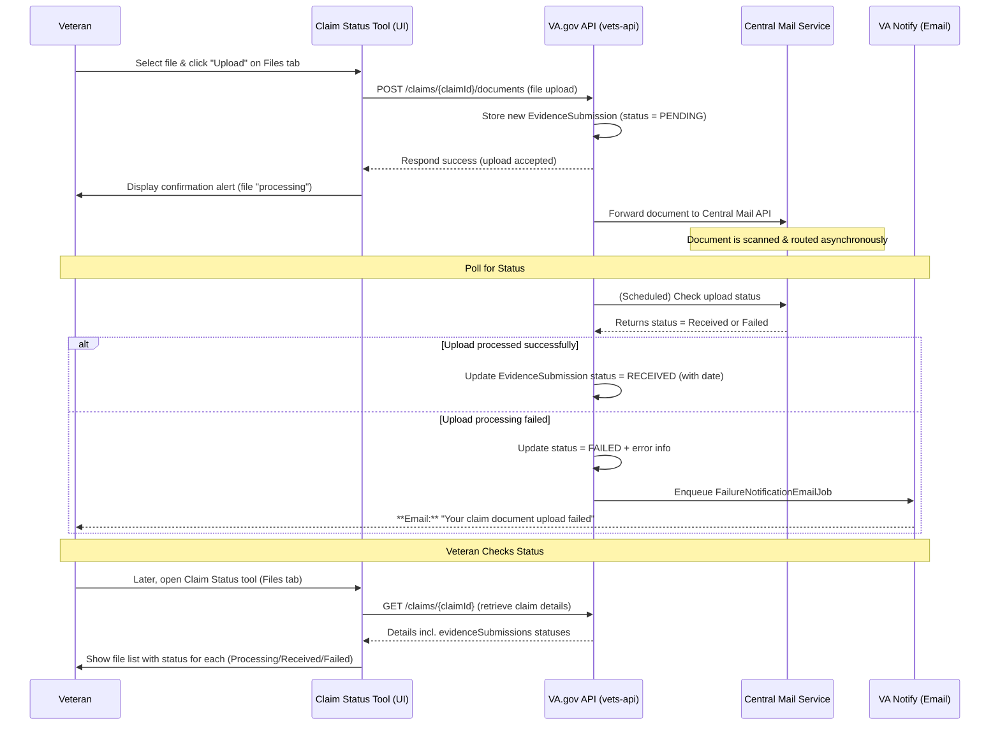
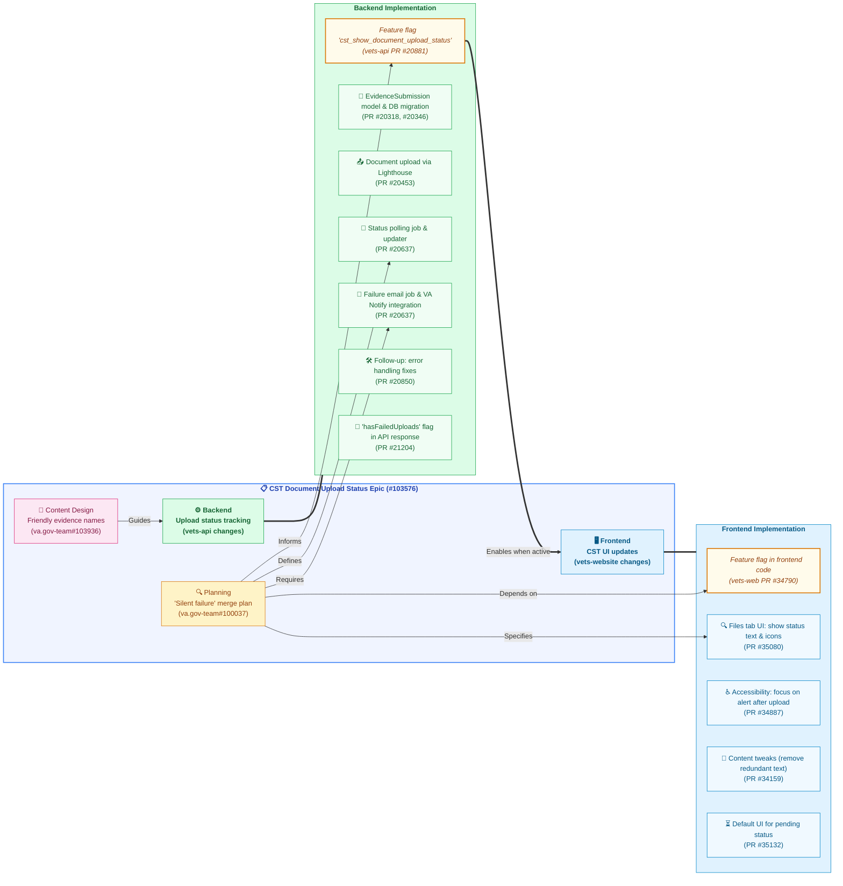

# Document Upload Status for VA Claim Status Tool (CST)

## Table of Contents

- [Background and Goals](#background-and-goals)
- [Vets-API (Backend) Implementation](#vets-api-backend-implementation)
  - [Status Updates](#status-updates)
  - [Failure Notifications](#failure-notifications)
  - [Feature Flags and Toggles](#feature-flags-and-toggles)
  - [Claim Status API Changes](#claim-status-api-changes)
  - [Edge-Case Handling](#edge-case-handling)
- [Vets-Website (Frontend) Implementation](#vets-website-frontend-implementation)
  - [Displaying Upload Status](#displaying-upload-status)
  - [Content and Design Enhancements](#content-and-design-enhancements)
  - [Feature Flag Usage](#feature-flag-usage)
  - [User Workflow Changes](#user-workflow-changes)
- [Developer Insights and Key Artifacts](#developer-insights-and-key-artifacts)
- [Sequence Diagram – Upload Journey](#sequence-diagram--upload-journey)
- [Development Artifact Flowchart](#development-artifact-flowchart)
  - [Explanation](#explanation)
- [Current Status and Future Enhancements](#current-status-and-future-enhancements)
- [Footnotes](#footnotes)

---

## Background and Goals

The “Document Upload Status” feature was introduced to give Veterans immediate feedback on evidence they upload in the Claim Status Tool (CST). Previously, after uploading documents (e.g. medical records or forms) via the CST Files tab, Veterans had no visibility into whether the VA received or processed those files, leading to uncertainty and repeat submissions.

The primary goals of this initiative were to **improve transparency** and **reduce support calls** by showing real-time upload statuses in CST (Flipper UI)[^1]. In other words, Veterans should see if an upload is still processing or has been received, instead of wondering if it vanished. This work was part of the Q2 2025 CST roadmap and was tracked under the “Document Status” epic (`va.gov-team#103576`). It also encompassed related improvements like “silent failure” email notifications (alerting users if an upload fails behind the scenes) and content design updates for clarity.

---

## Vets-API (Backend) Implementation

On the backend (`vets-api`), the **`EvidenceSubmission`** model and database table were central to tracking upload state. Initial groundwork added this model and new columns for status and timestamps. Each evidence upload begins in a **“pending”** state and is recorded in the `evidence_submissions` table (vets-api PR #20637)[^2]. The VA.gov API (`vets-api`) then orchestrates sending the file to the VA’s **Central Mail** system (via the **Lighthouse VA Documents API**) for processing.

A feature flag `cst_show_document_upload_status` was introduced to gate these new behaviors (`features.yml`)[^3]. When a Veteran uploads a file (e.g. via `POST /v0/claims/{id}/documents`), the API saves a new `EvidenceSubmission` record with status **`PENDING`** and sends the document to Central Mail.

### Status Updates

Since document processing is asynchronous, `vets-api` does not immediately mark uploads as “success.” Instead, a background **“document status polling”** job was implemented to periodically check with Central Mail (Lighthouse) for each upload’s outcome (vets-api PR #20637)[^4]. This polling service updates the `EvidenceSubmission` record when the document is either received or has failed.

-   If Central Mail confirms receipt, the status is updated to **`RECEIVED`** and an acknowledgment timestamp is recorded (vets-api PR #20637)[^2].
-   If an error or rejection occurs (e.g. a corrupt file or virus detected), the status is set to **`FAILED`**, along with a failure timestamp and an error message for internal tracking (vets-api PR #20637)[^2].

Notably, the code ensures an upload remains “pending” until an explicit success confirmation is received (an earlier bug had prematurely marked them success) (vets-api PR #20637)[^5].

### Failure Notifications

To address “silent failures” (where a Veteran might not realize an upload failed), the team introduced email notifications. A new feature toggle `cst_send_evidence_submission_failure_emails` controls this behavior (`features.yml`)[^6]. When enabled and an evidence upload ultimately **fails to send**, `vets-api` will trigger a **VA Notify** email to the Veteran informing them of the failure (`features.yml`)[^7].

The implementation uses a scheduled **`FailureNotificationEmailJob`** that runs periodically (cron) to find failed `EvidenceSubmissions` and send out emails (vets-api PR #20637)[^8]. The email content includes details like the document name and guidance to re-upload, improving the Veteran’s awareness. Importantly, the job was designed to retry or not based on configuration – when the flag is on, it will keep attempting to send the email until successful; if off, it sends once without retry (`features.yml`)[^7]. These notifications close the loop for users who might otherwise never know their evidence wasn’t received.

### Feature Flags and Toggles

Multiple feature flags were used to safely roll out this functionality:

-   **`cst_show_document_upload_status`**: The primary front-facing flag. When true, enables the exposure of upload status in the CST UI (`features.yml`)[^3]. On the backend, this flag also gates adding the evidence submission status data to the API responses.
-   **`cst_send_evidence_submission_failure_emails`**: Guards the email notification feature (sometimes referenced as `upload_failure_notifications_enabled` in planning docs) (`features.yml`)[^6].
-   **`cst_synchronous_evidence_uploads`**: Controls whether uploads are handled synchronously or asynchronously (`features.yml`)[^9]. In production this remains **disabled** (asynchronous mode) (vets-api PR #20637)[^10], meaning the user isn’t blocked waiting for Central Mail – the file is accepted as pending and processed in the background.
-   **`benefits_documents_use_lighthouse`**: Determines whether to use the new Lighthouse/Central Mail route or fall back to the legacy EVSS route for document upload (vets-api PR #20637)[^11]. The new status tracking requires the Lighthouse approach.

All these toggles allowed iterative development and safe deployment by toggling new code paths on or off as needed (`va.gov-team#100037`)[^12].

### Claim Status API Changes

The `GET /v0/claims/{id}` endpoint was enhanced to include evidence submission statuses when the feature is active. Specifically, developers added an “evidence submission section” to the claim details serializer/service so that each claim can return a list of its uploaded documents with current status (vets-api Pull Requests)[^13].

In addition, a helper boolean **`hasFailedUploads`** was added to each claim’s data (vets-api Pull Requests)[^14]. This flag is true if any associated evidence submission for that claim has a failed status, enabling the front-end to quickly determine if the user needs to be alerted about a problem (vets-api Pull Requests)[^14]. By March 2025, these changes were merged and available behind the feature toggle.

The backend also logs events for monitoring (a “Zero Silent Failure” logging was created to support Datadog dashboards/alerts on these upload outcomes (vets-api Pull Requests)[^13]).

### Edge-Case Handling

-   A planned job to delete old `evidence_submissions` records once their `delete_at` date passes was identified (`va.gov-team#100037`)[^15]. Although that cleanup task was noted as out-of-scope for the initial release, the table schema includes a deletion date for each record and the job was ticketed separately (`#94403`) (`va.gov-team#100037`)[^15].
-   Another out-of-scope item was creating webhook endpoints for VA Notify (`#93324`) to update email delivery status on the `EvidenceSubmission` (`va.gov-team#100037`)[^15].

In summary, by mid-Q2 2025, the `vets-api` changes introduced a robust tracking system: an `EvidenceSubmission` record with **status values (`pending`/`received`/`failed`)**, timestamps for acknowledgment or failure, periodic polling of Central Mail for updates, and automated email alerts on failures (vets-api PR #20637)[^4][^8].

---

## Vets-Website (Frontend) Implementation

On the front-end (`vets-website`), the Claim Status Tool UI was updated to surface the new upload statuses to users in a clear, accessible way. These changes focused on the **“Files” tab of a claim detail** (where a Veteran uploads and sees their submitted documents). Under feature flag control, the interface now renders a status indicator for each uploaded evidence item.

The React application checks the `cst_show_document_upload_status` flipper flag (exposed via the VA.gov feature toggle API) and, if enabled, includes the evidence submissions data from the API in the Redux store or component state (vets-website Pull Requests)[^16].

### Displaying Upload Status

For each document a Veteran uploads, the Files tab will list the document (often by the type or filename) along with a status label and icon. The content design team chose plain-language labels:
-   A pending upload might show **“Still processing”** or **“In progress”** with a spinner icon.
-   A completed upload shows **“Received by VA”** with a checkmark.
-   A failed upload highlights it with an error state – e.g. **“Could not be processed”** – and prompts the user to take action (such as re-uploading the document).

All of this conditional rendering is gated behind the feature flag and uses data from the claim API response. If the flag is off, the Files tab simply confirms an upload was submitted (the legacy behavior). If the flag is on, it adds a status column or inline status message for each file. These UI changes were implemented in React components within the claims status app, with selectors pulling `claim.evidenceSubmission` info (including the `hasFailedUploads` boolean).

### Content and Design Enhancements

To make the experience user-friendly, developers incorporated several **content and design enhancements**:

-   The CST team worked on making the names of evidence request items more veteran-friendly. The API provides **`friendlyName`** and descriptions for evidence requests (tracked items) instead of cryptic form codes (`va.gov-team#103936`)[^17]. On the front-end, those are used to label what is being requested.
-   For upload status specifically, designers ensured that the terminology is non-technical. Instead of showing a raw status like “pending” or “success,” the UI displays **“Processing…”** or **“Received by VA on [date]”** in plain language.
-   The **content design artifacts** (Figma mocks and content tables) defined these phrases and even the tone of an error message.
-   A front-end pull request updated the default text on the evidence upload page to remove confusing language (vets-website Pull Requests)[^18].
-   In one PR, they removed an extraneous sentence from the file uploader that was no longer needed once dynamic statuses were in place (vets-website Pull Requests)[^16].

Overall, the language in the UI was refined to be reassuring and action-oriented.

### Feature Flag Usage

On the client side, a corresponding feature toggle was added so that the front-end knows whether to show the new status UI. A pull request on `vets-website` introduced the `cst_show_document_upload_status` flag usage in the Redux state and components (vets-website Pull Requests)[^16]. This ensured that all new UI elements only render when the feature is turned on. For example, the Files tab component checks `toggleValues.cst_show_document_upload_status`. This approach allowed the team to deploy the front-end code to production in advance and simply flip the flag when ready (`features.yml`)[^3]. By late February 2025, the front-end feature flag code was merged (vets-website Pull Requests)[^16], shortly after the backend flag was put in place.

### User Workflow Changes

With the new statuses visible, the workflow in the UI became more interactive. After a Veteran uploads a file, the page now immediately shows a **confirmation alert** that the file was uploaded successfully and is being processed.

Importantly, an accessibility improvement was made to ensure screen-reader users are alerted to this status: the code explicitly moves focus to the `<va-alert>` box that appears after uploading (vets-website PR #34887)[^19]. This was done in PR `#34887` to ensure assistive technology reads out the “upload received” message (vets-website PR #34887)[^20]. That alert remains on the page and indicates the document is in queue.

Currently, the Veteran would typically see the updated status when they next visit the claim or refresh the page. (Real-time live updates were considered for the future – see **Future Enhancements** below.) If any upload failed, the front-end can display a prominent alert banner (using the `hasFailedUploads` flag) to draw attention (vets-api Pull Requests)[^14].

Lastly, the front-end team tested various scenarios: multiple files pending, mix of successes and failures, and graceful regression if the flag is off. Unit and end-to-end tests were updated accordingly.

---

## Developer Insights and Key Artifacts

Development involved multiple PRs across `vets-api` and `vets-website`, organized under epic **`va.gov-team#103576`**. Planning ticket **`#100037`** (“Merge feature branch for silent failure work”) detailed the technical strategy (`va.gov-team#100037`)[^21][^22]. The team introduced feature flags to deploy incrementally (`va.gov-team#100037`)[^12]. The *definition of done* emphasized testing and design QA (`va.gov-team#100037`)[^23].

Key backend PRs included:
-   DB migrations and model (`#20318`, `#20346`)
-   EVSS integration (`#20380`)
-   Lighthouse integration (`#20453`) (vets-api PR #20637)[^24]
-   Polling job and email job (`#20637`) (vets-api PR #20637)[^4][^8]
-   Error handling fixes (`#20808`, `#20850`)

**Notable backend components** introduced:
-   **`DocumentUpload` Sidekiq job** (`app/sidekiq/lighthouse/evidence_submissions/document_upload.rb`) modified for flag logic (vets-api PR #20637)[^5].
-   **`DocumentStatusPollingService`** and **`UploadStatusUpdater`** for fetching status updates (vets-api PR #20637)[^4].
-   **`FailureNotificationEmailJob`** for VA Notify integration (vets-api PR #20637)[^8].

Key frontend files changed:
-   Claim detail React components (display statuses/alerts).
-   Actions/reducers in claims Redux module.
-   Feature toggle plumbing.
-   `ClaimDetailLayout.jsx` updated for focus management (vets-website PR #34887)[^19].
-   FilesTab component updated to render statuses.
-   Codeowners and tests updated (`va.gov-team#100037`)[^25].

Developer feedback emphasized **monitoring and reliability**. Logging (with “zero-silent-failures” tag) was added (vets-api Pull Requests)[^13]. Future work includes a cron job for deleting old records and potential VA Notify webhooks (`va.gov-team#100037`)[^15]. Release coordination between backend and frontend was managed using feature flags (vets-website Pull Requests)[^16][^13].

Veteran experience was prioritized, ensuring failure emails included **file name and document type** (`va.gov-team#100037`)[^25][^22]. Accessibility was addressed via PR `#34887` for screen reader users (vets-website PR #34887)[^20].

---

## Sequence Diagram – Upload Journey

*Diagram: Flow of evidence upload, backend processing, status polling, potential failure notification, and subsequent status display to the Veteran.*

---

## Development Artifact Flowchart

### Explanation

The flowchart maps key GitHub artifacts to the feature's development. *Planning* (`#100037`) and *Content Design* (`#103936`) influenced both *Backend* (`vets-api`) and *Frontend* (`vets-website`) workstreams. Backend tasks included adding feature flags, database models, integrating with Lighthouse/Central Mail, implementing status polling, and failure notifications. Frontend tasks involved using the flag, updating the UI to show statuses and icons, improving accessibility, and refining content. Enabling the backend flag (`C1`) allows the frontend (`D`) to display the new status information.

*(Sources: Feature flag descriptions[^3][^6], GitHub issue/PR references[^17][^26][^4][^8][^16][^19].)*

---

## Current Status and Future Enhancements

As of April 2025, the Document Upload Status feature is **implemented and in testing/staging** behind a feature toggle. The backend tracks and reports statuses, and the frontend displays them. Initial rollout will likely be phased. The expected impact is fewer duplicate submissions and support calls, as Veterans can self-serve status checks (Flipper UI)[^1].

Future enhancements and considerations:

-   **Enable Real-Time Updates:** Use web sockets or server-sent events to push status updates to the UI instantly, eliminating the need for refresh.
-   **Completed Out-of-Scope Items:** Implement background deletion job for old `EvidenceSubmission` records (`va.gov-team#100037`)[^15]. Consider VA Notify webhooks for email delivery status (`#93324`).
-   **Additional Status Detail:** Potentially expose more granular statuses (e.g., “received – under review”, “Rejected – virus detected”) if available from downstream systems.
-   **Mobile Integration:** Ensure status changes are reflected in the VA Mobile app. Coordinate rollout if separate flags are used (Flipper UI)[^1].
-   **Monitoring and Support:** Monitor metrics (failed uploads, emails sent), gather feedback, and address bugs. Validate impact on call center volume.

In conclusion, the Document Upload Status initiative significantly improves the CST experience by providing transparency into evidence submission. By Q2 2025, the team transformed an opaque process into an **interactive and accountable** one, increasing Veteran confidence.

---

## Footnotes

[^1]: [Features // Flipper](https://api.va.gov/flipper/features#:~:text=cst_show_document_upload_status%20When%20enabled%2C%20claims%20status,lookup%20job%20%20%20422)
[^2]: [PR #5 for silent failure work - Add files to create a job to poll the upload status from lighthouse and to create a cron job to send emails for failed uploads by pmclaren19 · Pull Request #20637 · department-of-veterans-affairs/vets-api · GitHub](https://github.com/department-of-veterans-affairs/vets-api/pull/20637#:~:text=,upload_status_updater)
[^3]: [vets-api/config/features.yml at master · department-of-veterans-affairs/vets-api · GitHub](https://github.com/department-of-veterans-affairs/vets-api/blob/master/config/features.yml#:~:text=cst_show_document_upload_status%3A)
[^4]: [PR #5 for silent failure work - Add files to create a job to poll the upload status from lighthouse and to create a cron job to send emails for failed uploads by pmclaren19 · Pull Request #20637 · department-of-veterans-affairs/vets-api · GitHub](https://github.com/department-of-veterans-affairs/vets-api/pull/20637#:~:text=,model)
[^5]: [PR #5 for silent failure work - Add files to create a job to poll the upload status from lighthouse and to create a cron job to send emails for failed uploads by pmclaren19 · Pull Request #20637 · department-of-veterans-affairs/vets-api · GitHub](https://github.com/department-of-veterans-affairs/vets-api/pull/20637#:~:text=,for%20regarding%20the%20upload_status)
[^6]: [vets-api/config/features.yml at master · department-of-veterans-affairs/vets-api · GitHub](https://github.com/department-of-veterans-affairs/vets-api/blob/master/config/features.yml#:~:text=description%3A%20)
[^7]: [vets-api/config/features.yml at master · department-of-veterans-affairs/vets-api · GitHub](https://github.com/department-of-veterans-affairs/vets-api/blob/master/config/features.yml#:~:text=If%20enabled%20and%20a%20user,to%20the%20user%20and%20retried)
[^8]: [PR #5 for silent failure work - Add files to create a job to poll the upload status from lighthouse and to create a cron job to send emails for failed uploads by pmclaren19 · Pull Request #20637 · department-of-veterans-affairs/vets-api · GitHub](https://github.com/department-of-veterans-affairs/vets-api/pull/20637#:~:text=,to%20test%20it)
[^9]: [vets-api/config/features.yml at master · department-of-veterans-affairs/vets-api · GitHub](https://github.com/department-of-veterans-affairs/vets-api/blob/master/config/features.yml#:~:text=cst_synchronous_evidence_uploads%3A)
[^10]: [PR #5 for silent failure work - Add files to create a job to poll the upload status from lighthouse and to create a cron job to send emails for failed uploads by pmclaren19 · Pull Request #20637 · department-of-veterans-affairs/vets-api · GitHub](https://github.com/department-of-veterans-affairs/vets-api/pull/20637#:~:text=,acknowledgment%20dates%2C%20and%20deletion%20dates)
[^11]: [PR #5 for silent failure work - Add files to create a job to poll the upload status from lighthouse and to create a cron job to send emails for failed uploads by pmclaren19 · Pull Request #20637 · department-of-veterans-affairs/vets-api · GitHub](https://github.com/department-of-veterans-affairs/vets-api/pull/20637#:~:text=PR%20Changes%20for%20the%20poll,job)
[^12]: [[CST] Merge feature branch for silent failure work into master · Issue #100037 · department-of-veterans-affairs/va.gov-team · GitHub](https://github.com/department-of-veterans-affairs/va.gov-team/issues/100037#:~:text=As%20a%20part%20of%20this,document_upload.rb)
[^13]: [Pull requests · department-of-veterans-affairs/vets-api · GitHub](https://github.com/department-of-veterans-affairs/vets-api/pulls?q=document+upload+status+is%3Aclosed#:~:text=%5BCST%5D%20,passing)
[^14]: [Pull requests · department-of-veterans-affairs/vets-api · GitHub](https://github.com/department-of-veterans-affairs/vets-api/pulls?q=document+upload+status#:~:text=match%20at%20L278%20hasFailedUploads%20for,passing)
[^15]: [[CST] Merge feature branch for silent failure work into master · Issue #100037 · department-of-veterans-affairs/va.gov-team · GitHub](https://github.com/department-of-veterans-affairs/va.gov-team/issues/100037#:~:text=These%20tickets%20do%20not%20need,merged%20into%20the%20feature%20branch)
[^16]: [Pull requests · department-of-veterans-affairs/vets-website · GitHub](https://github.com/department-of-veterans-affairs/vets-website/issues?q=is%3Apr+author%3Apmclaren19#:~:text=1)
[^17]: [[CST] Evidence Requests schema changes · Issue #103936 · department-of-veterans-affairs/va.gov-team · GitHub](https://github.com/department-of-veterans-affairs/va.gov-team/issues/103936#:~:text=1.%20Leave%20,list%20of%20aliases%20the%20given)
[^18]: [Pull requests · department-of-veterans-affairs/vets-website · GitHub](https://github.com/department-of-veterans-affairs/vets-website/pulls?q=CST#:~:text=1)
[^19]: [[CST] - 91820 Added focus to the va-alert after submitting a document by pmclaren19 · Pull Request #34887 · department-of-veterans-affairs/vets-website · GitHub](https://github.com/department-of-veterans-affairs/vets-website/pull/34887#:~:text=called%20,src%2Fapplications%2Fclaims)
[^20]: [[CST] - 91820 Added focus to the va-alert after submitting a document by pmclaren19 · Pull Request #34887 · department-of-veterans-affairs/vets-website · GitHub](https://github.com/department-of-veterans-affairs/vets-website/pull/34887#:~:text=component%2C%20specifically%20the%20va,after%20completing%20a%205103%20Notice)
[^21]: [[CST] Merge feature branch for silent failure work into master · Issue #100037 · department-of-veterans-affairs/va.gov-team · GitHub](https://github.com/department-of-veterans-affairs/va.gov-team/issues/100037#:~:text=The%20feature%20branch%20%60%5Bfeature%2Fupdated,can%20be%20merged%20into%20master)
[^22]: [[CST] Merge feature branch for silent failure work into master · Issue #100037 · department-of-veterans-affairs/va.gov-team · GitHub](https://github.com/department-of-veterans-affairs/va.gov-team/issues/100037#:~:text=,Add%20DocType%20to%20personalisation)
[^23]: [[CST] Merge feature branch for silent failure work into master · Issue #100037 · department-of-veterans-affairs/va.gov-team · GitHub](https://github.com/department-of-veterans-affairs/va.gov-team/issues/
