# Forking `VaFileInputMultiple` for Conditional Slot Rendering

## Table of Contents

- [Background](#background)
- [Progress Summary of Issues & Resolutions](#progress-summary-of-issues--resolutions)
- [Current Component Review (`VaFileInputMultiple` V3)](#current-component-review-vafleinputmultiple-v3)
  - [Implementation Summary](#implementation-summary)
  - [Props (Attributes)](#props-attributes)
  - [Slot Content Rendering](#slot-content-rendering)
  - [Child Components](#child-components)
  - [Events](#events)
  - [Recent Changes](#recent-changes)
  - [Component Structure Diagram](#component-structure-diagram)
- [Forking and Local Demo Guide](#forking-and-local-demo-guide)
  - [1. Set Up Repositories Locally](#1-set-up-repositories-locally)
  - [2. Link the Local Component Library into `vets-website`](#2-link-the-local-component-library-into-vets-website)
  - [3. Modify `<va-file-input-multiple>` for Conditional Slots](#3-modify-va-file-input-multiple-for-conditional-slots)
  - [4. Use the Modified Component in CST Code](#4-use-the-modified-component-in-cst-code)
  - [5. Verify End-to-End Functionality](#5-verify-end-to-end-functionality)
- [Risks, Trade-offs, and Benefits](#risks-trade-offs-and-benefits)
- [Next Steps](#next-steps)
  - [Technical Onboarding Summary](#technical-onboarding-summary)
- [Conclusion](#conclusion)
- [References](#references)

---

## Background

The VA.gov Design System’s **V3 File Input (multiple)** component (`<va-file-input-multiple>`) provides a standardized multi-file upload control. It’s used in forms such as the Claims Status Tool (CST) to let users attach evidence files. However, CST has **complex file upload requirements**: for each uploaded file, the UI must collect extra data (e.g. a “Document Type” dropdown for all files, and a “Password” field only if a file is encrypted). The current V3 component doesn’t fully support these conditional per-file fields out of the box ([department-of-veterans-affairs/vets-design-system-documentation#3785](https://github.com/department-of-veterans-affairs/vets-design-system-documentation/issues/3785#:~:text=Currently%20we%20are%20using%20a,also%20see%20the%20password%20field)).

Recently, the design system team introduced a *conditional slot* feature (`slotFieldIndexes`) to allow injecting additional form inputs for certain files ([department-of-veterans-affairs/component-library#1458](https://github.com/department-of-veterans-affairs/component-library/pull/1458/files/670e9ae9ba3b29286177a25365bffebc34c483fb#diff-8896460333bdd0119fc909b70f3d2df7f6da40f8b221c7f5f41ab0e8ded3a37d#:~:text=%2F,%3D%20null)). This is a good start – for example, to show a password input only for specific file entries. But CST’s needs are broader: they require **multiple different slot contents** (one type of extra field for all files, and another type only for some files). The team encountered limitations trying to use `slotFieldIndexes` for this scenario (the extra fields did not render as expected in the UI ([department-of-veterans-affairs/vets-design-system-documentation#3785](https://github.com/department-of-veterans-affairs/vets-design-system-documentation/issues/3785#:~:text=When%20I%20attempted%20to%20use,of%20what%20I%20am%20seeing))).

To unblock development and demonstrate a solution, the CST team is considering **forking and modifying** the `<va-file-input-multiple>` component locally. This fork would enable more advanced conditional slot rendering logic to support CST’s file upload workflow. The following sections review the component’s implementation, outline how to create a local fork and integrate it into `vets-website`, and discuss the trade-offs of this approach.

VA.gov tracking issue **`#87835`** (`[CST][ENG] Update File Uploader to use the new va-file-input-multiple component`) was opened to manage this transition and is still in progress ([department-of-veterans-affairs/vets-design-system-documentation#3551](https://github.com/department-of-veterans-affairs/vets-design-system-documentation/issues/3551#:~:text=This%20was%20referenced%20Nov%2027%2C,2024)).

---

## Progress Summary of Issues & Resolutions

-   **Nov 2024:** CST team identified need for enhancements. Design System team opened issue **`#3551`** for **conditional slot rendering** ([department-of-veterans-affairs/vets-design-system-documentation#3551](https://github.com/department-of-veterans-affairs/vets-design-system-documentation/issues/3551#:~:text=Description)). Linked to CST epic `#87835`.
-   **Late Nov 2024:** Additional bugs logged:
    -   Double event emission (`#3549`).
    -   Duplicate file selection (`#3550`).
    -   Documented in CST PR notes ([department-of-veterans-affairs/vets-website#33296](https://github.com/department-of-veterans-affairs/vets-website/pull/33296#:~:text=%2A%20va,documentation%233549)).
-   **Dec 2024:** CST team opened draft PR **`vets-website#33296`**, listing blockers and pausing work pending Design System fixes ([department-of-veterans-affairs/vets-website#33296](https://github.com/department-of-veterans-affairs/vets-website/pull/33296#:~:text=multiple,we%20can%20continue%20this%20work)).
-   **Late Dec 2024 – Jan 2025:** Design System team delivered fixes:
    -   Double event emission fixed ([component-library Releases](https://github.com/department-of-veterans-affairs/component-library/releases#:~:text=%2A%20va,ataker%20%20in%20%20184)).
    -   Conditional slots implemented via `slotFieldIndexes` prop (PR **`#1458`**) ([department-of-veterans-affairs/component-library#1458](https://github.com/department-of-veterans-affairs/component-library/pull/1458#:~:text=Adds%20a%20property%20to%20allow,on%20specific%20file%20input%20fields)).
    -   `vaMultipleChange` event payload expanded (Breaking Change) (PR **`#1460`**) ([department-of-veterans-affairs/component-library#1460](https://github.com/department-of-veterans-affairs/component-library/pull/1460#:~:text=BREAKING%20CHANGE)).
    -   Included in **Component Library `v49.0.0` (Jan 2025)** ([component-library Releases](https://github.com/department-of-veterans-affairs/component-library/releases#:~:text=%2A%20va,powellkerry%20%20in%20%20152), [component-library Releases](https://github.com/department-of-veterans-affairs/component-library/releases#:~:text=%2A%20va,powellkerry%20%20in%20%20155)).
-   **Feb 2025:** CST team found **new blocking issue**: `slotFieldIndexes` insufficient for showing *docType* (all files) + *password* (some files) conditionally ([department-of-veterans-affairs/vets-design-system-documentation#3785](https://github.com/department-of-veterans-affairs/vets-design-system-documentation/issues/3785#:~:text=Our%20Use%20Case%3A%20When%20using,not%20supporting%20the%20two%20fields)). Also encountered slot rendering issues in React ([department-of-veterans-affairs/vets-design-system-documentation#3785](https://github.com/department-of-veterans-affairs/vets-design-system-documentation/issues/3785#:~:text=When%20I%20tried%20to%20implement,a%20slot%20on%20the%20component)). Documented in **`vets-design-system-documentation#3785`**. CST remains on older solution / "imposter" component ([department-of-veterans-affairs/vets-design-system-documentation#3785](https://github.com/department-of-veterans-affairs/vets-design-system-documentation/issues/3785#:~:text=We%20are%20haivng%20to%20use,user%20the%20new%20uplaod%20component), [`va.gov-team#104547`](https://github.com/department-of-veterans-affairs/va.gov-team/issues/104547#:~:text=The%20file%20input%20is%20an,imposter%20component)).
-   **Mar 2025:** Design System team acknowledged limitations, planned **refactor/enhancement** for more flexible per-file custom fields ([department-of-veterans-affairs/vets-design-system-documentation#3785](https://github.com/department-of-veterans-affairs/vets-design-system-documentation/issues/3785#:~:text=micahchiang%20%20%20commented%20,104)). Proof-of-concept planned for April 2025 ([department-of-veterans-affairs/vets-design-system-documentation#3785](https://github.com/department-of-veterans-affairs/vets-design-system-documentation/issues/3785#:~:text=caw310%20%20%20commented%20,108)). CST team reiterated conditional slots as the blocker ([department-of-veterans-affairs/vets-design-system-documentation#3785](https://github.com/department-of-veterans-affairs/vets-design-system-documentation/issues/3785#:~:text=pmclaren19%20%20%20commented%20,109)).
-   **Current Status (April 2025):** `va-file-input-multiple` v49+ available but insufficient for CST's conditional slot needs. Issue `#3785` open pending Platform team solution. CST integration epic `#87835` blocked. CST uses legacy/imposter component ([`va.gov-team#104547`](https://github.com/department-of-veterans-affairs/va.gov-team/issues/104547#:~:text=The%20file%20input%20is%20an,imposter%20component), [`va.gov-team#104547`](https://github.com/department-of-veterans-affairs/va.gov-team/issues/104547#:~:text=We%20are%20currently%20experiencing%20this,for%20work%20as%20capacity%20allows)).

---

## Current Component Review (`VaFileInputMultiple` V3)

### Implementation Summary

`<va-file-input-multiple>` is a Web Component (Stencil-based) that renders a list of file upload fields and manages their state internally.

### Props (Attributes)

-   `label`, `name`, `hint`: Standard form labeling props ([component-library Source](https://github.com/department-of-veterans-affairs/component-library/blob/main/packages/web-components/src/components/va-file-input-multiple/va-file-input-multiple.tsx#:~:text=%40Prop), [component-library Source](https://github.com/department-of-veterans-affairs/component-library/blob/main/packages/web-components/src/components/va-file-input-multiple/va-file-input-multiple.tsx#:~:text=%40Prop)).
-   `required` (Boolean): Marks input as required ([component-library Source](https://github.com/department-of-veterans-affairs/component-library/blob/main/packages/web-components/src/components/va-file-input-multiple/va-file-input-multiple.tsx#:~:text=match%20at%20L1144%20%40Prop,boolean%20%3D%20false)).
-   `accept` (String): Allowed file types ([component-library Source](https://github.com/department-of-veterans-affairs/component-library/blob/main/packages/web-components/src/components/va-file-input-multiple/va-file-input-multiple.tsx#:~:text=match%20at%20L1153%20%40Prop,string)).
-   `value` (File[]): Array of `File` objects to pre-populate ([component-library Source](https://github.com/department-of-veterans-affairs/component-library/blob/main/packages/web-components/src/components/va-file-input-multiple/va-file-input-multiple.tsx#:~:text=match%20at%20L1203%20%40Prop,File)) (added in v49 ([component-library Releases](https://github.com/department-of-veterans-affairs/component-library/releases#:~:text=%2A%20va,powellkerry%20%20in%20%20155))).
-   `errors` (String[]): Array of error messages per file slot ([component-library Source](https://github.com/department-of-veterans-affairs/component-library/blob/main/packages/web-components/src/components/va-file-input-multiple/va-file-input-multiple.tsx#:~:text=match%20at%20L1162%20%40Prop,%3D)).
-   `encrypted` (Boolean[]): Array indicating which files are encrypted ([component-library Source](https://github.com/department-of-veterans-affairs/component-library/blob/main/packages/web-components/src/components/va-file-input-multiple/va-file-input-multiple.tsx#:~:text=match%20at%20L1170%20%40Prop,%3D)). Passed down to child `<va-file-input>` instances ([component-library Source](https://github.com/department-of-veterans-affairs/component-library/blob/main/packages/web-components/src/components/va-file-input-multiple/va-file-input-multiple.tsx#:~:text=%3A%20), [component-library Source](https://github.com/department-of-veterans-affairs/component-library/blob/main/packages/web-components/src/components/va-file-input-multiple/va-file-input-multiple.tsx#:~:text=error%3D)).
-   `readOnly` (Boolean): Renders component in read-only state ([component-library PR #1458](https://github.com/department-of-veterans-affairs/component-library/pull/1458/files/670e9ae9ba3b29286177a25365bffebc34c483fb#diff-8896460333bdd0119fc909b70f3d2df7f6da40f8b221c7f5f41ab0e8ded3a37d#:~:text=Expand%20Up%20%40%40%20,readOnly%3F%3A%20boolean%20%3D%20false)).
-   **`slotFieldIndexes` (Number[] or null)**: Prop added in v49.0.0 to conditionally render slot content on specific file fields ([component-library PR #1458](https://github.com/department-of-veterans-affairs/component-library/pull/1458/files/670e9ae9ba3b29286177a25365bffebc34c483fb#diff-8896460333bdd0119fc909b70f3d2df7f6da40f8b221c7f5f41ab0e8ded3a37d#:~:text=%2F,%3D%20null)). Default (`null`) renders slot for **all** files. Array of indices renders slot only for those files ([component-library PR #1458](https://github.com/department-of-veterans-affairs/component-library/pull/1458/files/670e9ae9ba3b29286177a25365bffebc34c483fb#diff-8896460333bdd0119fc909b70f3d2df7f6da40f8b221c7f5f41ab0e8ded3a37d#:~:text=%2F,%3D%20null)). Intended for cases like showing password input only for encrypted PDFs ([department-of-veterans-affairs/vets-design-system-documentation#3551](https://github.com/department-of-veterans-affairs/vets-design-system-documentation/issues/3551#:~:text=Developers%20want%20to%20be%20able,field%20to%20enter%20a%20password)).

### Slot Content Rendering

-   Component template includes a default `<slot>` ([component-library Source](https://github.com/department-of-veterans-affairs/component-library/blob/main/packages/web-components/src/components/va-file-input-multiple/va-file-input-multiple.tsx#:~:text=)).
-   Developer-provided slot content is used as a **template** for each file entry's extra content.
-   On render, the component removes the original slot and **clones** the slotted nodes into each file's `<va-file-input>` element in the Shadow DOM ([component-library Source](https://github.com/department-of-veterans-affairs/component-library/blob/main/packages/web-components/src/components/va-file-input-multiple/va-file-input-multiple.tsx#:~:text=private%20setSlotContent%28%29%20), [component-library Source](https://github.com/department-of-veterans-affairs/component-library/blob/main/packages/web-components/src/components/va-file-input-multiple/va-file-input-multiple.tsx#:~:text=private%20getAdditionalContent%28%29%20)).
-   If `slotFieldIndexes` is set, cloning is conditional based on the file index ([component-library PR #1458](https://github.com/department-of-veterans-affairs/component-library/pull/1458#:~:text=This%20solution%20adds%20a%20%60slot,slot%20content%20should%20be%20rendered), [component-library PR #1458](https://github.com/department-of-veterans-affairs/component-library/pull/1458#:~:text=this.setSlotContent%28%29%3B%20theFileInputs.forEach%28%28fileEntry%2C%20index%29%20%3D,if%20%28this.files%5Bindex%5D.content), [component-library PR #1458](https://github.com/department-of-veterans-affairs/component-library/pull/1458/files/670e9ae9ba3b29286177a25365bffebc34c483fb#diff-8896460333bdd0119fc909b70f3d2df7f6da40f8b221c7f5f41ab0e8ded3a37d#:~:text=const%20theFileInputs%20%3D%20this.el.shadowRoot.querySelectorAll%28%60va,1)).

> [!NOTE]
> The current slot mechanism clones the **same DOM nodes** for each targeted file. It doesn't support different content per file or conditionally showing parts of the slot content. This is the limitation CST encountered.

### Child Components

-   Each file input row rendered is an instance of `<va-file-input>` ([component-library Source](https://github.com/department-of-veterans-affairs/component-library/blob/main/packages/web-components/src/components/va-file-input-multiple/va-file-input-multiple.tsx#:~:text=%3Cva)).
-   The multiple-file component manages an internal array of file slots and renders a list of `<va-file-input>` elements ([component-library Source](https://github.com/department-of-veterans-affairs/component-library/blob/main/packages/web-components/src/components/va-file-input-multiple/va-file-input-multiple.tsx#:~:text=%3Cva), [component-library Source](https://github.com/department-of-veterans-affairs/component-library/blob/main/packages/web-components/src/components/va-file-input-multiple/va-file-input-multiple.tsx#:~:text=error%3D)).
-   Props like `label`, `hint`, `required`, `encrypted` are passed down to each child ([component-library Source](https://github.com/department-of-veterans-affairs/component-library/blob/main/packages/web-components/src/components/va-file-input-multiple/va-file-input-multiple.tsx#:~:text=%2F%2F%20only%20add%20custom%20upload,after%20the%20first%20file%20input), [component-library Source](https://github.com/department-of-veterans-affairs/component-library/blob/main/packages/web-components/src/components/va-file-input-multiple/va-file-input-multiple.tsx#:~:text=%3A%20)).

### Events

-   Emits custom **`vaMultipleChange`** event on file list changes (add, replace, remove) ([component-library Source](https://github.com/department-of-veterans-affairs/component-library/blob/main/packages/web-components/src/components/va-file-input-multiple/va-file-input-multiple.tsx#:~:text=%40Event)).
-   Event detail (v49+): `{ action, file, state }` where `state` is the current array of file info objects ([component-library Source](https://github.com/department-of-veterans-affairs/component-library/blob/main/packages/web-components/src/components/va-file-input-multiple/va-file-input-multiple.tsx#:~:text=const%20result%20%3D%20), [component-library Source](https://github.com/department-of-veterans-affairs/component-library/blob/main/packages/web-components/src/components/va-file-input-multiple/va-file-input-multiple.tsx#:~:text=), [component-library Source](https://github.com/department-of-veterans-affairs/component-library/blob/main/packages/web-components/src/components/va-file-input-multiple/va-file-input-multiple.tsx#:~:text=public%20buildFilesArray%20%28files%3A%20File,)).

### Recent Changes

-   **v49.0.0:** Introduced `slotFieldIndexes` ([component-library PR #1458](https://github.com/department-of-veterans-affairs/component-library/pull/1458/files/670e9ae9ba3b29286177a25365bffebc34c483fb#diff-8896460333bdd0119fc909b70f3d2df7f6da40f8b221c7f5f41ab0e8ded3a37d#:~:text=%2F,%3D%20null)).
-   **v49.0.0:** Breaking change to `vaMultipleChange` event detail structure ([component-library Releases](https://github.com/department-of-veterans-affairs/component-library/releases#:~:text=%2A%20va,powellkerry%20%20in%20%20152)).
-   Open bug (`#3785`) regarding limitations for CST's use case ([department-of-veterans-affairs/vets-website#33296](https://github.com/department-of-veterans-affairs/vets-website/pull/33296#:~:text=%2A%20va,system), [department-of-veterans-affairs/vets-website#33296](https://github.com/department-of-veterans-affairs/vets-website/pull/33296#:~:text=Attempted%20to%20implement%20but%20was,documentation%233785)).

### Component Structure Diagram

```mermaid
flowchart TD
    %% Main component with vertical flow
    ComponentTitle["📂 va-file-input-multiple Component"]
    LabelHint["🏷️ Label & Hint Text"]
    AddButton["➕ Add File Button"]
    FileList["📋 File List Container"]
    SlotTemplate["🧩 &lt;slot&gt; Template\nfor extra fields"]
    
    ComponentTitle --> LabelHint
    ComponentTitle --> AddButton
    ComponentTitle --> FileList
    ComponentTitle --> SlotTemplate
    
    %% File list items with vertical alignment
    FileList --> F1["📄 File 1"]
    FileList --> F2["📄 File 2"]
    FileList --> F_New["⬜ Empty File Input\n(Add New)"]
    
    %% File card detail with vertical flow
    F1 --> FileCard["📝 File Card Structure"]
    FileCard --> FileName["📋 File Name & Size"]
    FileCard --> Actions["🔄 Change / 🗑️ Delete"]
    FileCard --> ExtraFields["🔧 Custom Fields\n(Doc Type, Password)"]
    
    %% Connection between slot and extra fields
    SlotTemplate -.->|"Cloned based on\nslotFieldIndexes prop"| ExtraFields
    
    %% Enhanced styling with GitHub-friendly colors
    classDef title fill:#0366d6,stroke:#0366d6,color:#ffffff,font-weight:bold
    classDef container fill:#f6f8fa,stroke:#d1d5da,stroke-width:1px,color:#24292e
    classDef fileElement fill:#e1e4e8,stroke:#d1d5da,stroke-width:1px,color:#24292e
    classDef emptyFile fill:#f6f8fa,stroke:#d1d5da,stroke-width:1px,color:#6a737d,font-style:italic
    classDef slot fill:#dbedff,stroke:#0366d6,stroke-width:1px,color:#0366d6
    classDef cardSection fill:#fff5b1,stroke:#d1d5da,stroke-width:1px,color:#24292e
    
    %% Apply classes to elements
    class ComponentTitle title
    class FileList,FileCard container
    class LabelHint,AddButton,FileName,Actions fileElement
    class F1,F2 fileElement
    class F_New emptyFile
    class SlotTemplate slot
    class ExtraFields cardSection
```


*Diagram: `<va-file-input-multiple>` contains multiple `<va-file-input>` child components. If slot content is provided, it's cloned and appended into each file card (or only those specified by `slotFieldIndexes`).*

---

## Forking and Local Demo Guide

To experiment with a fix, CST engineers can **fork the component library and run a local copy** of `<va-file-input-multiple>` within `vets-website`.

### 1. Set Up Repositories Locally

-   **Clone the VA Component Library:**
    ```bash
    git clone https://github.com/department-of-veterans-affairs/component-library.git
    cd component-library
    # git checkout main # Or specific tag/release
    yarn install
    ```
    Source code for `<va-file-input-multiple>` is in `packages/web-components/src/components/va-file-input-multiple/`.

-   **Clone `vets-website`:**
    ```bash
    git clone https://github.com/department-of-veterans-affairs/vets-website.git
    cd vets-website
    yarn install
    ```
    Ensure you are on the correct branch for CST testing.

### 2. Link the Local Component Library into `vets-website`

Choose one method:

-   **Option A: Yarn Link**
    1.  In `component-library`, build the library: `yarn build` (likely within `packages/core` or relevant sub-packages).
    2.  In `component-library/packages/core`, run `yarn link`.
    3.  In `vets-website`, run `yarn link "@department-of-veterans-affairs/component-library"`.
    4.  Run `yarn watch` in `vets-website`.

-   **Option B: Local Path Override**
    1.  Edit `vets-website/package.json`:
        ```json
        "@department-of-veterans-affairs/component-library": "file:../component-library/packages/core"
        ```
    2.  Run `yarn install` in `vets-website`.
    3.  Revert this change after testing.

> [!TIP]
> Verify the link by adding a `console.log` in the component's code and checking the browser console when running `vets-website`.

### 3. Modify `<va-file-input-multiple>` for Conditional Slots

Goal: Allow **multiple different slot contents** and control which file gets which content.

-   **Approach A: Multiple Named Slots + Mapping (Recommended for Demo)**
    -   Define additional named slots (e.g., `<slot name="passwordSlot"></slot>`).
    -   Introduce a prop to map slot names to file indices (e.g., `conditionalSlotMap={{ passwordSlot: [1, 3] }}`).
    -   Modify component code:
        -   Capture assigned elements for each named slot.
        -   Remove slot placeholders.
        -   In the file item rendering loop, append default slot content clones (e.g., doc type) and conditional slot content clones (e.g., password) based on the map/indices.
    -   Example Usage:
        ```jsx
        <va-file-input-multiple
           conditionalSlotMap={{ passwordSlot: [1, 3] }}>
          {/* Default slot content (e.g., Doc Type) */}
          <va-select label="Document type" ...></va-select>
          {/* Named slot content (e.g., Password) */}
          <va-text-input slot="passwordSlot" label="File password" ...></va-text-input>
        </va-file-input-multiple>
        ```

-   **Approach B: Simplified Dual-Slot Solution (Quicker Demo, Less Ideal)**
    -   Keep default slot for content shown on all files (e.g., doc type).
    -   Repurpose `slotFieldIndexes` to control a *second*, hardcoded piece of content (e.g., password field).
    -   Modify component template to conditionally insert the second field based on `slotFieldIndexes`.
    -   Example Usage:
        ```jsx
        <va-file-input-multiple slotFieldIndexes={encryptedFileIndexes}>
          {/* Default slot content (Doc Type) */}
          <va-select label="Document type" ...></va-select>
        </va-file-input-multiple>
        ```
        (Component internally adds password field for specified indices). *Use only for PoC.*

-   **Step-by-Step Code Changes (Approach A Example):**
    1.  Open `va-file-input-multiple.tsx`.
    2.  Add new Prop: `@Prop() conditionalSlotMap?: { [name: string]: number[] };`
    3.  Update `render()`: Add `<slot name="passwordSlot"></slot>` in the template.
    4.  Capture slot content: Extend `setSlotContent()` to capture elements for named slots (e.g., `this.passwordSlotElements`). Remove placeholders.
    5.  Append logic: In the file rendering loop, append default slot clones, then check `conditionalSlotMap` and append named slot clones (e.g., password elements) if the index matches.
    6.  Adjust default slot behavior if needed (e.g., ensure it always renders unless filtered).
    7.  Rebuild component library (`yarn build`).

### 4. Use the Modified Component in CST Code

-   Update CST React code to use the modified `<VaFileInputMultiple>` (or wrapper).
-   Pass the new prop (`conditionalSlotMap` or similar) with the appropriate data (e.g., `encryptedFileIndexes` from state).
-   Provide content for default and named slots.
-   Ensure `onVaMultipleChange` handler updates Redux state correctly, including determining which files need the conditional slot and updating the prop passed to the component.

### 5. Verify End-to-End Functionality

-   Start `vets-website` dev server (`yarn watch --env entry=claims-status`).
-   Navigate to CST evidence upload UI.
-   **Test Scenarios:**
    -   Upload normal file: Should show only doc type field.
    -   Upload encrypted file: Should show doc type **and** password field.
    -   Upload multiple files (mixed): Verify correct fields appear for each.
    -   Remove/Change files: Ensure UI updates correctly and events fire.
    -   Check event payload (`vaMultipleChange`) structure.
    -   Test error states (invalid file type, size limits).

---

## Risks, Trade-offs, and Benefits

-   **Deviation from Design System:** Forking breaks the single source of truth. Requires manual syncing with upstream changes (bug fixes, accessibility). Risk of divergence.
-   **Maintenance Cost:** CST team assumes ownership of the forked code (testing, compatibility). Non-trivial effort.
-   **Upstream Contribution Possibility:** A robust solution could be contributed back, reducing long-term maintenance. Coordinate with Platform team.
-   **Speed vs. Perfection:** Fork allows immediate progress and demo capability, unblocking development.
-   **Performance Impact:** Likely minimal. Cloning extra DOM nodes per file is generally inexpensive for typical usage. Monitor memory usage.
-   **Accessibility Considerations:** Added fields must be accessible (labels, focus order, screen reader announcements). Test thoroughly. Avoid duplicate IDs if cloning elements with static IDs.
-   **Cross-Browser/Tech:** Verify behavior in modern browsers (Chrome, Firefox, Safari, Edge). Ensure compatibility with Web Component polyfills if needed.
-   **Dependency Impact:** Check if other `vets-website` apps use `<va-file-input-multiple>`. Ensure fork is backward-compatible or coordinate changes.
-   **Testing:** Requires unit tests for modified logic and integration/e2e tests in `vets-website`.

**Conclusion on Forking:** Provides immediate control and unblocks development, but incurs maintenance overhead and risks divergence. Best used as a **temporary measure** while coordinating an official solution with the Platform Design System team.

---

## Next Steps

### Technical Onboarding Summary

We now have a local working prototype of an enhanced file input component. Next steps:

-   **Coordinate with Design System Team:** Share the solution/findings via issue `#3785`. Offer to contribute code or test their planned fix. Align on timeline.
-   **Harden the Fork (if needed temporarily):** Add unit tests, handle edge cases, ensure accessibility, document changes clearly within the forked code. Create technical debt ticket to remove fork later.
-   **Monitor Other Dependents:** Identify other users of the component and communicate changes/risks.
-   **Upstream Merge (Goal):** Propose the enhanced solution (e.g., `conditionalSlotMap`) to the component library for official adoption.
-   **Contingency Plan:** If fork/upstream fix isn't viable, consider a fully custom CST file upload component (less preferred due to divergence).

By following this guide, a CST engineer can implement and test a solution locally, demonstrate the required functionality, and make informed decisions about short-term needs vs. long-term alignment with the VA design system.

---

## References

-   [VA.gov Design System: File Input](https://design.va.gov/components/form/file-input) - Component documentation.
-   [VA.gov Component Library Releases](https://github.com/department-of-veterans-affairs/component-library/releases) - Release notes.
-   GitHub Issues & PRs:
    -   [`vets-design-system-documentation#3551`](https://github.com/department-of-veterans-affairs/vets-design-system-documentation/issues/3551) - Initial request for conditional slots.
    -   [`vets-design-system-documentation#3785`](https://github.com/department-of-veterans-affairs/vets-design-system-documentation/issues/3785) - Current blocking issue for CST.
    -   [`component-library#1458`](https://github.com/department-of-veterans-affairs/component-library/pull/1458) - PR implementing `slotFieldIndexes`.
    -   [`component-library#1460`](https://github.com/department-of-veterans-affairs/component-library/pull/1460) - PR with breaking change to `vaMultipleChange` event.
    -   [`vets-website#33296`](https://github.com/department-of-veterans-affairs/vets-website/pull/33296) - CST team's draft integration PR.
    -   [`va.gov-team#104547`](https://github.com/department-of-veterans-affairs/va.gov-team/issues/104547) - Staging review finding on "imposter" component.
    -   [`vets-website#34887`](https://github.com/department-of-veterans-affairs/vets-website/pull/34887) - Accessibility fix for focus management.
-   [`<va-file-input-multiple>` Source Code](https://github.com/department-of-veterans-affairs/component-library/blob/main/packages/web-components/src/components/va-file-input-multiple/va-file-input-multiple.tsx) - For implementation details.

---
