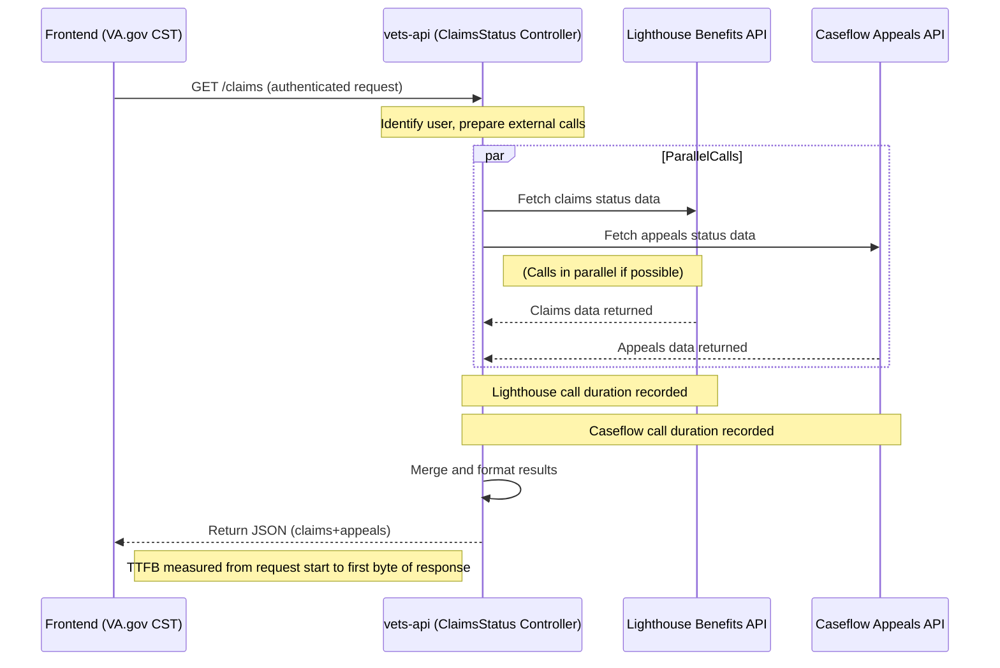

# VA Claims Status Tool (CST) Performance Analysis Report

## Table of Contents

*   [Executive Summary](#executive-summary)
*   [User Journey & Architecture Mapping](#user-journey--architecture-mapping)
    *   [Front-End Overview](#front-end-overview)
    *   [Back-End Overview](#back-end-overview)
    *   [High-Level User Flow Stages](#high-level-user-flow-stages)
    *   [Front-End Components & Rendering Details](#front-end-components--rendering-details)
*   [Performance Metrics & Measurement](#performance-metrics--measurement)
*   [Instrumentation Guidelines (Datadog, Google Analytics, Synthetic Testing)](#instrumentation-guidelines-datadog-google-analytics-synthetic-testing)
*   [Recommendations and Optimization Opportunities](#recommendations-and-optimization-opportunities)
*   [Diagram Appendix](#diagram-appendix)

## Executive Summary

The VA Claims Status Tool (CST) enables Veterans to check the status of their disability compensation claims and appeals online. It’s one of the most heavily used VA.gov tools, with over **4.1 million status checks in March 2025** alone.

The CST consists of a `React`/`Redux` front-end on VA.gov and a `Rails`-based back-end (`vets-api`) that aggregates data from multiple VA systems – notably the VA **Lighthouse Benefits Claims API** for claim status and **Caseflow** for appeals status. This multi-source integration means performance is largely **network-bound**: users often wait on API calls to external systems before seeing their information. The front-end itself renders quickly once data arrives, but any slowness or errors from upstream services directly impacts the user experience.

Currently, **page load times are suboptimal**. Users see loading spinners while data fetches complete. Initial data load latency has been averaging `~3.7` seconds, with a goal to reduce this by 50% (to `~1.86s`). Mobile users experience even slower loads – about **39% slower** than desktop on average – highlighting a gap that needs closing.

Despite these challenges, the CST’s `React` app and API design do follow some best practices (like parallel API calls) to minimize wait time. However, there are clear opportunities to **optimize performance** and **instrument detailed metrics**.

This report provides an end-to-end mapping of the user journey (from login through checking a list of claims, viewing claim details, and uploading documents), identifies where time is spent at each stage, and pinpoints how to measure key performance metrics (API latency, rendering times, network delays, etc.). We also present recommendations – such as enhanced monitoring via `Datadog` and `Google Analytics`, caching strategies, parallelization improvements, and UI tweaks – to help the VA team cut load times, improve mobile performance, and ensure a smoother experience for all users.

The aim is to enable the CST product team (engineers and stakeholders alike) to clearly see how data flows through the system, where the bottlenecks are, and what steps can be taken next to achieve faster, more reliable service for Veterans.

## User Journey & Architecture Mapping

The CST user journey involves several stages: **authentication**, loading the **Claims & Appeals list**, viewing a **specific claim’s details**, and optionally uploading a **supporting document**. Below we map these end-to-end flows, covering the desktop and mobile experiences (which use the same flows, but mobile may incur extra network latency). We annotate where in each journey performance metrics can be captured (e.g. points to measure API timing, rendering milestones, etc.).

### Front-End Overview

The Claims Status Tool is implemented as a `React` single-page application within VA.gov. When a user navigates to the tool (URL path `/track-claims/your-claims/`), the `React` app (often referred to as `ClaimsStatusApp`) is mounted. This in turn renders the `YourClaimsPageV2` component, which handles displaying the claims/appeals overview.

On component mount, it triggers `Redux` actions to fetch the user’s claims and appeals data from the back-end APIs. The app uses the VA.gov platform’s common `apiRequest` helper (a wrapper around `fetch`) to call the appropriate API endpoints.

The front-end does minimal processing – it is mainly responsible for dispatching requests and then updating the UI when data is returned. Rendering the list of claims and appeals is not CPU-intensive (usually only a handful of items with text/status) and takes only a few milliseconds once data is in memory. Thus, **the bulk of user wait time is due to network calls and back-end processing**, not front-end rendering.

The `React` app shows loading indicators (spinners) while waiting for responses. If the user navigates within the app (e.g. to a detail page and back), the `Redux` state can be reused without refetching data in that session. However, a full page reload or returning later will fetch fresh data to ensure up-to-date status.

### Back-End Overview

On the server side, `vets-api` exposes REST endpoints under the `/v0` namespace that the front-end calls. For CST, the relevant endpoints include `GET /v0/claims` for retrieving the list of claims (and possibly decision review statuses) and `GET /v0/appeals` for retrieving appeals (Board of Veterans’ Appeals status). There are also endpoints for individual claim details (`GET /v0/claims/{id}`) and for uploading claim documents (`POST /v0/claims/{id}/documents`).

The `vets-api` is essentially an orchestrator: it authenticates the user’s session (using the login token established via SSO), then on each request it **calls out to the appropriate VA backend systems** to get the data.
*   For claim status, `vets-api` integrates with the **Lighthouse Benefits Claims API**. This is a VA-managed external API that interfaces with legacy systems (like the Benefits Gateway Service and `VBMS`) to fetch a Veteran’s claims info.
*   For appeals status, `vets-api` calls the **Caseflow API**. This provides status of appeals and decision reviews (pulling from `Caseflow`’s database or legacy `VACOLS` records).

In both cases, `vets-api` acts as a proxy/adapter: it makes an HTTP request to the external service, waits for the response, does minor processing (formatting JSON, error handling), and then forwards the data back to the front-end. This means the performance of CST is directly tied to the performance of these upstream APIs. If `Lighthouse` takes 2 seconds to return claims, the user waits those 2 seconds (plus a bit of overhead) to see their claims list.

**No significant caching is currently implemented** for these calls – each page load triggers fresh data fetches. This ensures users see up-to-date information but means repeat visits incur full latency each time. If either `Lighthouse` or `Caseflow` is down or slow, it directly affects the CST user (potentially resulting in an error message or a long spinner).

### High-Level User Flow Stages

The diagrams in the Appendix illustrate the major flow stages and system interactions for a typical user session, from login through viewing the claims list, and subsequently a claim detail and document upload. (See **Diagram 1**, **Diagram 2**, and **Diagram 3** in the Appendix).

**1. Login/Authentication:**
A user must be authenticated to use CST. If the user navigates to the tool without an active session, VA.gov redirects them to sign in (e.g., via `login.gov` or `ID.me`). The authentication flow is handled by a separate SSO system. Once successful, the user is redirected back to the CST URL with a valid session token. Our focus is on the CST application performance *after* login.

**2. Claims & Appeals List Load:**
After login, the user lands on the “Your claims and appeals” page. The front-end immediately issues **two API requests in parallel** – one to `GET /v0/claims` and one to `GET /v0/appeals`. These hit the `vets-api` back-end almost simultaneously.

`vets-api` calls the `Lighthouse` API (for claims) and the `Caseflow` API (for appeals) concurrently. This parallel design is crucial. The user’s browser receives two responses. The UI currently waits until **both** responses are received to remove the loading spinner, meaning the slower call dictates the wait.

Once both datasets are ready, the `React` components render a unified view. This page typically shows each claim/appeal as a summary card or row. Rendering this list is very fast. The **network/API latency** dominates this stage. The key metric here is **Time to Data** (initial data load time). (See **Diagram 1** in the Appendix for this flow).

**3. Claim Detail View:**
From the list, the user can select a specific claim to view more details. The front-end navigates (client-side route change) and loads the Claim Detail component.

If detailed data isn't already loaded, it makes a request to `GET /v0/claims/{id}`. `vets-api` calls the `Lighthouse` Claims API for detailed status. The response is sent back, and the front-end populates the detail view. The user sees a spinner until data arrives. The latency is again mostly the external API call to `Lighthouse`. The **Time to Detail** (from clicking a claim to seeing the details) should be measured.

**4. Document Upload:**
Within a claim’s detail view, users can upload supporting documents. Clicking “Submit” after selecting a file issues a `POST /v0/claims/{id}/documents` request to `vets-api`.

`vets-api` forwards the file to the evidence upload service (likely `EVSS` or a `Lighthouse` endpoint). The upload process is typically asynchronous – the API returns quickly with a job ID (HTTP 202 Accepted). The front-end shows a confirmation (“Your document has been uploaded...”). The document appears in the list later after processing.

For performance, the **upload request latency** (click to confirmation) is typically just a few seconds. This involves network upload time (slower on mobile) and the server response. (See **Diagram 3** in the Appendix for backend flow, and adapt concept for upload POST).

**Mobile vs Desktop:**
The flows are identical, but mobile devices experience longer load times due to higher network latency and potentially slower processing. If combined API calls take 2.5s on desktop, they might take `~3.5s` on mobile 4G (about 39% slower). The primary mobile impact is network-related: higher **Time to First Byte (TTFB)** and lower download throughput. We should measure metrics separately for mobile and desktop sessions.

### Front-End Components & Rendering Details

Connecting the journey to the code:

-   **Application Initialization:** `ClaimsStatusApp` loads `YourClaimsPageV2`. A `React` `useEffect` dispatches actions (`getClaims()`, `getAppeals()`) which call `apiRequest('/v0/claims')`, etc.
-   **State Management:** Data is stored in the `Redux` store. Components subscribe to this state. A loading flag controls the spinner display.
-   **Partial Rendering Logic:** Current code waits for both calls. An enhancement could be to render partial results sooner. Feature flags (`TogglerRoute`) might exist for different versions.
-   **Claim Detail Loading:** Navigating to detail checks state; if data missing, fetches via `apiRequest(/v0/claims/${id})`. Updates `Redux` state (`state.claims.detail[id] = {...}`). Detail component renders the info.

## Performance Metrics & Measurement

To improve CST, we need to measure where time is spent using key performance metrics:

-   **API Latency (Response Time):** Time for `vets-api` to handle `/claims`, `/appeals`, etc. High latency means longer waits. Currently averages `~3.7s`, goal `~1.86s`. Measure median, p90, p95.
    -   **Where to measure:** Datadog APM (server-side), Browser DevTools/RUM (client-side).

-   **Number of API Calls per CST Request:** How many network requests load data. Initial page: 2 calls. Aim to minimize redundant calls. Fewer calls reduce overhead, especially on mobile.
    -   **Where to measure:** Front-end instrumentation (count requests), Network logs, GA events.

-   **Parallel vs. Sequential Requests:** Confirm calls run in parallel. Measure the time difference between the two responses. If Lighthouse internal calls parallelize, expect lower latency.
    -   **Where to measure:** Datadog APM traces (breakdown of external call timing), Browser Network tab timings.

-   **Largest Contentful Paint (LCP):** User-centric metric marking when the main content (claims list) becomes visible. Goal: improve LCP by `>1s`.
    -   **Where to measure:** Front-end Performance API (`PerformanceObserver`), RUM tools (Datadog RUM), Google Analytics (custom event), Synthetic testing (Lighthouse).

-   **Time to First Byte (TTFB):** How quickly the server starts responding to API requests (`/claims`, `/appeals`). Lower TTFB means quicker feedback.
    -   **Where to measure:** Synthetic monitors, Datadog APM (approximated by server handling time), GA Site Speed/User Timing.

-   **Interaction to Next Paint (INP):** Measures responsiveness to user interactions (clicks). Goal: optimize interactivity.
    -   **Where to measure:** Browser Event Timing API, RUM tools, Lighthouse v10+, GA User Timing events.

-   **Mobile Load Time Gap:** Difference in metrics (LCP, Time to Data) between mobile and desktop. Currently ~39% slower. Aim to shrink this gap.
    -   **Where to measure:** GA or Datadog RUM segmented by device type, Synthetic tests with mobile profiles.

-   **Network Impact on Mobile:** Analyze how slow networks (e.g., 3G) affect performance.
    -   **Where to measure:** Synthetic tests with network throttling (WebPageTest, Lighthouse), RUM data capturing connection type.

Measuring these provides a full picture of performance bottlenecks and tracks improvement progress.

## Instrumentation Guidelines (Datadog, Google Analytics, Synthetic Testing)

Use available tools to gather metrics:

**Datadog (APM & RUM):**
-   **APM (`vets-api`):**
    -   Track **Latency** (avg, p90, p95) for CST endpoints (`/claims`, `/appeals`). Set alerts.
    -   Instrument **External call timing** (to Lighthouse, Caseflow). See breakdown in traces.
    *   Monitor **Error Rates** (4xx/5xx). Alert on spikes.
    *   Track **Throughput** (requests/min) to correlate load with latency.
    -   Monitor basic server **Infrastructure** (CPU, memory) if needed.
-   **RUM (VA.gov Front-End):**
    -   Capture **Core Web Vitals** (LCP, FID/INP, CLS) for real users.
    -   Track **User Navigation Timings** and custom spans for API call completion.
    -   Segment data by device, browser, etc.

**Google Analytics (GA):**
-   Use **Custom Events / User Timing API:**
    -   Send `claims_data_loaded` event with time from page start ("Time to Data"). Segment by device.
    -   Send Core Web Vitals (LCP, FID) as custom events using `web-vitals` library.
    -   Use `performance.measure()` to send detailed user timings (e.g., "CST Data Fetch Time").
-   Track **Bounce Rate** on CST page – correlate with load times.
-   Track **Engagement** (clicks on details, uploads) – see if improved performance increases interaction. Ensure adequate sampling in GA settings.

**Synthetic Testing:**
-   Use Lighthouse CI, WebPageTest, etc., for scheduled tests.
-   **Test Scenarios:** Load claims list page (desktop & mobile profiles), claim detail page. Simulate upload endpoint call.
-   **Metrics:** Get lab measures of LCP, TTFB, FCP, INP. Track release-over-release.
-   **Mobile Network Simulation:** Test on 3G to quantify network impact.
-   **Regression Budgets:** Integrate into CI/CD. Set thresholds (e.g., "LCP < 3s on 4G mobile") to catch regressions.

Combining Datadog (server + RUM), GA (client-side scale), and Synthetic Testing (controlled lab) gives a 360° view. Create a consolidated dashboard (e.g., Domo) for easy monitoring.

## Recommendations and Optimization Opportunities

Based on the analysis, here are recommendations to improve CST performance:

1.  **Implement Comprehensive Monitoring & Alerts:** Set up Datadog dashboards, alerts, and GA custom metrics *first*. This guides optimization and validates improvements.

2.  **Optimize Front-End Data Handling:**
    *   **Display Partial Results:** Modify UI to show claims/appeals as soon as their respective API calls return, reducing perceived wait time.
    *   **Client-Side Caching:** Implement short-term caching (e.g., `sessionStorage` or `Redux` persistence for 1-5 minutes) to speed up repeat visits, especially helpful on mobile. Refresh data in the background.
    *   **Optimize Bundle Size:** Ensure the CST JavaScript bundle is minimized via code-splitting if needed.
    *   **Improve Interaction Feedback:** Provide immediate visual feedback (e.g., spinners, disabled states) upon user interactions like clicks or uploads.

3.  **Optimize Back-End and API Usage:**
    *   **Advocate for Lighthouse Improvements:** Support and leverage Lighthouse team efforts for internal parallelization and caching within their API.
    *   **Server-Side Caching (`vets-api`):** Implement a short-lived cache (e.g., Redis for 30-60 seconds per user) for `/claims` and `/appeals` responses to reduce load on upstream systems and speed up responses for frequent refreshes.
    *   **Streamline `vets-api` Processing:** Ensure no inefficient data transformations occur.
    *   **Explore HTTP/2 or HTTP/3:** Use modern protocols for backend-to-backend calls if beneficial.
    *   **Consider SSR/Edge Rendering (Longer Term):** Investigate if server-side rendering could improve initial load, especially on mobile, though complex with personalized data.

4.  **Improve Error Handling & Resilience:**
    *   **Graceful Partial Failures:** Update front-end to display available data even if one source fails (e.g., show appeals if claims call errors out), with clear error messages.
    *   **Implement Retries:** Add limited, smart retries for transient network errors when calling external APIs.
    *   **Proactive Messaging:** Inform users during known maintenance windows of upstream services.

5.  **Mobile-Specific Optimizations:**
    *   **Use Network Information API:** Potentially adapt behavior on very slow connections (e.g., 3G), though CST is mostly text.
    *   **Ensure Compression:** Verify `gzip` is enabled for all API responses.
    *   **Test on Low-End Devices:** Ensure JS performance is acceptable on older hardware.
    *   **Monitor the Mobile Gap:** Track metrics specifically for mobile users to ensure improvements benefit them proportionally.

6.  **Collaboration with Upstream Teams (Lighthouse, Caseflow):**
    *   Share performance data and bottlenecks observed in CST with API provider teams.
    *   Coordinate on testing and adopting new, faster API versions or features.

7.  **Continuous Improvement & Reporting:**
    *   Treat performance as an ongoing feature, setting new goals after initial improvements.
    *   Document changes and results for stakeholders and future teams. Update product documentation with current architecture and performance stats.

By focusing on the critical API path, implementing robust monitoring, and applying these optimizations, the VA can significantly improve the CST experience, making it faster and more reliable for Veterans, especially on mobile devices.

## Diagram Appendix

Below are the Mermaid diagrams illustrating various aspects of the CST architecture and performance-critical points. These diagrams are written in Mermaid syntax for compatibility with GitHub Markdown rendering.

**Diagram 1: High-Level User Journey (Login to Claim/Appeal Load and Interaction)**

This sequence diagram shows the steps from a Veteran logging in and navigating to the Claims Status Tool, through the data fetching process, to a user interaction. Key performance measurement points (start/stop timers, LCP, INP, TTFB) are annotated in the flow.

```mermaid
sequenceDiagram
    participant Veteran as Veteran (User)
    participant Browser as VA.gov Frontend (Claims Status Tool)
    participant VAAPI as VA.gov Backend (vets-api)
    participant LHB as Lighthouse API (Claims)
    participant Caseflow as Caseflow API (Appeals)

    Veteran->>Browser: Login & navigate to Claims Status page
    Browser->>VAAPI: HTTPS GET /claims (request claim & appeal data)
    Note right of Browser: **Start timer** for data fetch (TTFB begins)
    par FetchClaimsAndAppeals
        VAAPI-->>LHB: Request Veteran's claims data
        VAAPI-->>Caseflow: Request Veteran's appeals data
        Note over VAAPI,LHB: External call to Lighthouse starts
        Note over VAAPI,Caseflow: External call to Caseflow starts
        LHB-->>VAAPI: Returns claims JSON
        Caseflow-->>VAAPI: Returns appeals JSON
    end
    Note over VAAPI: Combine claims + appeals results<br/>and format response
    VAAPI-->>Browser: Respond with consolidated data (JSON)
    Note right of Browser: **Stop timer** (data received; TTFB measured)
    Browser->>Browser: Render claims and appeals lists
    Note over Browser: **LCP** – Main content (claims list) visible to user
    Veteran->>Browser: Clicks on a claim item (user interaction)
    Browser-->>Browser: Front-end handles interaction (e.g., expand details)
    Note right of Browser: **INP** – Measure time to next paint after click
```

**Diagram 2: Front-End Component Hierarchy and Performance Hooks**

This flowchart illustrates the structure of the React/Redux front-end for CST and highlights where performance measurements occur. The diagram shows the main application component, subcomponents for claims and appeals, the Redux store interactions, and the points at which we start/stop timers for performance.

```mermaid
flowchart TD
    subgraph Frontend [VA.gov Frontend (React App)]
        CSTApp[Claims Status App (Container Component)]
        ReduxStore((Redux Store))
        ClaimsList[ClaimsList Component]
        AppealsList[AppealsList Component]
        ClaimItem[ClaimItem Subcomponent]
        AppealItem[AppealItem Subcomponent]
    end

    CSTApp --> ReduxStore: dispatch "Fetch Claims & Appeals" action<br/>**(Start timer)**
    ReduxStore --> APIRequest[/vets-api fetch initiated/]
    APIRequest -->> ReduxStore: receive data response<br/>**(Stop timer)**
    CSTApp --> ClaimsList: render claims list (with data)
    CSTApp --> AppealsList: render appeals list (with data)
    ClaimsList --> ClaimItem: render each claim entry
    AppealsList --> AppealItem: render each appeal entry
    CSTApp --> LCPpoint[LCP: Main content painted]
    User["Veteran User"] -->> CSTApp: clicks or interacts (e.g., expand details)
    CSTApp --> INPpoint[INP: UI updated after interaction]
```

**Diagram 3: Back-End API Interaction Flow (vets-api, Lighthouse, Caseflow)**

This sequence diagram focuses on the back-end processing when the front-end requests claim status data. It shows the `vets-api` handling of the request and the parallel calls to Lighthouse and Caseflow. Performance annotations indicate where we measure external call latency and overall response time (TTFB).


