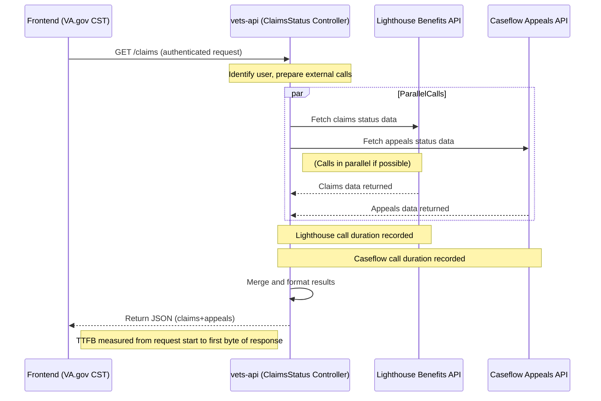

# VA Claims Status Tool (CST) Performance Analysis Report

## Table of Contents

*   [Executive Summary](#executive-summary)
*   [User Journey & Architecture Mapping](#user-journey--architecture-mapping)
    *   [Front-End Overview](#front-end-overview)
    *   [Back-End Overview](#back-end-overview)
    *   [High-Level User Flow Stages](#high-level-user-flow-stages)
    *   [Front-End Components & Rendering Details](#front-end-components--rendering-details)
*   [Performance Metrics & Measurement](#performance-metrics--measurement)
*   [Instrumentation Guidelines (Datadog, Google Analytics, Synthetic Testing)](#instrumentation-guidelines-datadog-google-analytics-synthetic-testing)
*   [Recommendations and Optimization Opportunities](#recommendations-and-optimization-opportunities)
*   [Diagram Appendix](#diagram-appendix)
    *   [Diagram 1: High-Level User Journey](#diagram-1-high-level-user-journey-login-to-claimappeal-load-and-interaction)
    *   [Diagram 2: Front-End Component Hierarchy](#diagram-2-front-end-component-hierarchy-and-performance-hooks)
    *   [Diagram 3: Back-End API Interaction Flow](#diagram-3-back-end-api-interaction-flow-vets-api-lighthouse-caseflow)

---

## Executive Summary

The VA Claims Status Tool (CST) enables Veterans to check the status of their disability compensation claims and appeals online. It’s one of the most heavily used VA.gov tools, with over **4.1 million status checks in March 2025** alone.

The CST consists of a `React`/`Redux` front-end on VA.gov and a `Rails`-based back-end (`vets-api`) that aggregates data from multiple VA systems – notably the VA **Lighthouse Benefits Claims API** for claim status and **Caseflow** for appeals status. This multi-source integration means performance is largely **network-bound**: users often wait on API calls to external systems before seeing their information. The front-end itself renders quickly once data arrives, but any slowness or errors from upstream services impacts the user experience.

Currently, **page load times are suboptimal**. Users see loading spinners while data fetches complete. Initial data load latency has been averaging `~3.7` seconds, with a goal to reduce this by 50% (to `~1.86s`). Mobile users experience even slower loads – about **39% slower** than desktop on average – highlighting a gap that needs closing.

Despite these challenges, the CST’s `React` app and API design do follow some best practices (like parallel API calls) to minimize wait time. However, there are clear opportunities to **optimize performance** and **instrument detailed metrics**.

This report provides an end-to-end mapping of the user journey (from login through checking a list of claims, viewing claim details, and uploading documents), identifies where time is spent at each stage, and pinpoints how to measure key performance metrics (API latency, rendering times, network delays, etc.). We also present recommendations – such as enhanced monitoring via `Datadog` and `Google Analytics`, caching strategies, parallelization improvements, and UI tweaks – to help the VA team cut load times, improve mobile performance, and ensure a smoother experience for all users.

The aim is to enable the CST product team (engineers and stakeholders alike) to clearly see how data flows through the system, where the bottlenecks are, and what steps can be taken next to achieve faster, more reliable service for Veterans.

---

## User Journey & Architecture Mapping

The CST user journey involves several stages: **authentication**, loading the **Claims & Appeals list**, viewing a **specific claim’s details**, and optionally uploading a **supporting document**. Below we map these end-to-end flows, covering the desktop and mobile experiences. We annotate where in each journey performance metrics can be captured.

### Front-End Overview

The Claims Status Tool is implemented as a `React` single-page application within VA.gov. When a user navigates to `/track-claims/your-claims/`, the `React` app (often referred to as `ClaimsStatusApp`) mounts and renders the `YourClaimsPageV2` component for the claims/appeals overview.

On component mount, it triggers `Redux` actions to fetch the user’s claims and appeals data from the back-end APIs using the platform’s `apiRequest` helper. The front-end does minimal processing; it mainly dispatches requests and updates the UI when data is returned. Rendering the list is usually fast (`< 100ms`), as the data volume is small. Thus, **the bulk of user wait time is due to network calls and back-end processing**, not front-end rendering. The app shows loading indicators while waiting. Session state in `Redux` can prevent refetching on simple navigation, but page reloads fetch fresh data.

### Back-End Overview

The `vets-api` back-end exposes REST endpoints (e.g., `GET /v0/claims`, `GET /v0/appeals`, `GET /v0/claims/{id}`, `POST /v0/claims/{id}/documents`). It acts as an orchestrator: authenticating the user, then calling appropriate VA backend systems:

*   **Lighthouse Benefits Claims API:** For claim status (interfacing with systems like `BGS` and `VBMS`).
*   **Caseflow API:** For appeals status (interfacing with `Caseflow` database or `VACOLS`).

`vets-api` proxies these requests, waits for responses, does minor processing, and returns `JSON` to the front-end. CST performance is therefore directly tied to the performance of these upstream APIs. **No significant caching is currently implemented**, ensuring fresh data but incurring full latency on each visit. External service slowdowns directly impact users. (See **Diagram 3** in the Appendix for a visual of this backend flow).

### High-Level User Flow Stages

The end-to-end journey involves these main stages:

**1. Login/Authentication:**
Users must sign in (e.g., via `login.gov` or `ID.me`) before accessing CST. This SSO flow is handled separately. Our focus is on performance *after* login.

**2. Claims & Appeals List Load:**
Upon landing on the "Your claims and appeals" page, the front-end issues **two API requests in parallel**: `GET /v0/claims` and `GET /v0/appeals`. `vets-api` handles these concurrently, calling `Lighthouse` and `Caseflow` simultaneously. This parallel design avoids unnecessary serialization.

The browser receives two `JSON` responses. Currently, the UI waits for **both** to complete before removing the loading spinner, meaning the slower call dictates the wait time. Once data is ready, `React` renders the unified list. The dominant factor here is **network/API latency**. The key user metric is **Time to Data** (initial load time). (See **Diagram 1** in the Appendix for this primary flow).

**3. Claim Detail View:**
Selecting a specific claim triggers a client-side route change (e.g., `/track-claims/your-claims/{claimId}/detail`). The `Claim Detail` component loads. If detailed data isn't already cached in `Redux`, it fetches it via `GET /v0/claims/{id}`. `vets-api` calls `Lighthouse` again for detailed information. The user sees a loading state until the data arrives. The latency is again driven by the `Lighthouse` call. We measure **Time to Detail** (click to details displayed).

**4. Document Upload:**
Users can upload supporting evidence via a form in the claim detail view. Clicking "Submit" sends a `POST /v0/claims/{id}/documents` request with the file to `vets-api`. `vets-api` forwards the file to the upload service (e.g., `EVSS` or `Lighthouse`).

This process is typically asynchronous; the API returns quickly (HTTP 202 Accepted) with a job ID. The front-end confirms the upload ("Your document has been uploaded..."). The document appears later after backend processing. The key metric is **upload request latency** (click to confirmation), usually under a few seconds.

**Mobile vs Desktop:**
Flows are identical, but mobile performance differs due to network latency and potentially device speed. If desktop load is 2.5s, mobile 4G might be `~3.5s` (approx. 39% slower). The main impact is higher **TTFB** and lower throughput on mobile networks. Metrics should be segmented by device type. Slower networks (3G) can exacerbate delays.

### Front-End Components & Rendering Details

Code structure alignment:

-   **Initialization:** `ClaimsStatusApp` mounts `YourClaimsPageV2`. `useEffect` dispatches `getClaims()`/`getAppeals()` actions, triggering `apiRequest`.
-   **State Management:** Data stored in `Redux` store (`state.claims.list`, etc.). Components subscribe. Loading flags control spinners.
-   **Partial Rendering:** Currently waits for both calls. Could be enhanced to render partial results sooner by modifying rendering logic in `YourClaimsPageV2`.
-   **Detail Loading:** Checks `Redux` state; fetches via `apiRequest(/v0/claims/${id})` if needed. Updates state (`state.claims.detail[id]`). Detail component renders. (See **Diagram 2** in the Appendix for component hierarchy).

---

## Performance Metrics & Measurement

Key metrics to track CST performance:

-   **API Latency:** Time for `vets-api` endpoints (`/claims`, `/appeals`) to respond. Directly impacts user wait time. Goal: Reduce average from `~3.7s` to `~1.86s`. Measure median, p90, p95.
    *   *Measurement:* Datadog APM, Browser DevTools/RUM.

-   **Number of API Calls:** How many network requests per user action. Initial load = 2. Minimize redundant calls.
    *   *Measurement:* Front-end instrumentation, Network logs, GA Events.

-   **Parallel vs. Sequential:** Confirm `vets-api` calls to `Lighthouse`/`Caseflow` run in parallel. Measure time difference between responses.
    *   *Measurement:* Datadog APM traces, Browser Network timings.

-   **Largest Contentful Paint (LCP):** Time until the main content (claims list) is visible. Goal: Improve by `>1s`.
    *   *Measurement:* RUM tools (Datadog), `PerformanceObserver` + GA, Synthetic tests (Lighthouse).

-   **Time to First Byte (TTFB):** How quickly `vets-api` starts sending API response data. Lower is better.
    *   *Measurement:* Synthetic monitors, Datadog APM (server time), GA Site Speed/User Timing.

-   **Interaction to Next Paint (INP):** Responsiveness to user interactions (e.g., clicks). Aim for quick feedback.
    *   *Measurement:* RUM tools, Event Timing API + GA, Lighthouse v10+.

-   **Mobile Load Time Gap:** Difference in LCP/Time to Data between mobile and desktop. Aim to reduce the current `~39%` gap.
    *   *Measurement:* RUM/GA segmented by device, Synthetic tests with mobile profiles.

-   **Network Impact on Mobile:** Analyze how 3G/slow networks affect load times.
    *   *Measurement:* Synthetic tests with network throttling, RUM data with connection type.

---

## Instrumentation Guidelines (Datadog, Google Analytics, Synthetic Testing)

Leverage VA tools for comprehensive measurement:

**Datadog (APM & RUM):**
-   **APM (`vets-api`):** Track endpoint **Latency**, **External Call Timing** (to Lighthouse/Caseflow), **Error Rates**, and **Throughput**. Set up alerts.
-   **RUM (Front-End):** Capture **Core Web Vitals** (LCP, INP), **User Timings**, and segment by device/browser.

**Google Analytics (GA):**
-   Use **Custom Events/User Timing:**
    *   Log "Time to Data" (e.g., `claims_data_loaded` event with duration).
    *   Send Core Web Vitals using `web-vitals` library.
    *   Track detailed timings like "CST Data Fetch Time".
-   Monitor **Bounce Rate** and **Engagement** (clicks, uploads) in relation to performance.

**Synthetic Testing:**
-   Use Lighthouse CI, WebPageTest, etc.
-   **Scenarios:** Test claims list & detail pages on desktop/mobile profiles (including 3G).
-   **Metrics:** Capture lab LCP, TTFB, INP.
-   **Budgets:** Integrate into CI/CD to catch regressions automatically.

Combine insights from Datadog, GA, and synthetic tests onto a consolidated dashboard for a full performance picture.

---

## Recommendations and Optimization Opportunities

Prioritized actions to improve CST performance:

1.  **Implement Comprehensive Monitoring & Alerts:** Establish baseline metrics using Datadog, GA, and synthetics *before* optimization. This guides efforts and validates success.

2.  **Optimize Front-End Data Handling:**
    *   **Display Partial Results:** Render claims or appeals data as soon as it arrives, reducing perceived wait.
    *   **Client-Side Caching:** Implement short-term caching (1-5 min) in `sessionStorage` or `Redux` for faster repeat loads, especially on mobile.
    *   **Optimize Bundle Size:** Ensure JS bundle is minimized via code-splitting if large.
    *   **Improve Interaction Feedback:** Show immediate loading states on clicks/uploads.

3.  **Optimize Back-End and API Usage:**
    *   **Advocate for Upstream Improvements:** Collaborate with `Lighthouse` on their internal parallelization and caching efforts.
    *   **Server-Side Caching (`vets-api`):** Introduce short-lived `Redis` caching (30-60s per user) for `/claims`/`/appeals` responses.
    *   **Streamline Processing:** Ensure `vets-api` avoids heavy data transformations.
    *   **Explore Modern Protocols:** Use HTTP/2 or HTTP/3 for backend calls if beneficial.

4.  **Improve Error Handling & Resilience:**
    *   **Graceful Partial Failures:** Show available data even if one source fails, with clear error messages.
    *   **Implement Retries:** Add limited retries for transient external API errors.
    *   **Proactive Messaging:** Inform users during known upstream maintenance.

5.  **Mobile-Specific Optimizations:**
    *   **Ensure Compression:** Verify `gzip` is enabled for API responses.
    *   **Monitor the Mobile Gap:** Track mobile metrics specifically to ensure improvements reduce the gap.
    *   **Test on Low-End Devices:** Ensure acceptable JS performance.

6.  **Collaboration with Upstream Teams (`Lighthouse`, `Caseflow`):**
    *   Share performance data regularly to align priorities.
    *   Coordinate testing and adoption of faster API versions.

7.  **Continuous Improvement & Reporting:**
    *   Treat performance as an ongoing feature. Set new goals after initial wins.
    *   Document improvements and maintain updated performance stats in product documentation.

Focusing on optimizing the **critical API path** (Lighthouse/Caseflow calls) and **measuring effectively** will yield the most significant improvements, leading to a faster, more reliable CST for Veterans.

---

## Diagram Appendix

Visual representations of the CST architecture and user flows.

### Diagram 1: High-Level User Journey (Login to Claim/Appeal Load and Interaction)

This sequence diagram shows the steps from a Veteran logging in and navigating to the Claims Status Tool, through the data fetching process, to a user interaction. Key performance measurement points (start/stop timers, LCP, INP, TTFB) are annotated in the flow.

```mermaid
sequenceDiagram
    participant Veteran as Veteran (User)
    participant Browser as VA.gov Frontend (Claims Status Tool)
    participant VAAPI as VA.gov Backend (vets-api)
    participant LHB as Lighthouse API (Claims)
    participant Caseflow as Caseflow API (Appeals)

    Veteran->>Browser: Login & navigate to Claims Status page
    Browser->>VAAPI: HTTPS GET /claims (request claim & appeal data)
    Note right of Browser: **Start timer** for data fetch (TTFB begins)
    par FetchClaimsAndAppeals
        VAAPI-->>LHB: Request Veteran's claims data
        VAAPI-->>Caseflow: Request Veteran's appeals data
        Note over VAAPI,LHB: External call to Lighthouse starts
        Note over VAAPI,Caseflow: External call to Caseflow starts
        LHB-->>VAAPI: Returns claims JSON
        Caseflow-->>VAAPI: Returns appeals JSON
    end
    Note over VAAPI: Combine claims + appeals results<br/>and format response
    VAAPI-->>Browser: Respond with consolidated data (JSON)
    Note right of Browser: **Stop timer** (data received; TTFB measured)
    Browser->>Browser: Render claims and appeals lists
    Note over Browser: **LCP** – Main content (claims list) visible to user
    Veteran->>Browser: Clicks on a claim item (user interaction)
    Browser-->>Browser: Front-end handles interaction (e.g., expand details)
    Note right of Browser: **INP** – Measure time to next paint after click
```

### Diagram 2: Front-End Component Hierarchy and Performance Hooks

This flowchart illustrates the structure of the `React`/`Redux` front-end for CST and highlights where performance measurements occur. It shows the main application component, subcomponents, `Redux` store interactions, and points for performance timing.

```mermaid
flowchart TD
    subgraph Frontend [VA.gov Frontend (React App)]
        CSTApp[Claims Status App (Container Component)]
        ReduxStore((Redux Store))
        ClaimsList[ClaimsList Component]
        AppealsList[AppealsList Component]
        ClaimItem[ClaimItem Subcomponent]
        AppealItem[AppealItem Subcomponent]
    end

    CSTApp --> ReduxStore: dispatch "Fetch Claims & Appeals" action<br/>**(Start timer)**
    ReduxStore --> APIRequest[/vets-api fetch initiated/]
    APIRequest -->> ReduxStore: receive data response<br/>**(Stop timer)**
    CSTApp --> ClaimsList: render claims list (with data)
    CSTApp --> AppealsList: render appeals list (with data)
    ClaimsList --> ClaimItem: render each claim entry
    AppealsList --> AppealItem: render each appeal entry
    CSTApp --> LCPpoint[LCP: Main content painted]
    User["Veteran User"] -->> CSTApp: clicks or interacts (e.g., expand details)
    CSTApp --> INPpoint[INP: UI updated after interaction]
```

### Diagram 3: Back-End API Interaction Flow (vets-api, Lighthouse, Caseflow)

This sequence diagram focuses on the back-end processing when the front-end requests claim status data. It shows `vets-api` handling the request and the parallel calls to `Lighthouse` and `Caseflow`. Annotations indicate where external call latency and overall response time (TTFB) are measured.


