# VA Claims Status Tool – Technical User Journey & Performance Report

## Executive Summary

The **VA Claims Status Tool (CST)** on VA.gov enables Veterans to check the status of disability compensation claims, decision reviews, and appeals online. This report provides a detailed technical breakdown of the CST user journeys and a performance analysis roadmap for improvement. We map out high-level and low-level flows, from user entry and authentication through data fetching, rendering, and post-load interactions. Key performance measurement points (frontend and backend) are identified throughout. We incorporate insights from recent analyses and initiatives, including a latency deep-dive and a structured performance optimization plan, highlighting targets such as reducing API latency to ≤1.86s and improving Largest Contentful Paint (LCP) by 1s.

**Summary of Findings:** 

- **Multi-Stage Data Fetching:** The frontend makes parallel API calls to retrieve **claims** and **appeals** data (via **Lighthouse Benefits Claims API** and **Caseflow** respectively). The user sees a loading spinner until both responses arrive, meaning total load time is gated by the slower of the two.
- **Frontend Rendering:** The React UI is efficient and renders quickly once data is available; performance issues stem mostly from waiting on data rather than heavy frontend computation.
- **Backend Orchestration:** The **vets-api** (Rails backend) serves as a middleman, forwarding requests to upstream services. It has minimal overhead (authentication, data formatting) compared to the upstream API latencies.
- **Performance Metrics:** Current average API response time ~3.7s and page load ~5.6s indicate room for improvement. Mobile experiences are ~39% slower than desktop. We identify critical metrics to track: API latency distribution (mean, p95), LCP, Time to First Byte (TTFB), Interaction to Next Paint (INP), error rates, and mobile vs desktop gaps.
- **Targets:** Reduce API latency by 50% (to ≤1.86s), improve LCP by ≥1s, close mobile-desktop gap (≤10% difference target), and reduce bounce rates from slow loads.
- **Recommendations:** Parallelize and cache where possible (frontend and backend), instrument comprehensive monitoring (Datadog APM/RUM, GA4 Web Vitals), handle partial data gracefully to improve UX, and collaborate with upstream API teams (Lighthouse, Caseflow) on performance SLAs.

**Structure of Report:** 

We present an end-to-end user journey with diagrams at both high-level (user steps) and low-level (code and data flow). We then detail performance measurement points (frontend metrics like LCP, backend metrics like API timing) and discuss opportunities for optimization. Prior research is integrated throughout, ensuring recommendations are evidence-backed and actionable. 

By following this roadmap, VA.gov teams can **improve CST’s speed and reliability**, resulting in a better user experience – Veterans will get claim updates faster, with less frustration, ultimately increasing trust in VA digital services.

## Methodology

Our analysis combines:

- **Code Inspection:** Review of the **vets-website** (frontend) and **vets-api** (backend) code and architecture documentation. We traced React components, Redux actions, and Rails controllers/services to map data flow and integration points.
- **User Journey Mapping:** Creation of flowcharts (Mermaid diagrams) for the **user’s path** through CST, from login to data display and interactions. These outline key stages: entry (via VA.gov dashboard or direct link), authentication, initial page load, API calls for claims/appeals, rendering of the status list, and subsequent interactions (viewing details, uploading evidence, etc.).
- **Performance Data & Benchmarks:** Referenced performance stats from the VA.gov Performance Dashboard and recent CST latency analysis. This provided baseline metrics (current averages, p95s) and usage volume (4.1M+ status checks in March 2025). We also aligned with the **CST Improve Application Load Times Initiative** to incorporate defined targets (API ≤1.86s, LCP -1s, etc.).
- **Existing Documentation:** Integrated learnings from:
  - *LLM CST Latency Analysis* – deep dive into current performance bottlenecks and quick wins.
  - *CST Improve Load Times Initiative* – strategic plan outlining short-, medium-, long-term optimizations and KPIs.
  - *VA Claim Status Architecture* – comprehensive architecture of CST, including sequence diagrams for data fetching, submissions, and integrations.
- **Performance Best Practices:** Consideration of general web performance techniques (caching, parallel requests, async rendering, compression). Where direct data was unavailable, we made informed assumptions based on similar VA.gov patterns and noted them as such.

The combination of these sources allowed us to construct a **complete picture of the CST user journey and performance profile**. Below, we first present the user journey flows and architecture (with diagrams), then drill into performance metrics and improvement opportunities.

## User Journey Flowchart (High-Level)

The following flowchart captures the **high-level user journey** through the Claims Status Tool, from start to finish. It highlights user-facing stages and key system actions:

```mermaid
flowchart TD
    %% STYLES
    classDef userNode fill:#e6f7ff,stroke:#0073b7,stroke-width:2px,color:#00508c
    classDef serviceNode fill:#f0f0ff,stroke:#9370db,stroke-width:2px,color:#4b0082
    classDef apiNode fill:#fff0f5,stroke:#ff69b4,stroke-width:2px,color:#c71585
    classDef pageNode fill:#f0fff0,stroke:#2e8b57,stroke-width:2px,color:#006400
    classDef actionNode fill:#fff8dc,stroke:#daa520,stroke-width:2px,color:#8b4513
    
    %% NODES
    U["👤 User (Veteran)"]:::userNode
    L["🚀 Launch CST Entry"]:::actionNode
    Auth["🔐 VA.gov Login Service"]:::serviceNode
    CST["📋 Open Claims & Appeals Page"]:::pageNode
    APICalls["🔄 Fetch Data"]:::apiNode
    BE1["⚙️ Vets-API Backend (Claims)"]:::serviceNode
    BE2["⚙️ Vets-API Backend (Appeals)"]:::serviceNode
    LH["💡 Lighthouse Claims API"]:::apiNode
    CF["📊 Caseflow Appeals API"]:::apiNode
    FE["⚛️ React Frontend"]:::serviceNode
    UI["🖥️ Claims Status Page"]:::pageNode
    Interact["🔍 Post-Load Actions"]:::actionNode
    BE1Detail["📄 Vets-API (Claim Detail)"]:::serviceNode
    BE1Waiver["📝 Vets-API (Submit 5103)"]:::serviceNode
    BE1Upload["📤 Vets-API (Upload)"]:::serviceNode
    
    %% CONNECTIONS
    U -->|"Navigate to VA.gov"| L
    L -->|"Authentication"| Auth
    Auth -->|"Authenticated"| CST
    CST -->|"API Calls"| APICalls
    APICalls -->|"GET /v0/benefits_claims"| BE1
    APICalls -->|"GET /v0/appeals"| BE2
    BE1 -->|"Calls Lighthouse API"| LH
    BE2 -->|"Calls Caseflow API"| CF
    LH -->|"Claims JSON"| BE1
    CF -->|"Appeals JSON"| BE2
    BE1 -->|"200 OK (claims)"| FE
    BE2 -->|"200 OK (appeals)"| FE
    FE -->|"Render UI"| UI
    UI -->|"User Interaction"| Interact
    Interact -->|"GET claim details"| BE1Detail
    Interact -->|"POST submit waiver"| BE1Waiver
    Interact -->|"POST upload docs"| BE1Upload
    BE1Detail -->|"Claim Detail"| FE
    BE1Waiver -->|"Submit Waiver"| FE
    BE1Upload -->|"Upload Status"| FE
    FE -->|"Update UI"| U
```

**Figure: High-Level User Journey Flow** – From login to claim status page load and follow-on actions.

**Explanation:** 

1. **User Entry & Authentication:** The journey begins with a Veteran navigating to the CST, often via the VA.gov dashboard or direct link (`va.gov/track-claims`). If not already signed in, they must authenticate via SSO (Login.gov, ID.me, etc.). Only signed-in users can access their claim status. On successful login, the user opens the “Your Claims and Appeals” page (the main CST view).
2. **Page Load & Data Fetch:** As soon as the CST page loads, the frontend React app triggers data fetches for claims and appeals in parallel. This corresponds to API calls: `GET /v0/benefits_claims` and `GET /v0/appeals` to the VA.gov API. The user sees a loading indicator (spinner) while these calls are in progress.
3. **Backend Processing:** The **vets-api** receives these requests via the **BenefitsClaimsController** and **AppealsController**. It verifies the session, then calls out to:
   - **Lighthouse Benefits Claims API** to get the list of claims.
   - **Caseflow API** to get the list of appeals.
   Each of these external calls uses the Veteran’s identifiers (ICN or file number) to retrieve data from VA systems (e.g., VBA’s claims database via Lighthouse, BVA’s appeals via Caseflow). The Lighthouse call may internally query legacy systems (like BGS) before returning results.
4. **Data Returns & UI Rendering:** Once both API responses arrive (or one if the other fails – see error handling below), the backend sends JSON data to the frontend. The vets-api automatically converts keys to **camelCase** for consistency. The React app then **renders the combined list** of claims and appeals, interleaving them by date or showing separate sections. The initial display typically includes claim/appeal titles, status (e.g., “Pending decision approval”), and last update dates. This marks the end of the primary page load: the user can now see their claim status information.
5. **Post-Load Interactions:** The user can take various actions:
   - **View Claim Detail:** Clicking a specific claim triggers `GET /v0/benefits_claims/{id}` for detailed status (e.g., full timeline of events). The UI will navigate to a detail page and show more info once data is fetched.
   - **Submit 5103 Waiver:** If eligible (e.g., within evidence gathering phase), the user can submit a “Decision Request” (5103 waiver) – a `POST /v0/benefits_claims/{id}/submit5103` is sent. On success, the UI confirms receipt and the claim’s status updates to reflect the waiver.
   - **Upload Documents:** The user may upload supporting evidence. This uses `POST /v0/benefits_claims/{id}/benefits_documents` with the file attached. A successful upload triggers a confirmation message (“We received your file…”).
   - **Download Letters:** If decision letters or 5103 notice letters are available, `GET /v0/claim_letters` and `/v0/claim_letters/{id}` endpoints are called to list and fetch PDFs.
   - **Miscellaneous:** The CST also fetches static data like `GET /v0/average_days_for_claim_completion` to show average processing times, or uses evidence submission status endpoints to poll upload progress.
6. **Logout/Session Expiry:** If the user’s session expires, subsequent API calls will fail with 401, prompting re-authentication. The tool ensures secure operations by requiring valid session cookies and CSRF tokens for state-changing requests.

Throughout, **performance monitoring hooks** can capture key events (detailed later): e.g., record the time from page open to data loaded (“Time to Data”), measure LCP at the moment claims list is rendered, and log any errors encountered (to Sentry or GA).

**Note:** The CST is part of a larger logged-in experience on VA.gov, so some steps (like initial authentication) might occur earlier if the user was already signed in. Also, the **feature toggles** can alter behavior (e.g., using EVSS vs Lighthouse, including certain letters, etc.), but for this report, we assume the current production state (Lighthouse enabled for claims, etc.) ([cross-benefits-documentation/deep_research/va-claim-status-architecture.md at main · MikeC-A6/cross-benefits-documentation · GitHub](https://github.com/MikeC-A6/cross-benefits-documentation/blob/main/deep_research/va-claim-status-architecture.md#:~:text=,notice%20letters%20in%20downloadable%20letters)).

## Frontend Technical Flow (React & Redux)

On the frontend, CST is implemented as a React application within **vets-website**. The flowchart below details the **component hierarchy, Redux actions, and rendering logic** during the initial page load:

**Figure: Frontend Data Flow and Components (Initial Load)**

**Key Frontend Elements:**

- **Entry Point & Routing:** The `manifest.json` for CST defines the root route (`/track-claims`) and the entry point (`claims-status-entry.jsx`). When the user navigates to `/track-claims/your-claims`, the React app initializes via `claims-status-entry.jsx`, which likely renders a top-level `<ClaimsStatusApp>` or sets up routes. The `<ClaimsStatusApp>` component wraps the experience and may include common elements (e.g., breadcrumbs, page title).
- **YourClaimsPageV2:** This is the main component for the “Your Claims and Appeals” page. On mount (or when the route is hit), it triggers data loading by dispatching Redux **thunks**: `getClaims()` and `getAppealsV2()`. These are defined in `src/applications/claims-status/actions/index.js`.
- **Redux Actions (Thunks):** 
  - `getClaims()`: Dispatches a “loading” state, then calls the `apiRequest('/benefits_claims')` helper to hit the endpoint.
  - `getAppealsV2()`: Similarly uses `apiRequest('/appeals')`.
  Both functions provide success and error callbacks. On success, they dispatch actions like `CLAIMS_FETCH_SUCCESS` or `APPEALS_FETCH_SUCCESS` carrying the fetched data payload; on failure, they dispatch error actions (with different types depending on status code, e.g., `BACKEND_SERVICE_ERROR`). The code includes logic to map HTTP errors to specific Redux state fields and logs to Sentry for monitoring.
- **API Helper:** `apiRequest` is a platform utility that automatically prefixes the API base URL, includes credentials (session cookie), and handles JSON parsing. It also adds the required `X-Key-Inflection: camel` header so that the response JSON keys are in camelCase. This prevents the frontend from dealing with snake_case.
- **Redux Store Updates:** The CST Redux state likely has slices for `claims` and `appeals`. Initially, it might set flags like `claimsLoading = true`, then after data returns, `claimsLoading = false` and stores `claimsList` (array of claim summaries) and `appealsList`. There may also be an aggregated list or logic to merge them for display. Errors are stored in state if any (e.g., `claimsError` or a combined error flag).
- **Component Re-render:** Once the store has data, React re-renders `YourClaimsPageV2`, which now has props/state with the lists. The component maps over the claims and appeals arrays to render each item (likely using a sub-component like `<ClaimListItem>` or `<AppealListItem>`). The UI shows each claim/appeal’s title (e.g., “Disability Compensation – Status: Evidence gathering”), last update, and a link to view details.
- **Conditional Rendering:** If data is still loading, the page shows a loading spinner (via a loading state prop). If an error occurred, it might show an error message (perhaps a generic “We can’t load your information right now” or a specific one if coded).
- **Other Components:** 
  - A `<ClaimDetailPage>` component handles rendering details when a specific claim is selected. It uses another Redux action `getClaim(id)` to fetch detail (and similar for appeal detail if applicable).
  - `<FileUpload>` component encapsulates the file upload UI for evidence submission, interfacing with the FineUploader library (which directly calls the API endpoint with the file).
  - `<AppealsTimeline>` might display the history of an appeal on detail pages.
  - Global components like `<RequiredLoginView>` or `<DowntimeNotification>` might wrap the app to ensure only authenticated access and handle system maintenance windows.

- **Feature Flags (Frontend):** The UI checks flags for conditional features (via `window.VetsGov.featureFlags` or similar). E.g., toggles exist for showing 5103 content updates (`cst_5103_update_enabled`), whether to include 5103 letters (`cst_include_ddl_5103_letters`), etc. These flags are typically fetched on page load as well (the platform may batch fetch all flags). If flags are not yet loaded, they could delay rendering of certain elements – one optimization in the initiative is to reduce blocking on feature flags.

**Performance considerations on frontend:** 

- The app is **SPA-based**, so if the user had navigated from another tool or after login, the JS bundle might already be cached, making load faster. Initial load cost is then mainly the data fetch.
- **Largest Contentful Paint (LCP)** on this page is likely when the list of claims appears (which is after data fetch). To improve LCP by 1s, we aim to get content on screen faster – either by getting data sooner (optimize API) or showing partial data early (e.g., show claims as soon as available, without waiting for appeals).
- **Interaction to Next Paint (INP)** is usually fine since the UI isn’t heavy. Once loaded, interacting (expanding an item, clicking detail) is quick, as most heavy lifting is reading from already fetched data or making one-off calls (which again can show a spinner but not block UI thread).
- **Front-End Timing Hooks:** We can use the Navigation Timing API or `performance.mark`/`measure` in code to mark when data fetch starts and ends, then send that delta to GA as a custom metric (e.g., `claims_data_load_time`). Web Vital APIs can capture LCP and INP for GA4.
- **Mobile vs Desktop (frontend):** Part of the 39% slower mobile experience could be due to network (slower fetch of data) and possibly device performance. The React app itself is lightweight, but mobile might parse/render slightly slower. Ensuring **responsive design** and not doing extra re-renders helps. Also, if any images or heavy assets were included (which is minimal here), lazy-loading them is vital. On claims list, mostly icons or small SVGs are used, which are negligible.

**Summary:** The frontend orchestrates the user experience by kicking off parallel data calls and managing UI state. Its performance is largely dependent on how quickly the data arrives and how it handles interim states. Next, we examine the backend flow which is crucial to that data retrieval speed.

## Backend Technical Flow (vets-api & Integrations)

The **vets-api** backend (Ruby on Rails) exposes REST endpoints under `/v0/` that the CST frontend calls. We detail the **backend flow** for the two primary GET endpoints and how data travels through services to external APIs:

**Figure: Backend Sequence for Data Fetching (Claims & Appeals)**

**Backend Components & Flow:**

- **Rails Controllers:** 
  - `BenefitsClaimsController#index` handles `GET /v0/benefits_claims`.
  - `AppealsController#index` handles `GET /v0/appeals`.
  These controllers ensure the user is authenticated (`before_action :authorize`) and then typically call corresponding service classes to fetch data. They don’t contain heavy logic themselves (just parameter handling and invoking services).
- **Service Classes:** 
  - `BenefitsClaims::Service` (located in `lib/lighthouse/benefits_claims/service.rb`) encapsulates calls to the **Lighthouse Benefits Claims API**. Method `get_claims(user)` likely constructs a Lighthouse API request using the Veteran’s **ICN** (Integration Control Number, a unique healthcare identifier often used to query Lighthouse). It might also need the Veteran’s EDIPI or SSN depending on the API, but likely ICN is primary for Lighthouse. The service class handles the HTTP call (e.g., via `Faraday` or a common client wrapper) and transforms the result (e.g., raising exceptions on errors, possibly filtering or normalizing data).
  - `Appeals Service`: VA.gov’s appeals integration might not have a clearly named service class in the open (it could be internal or part of Caseflow service modules). But conceptually, an Appeals service uses the Veteran’s **file number (usually SSN or claims file #)** to request appeals from Caseflow. Caseflow returns appeals status including details on each appeal (issues, status, last event).
  - Both calls run in parallel **at the system level** because they are separate HTTP requests from the frontend. Rails (with Puma server) handles each in a separate thread/worker. Thus, one request processing does not block the other – they run concurrently, fully utilizing multi-threading on the server. This is good for performance (the front-end design of two calls enables true parallelism).
- **External API Details:**
  - **Lighthouse Claims API**: A REST API (v1) that returns the list of benefit claims for the given Veteran. Under the hood, it might query the **VBA’s Benefits Gateway Service (BGS)** or other data sources to get claim status. The data includes fields like claim phase, status, date filed, contention list, etc. The response time can vary (assume ~1–2s normally, but sometimes slower). If Lighthouse is backed by BGS, certain calls (like initial load if not cached) could be expensive. There is likely some caching at Lighthouse for active claims because millions of hits otherwise directly to BGS could be heavy.
  - **Caseflow API**: Caseflow is the Board of Veterans’ Appeals system. The endpoint returns any active appeals or higher-level reviews. It might include details such as docket number, status (e.g., “Evidence submission”), last action, etc. Caseflow performance is typically pretty good (sub-second) but can slow if it has to pull data from legacy VACOLS for older appeals. For modern appeals (AMA), Caseflow has them in its DB.
  - Both APIs return JSON in a certain format – vets-api likely doesn’t deeply transform these, except to unify the casing and maybe data structure (ensuring both fit a common schema expected by frontend).
- **Middleware & Helpers:**
  - **Auth & Session:** The user’s identity (like `current_user`) is resolved via the session cookie (which corresponds to a Redis session or SSOe token). From `current_user`, the system gets the ICN and file#, which are passed to the service calls.
  - **Breaker Circuit:** The `breaker_box` gem usage implies that calls to Lighthouse and Caseflow are wrapped in a **circuit breaker**. If, say, Lighthouse is consistently failing or timing out, the breaker trips and for a short time all calls fail fast with a 503, rather than hanging. This prevents resource exhaustion and gives upstream time to recover. It likely resets after X seconds or upon a successful call.
  - **Error Handling:** If Lighthouse API call throws an exception (like timeout or returns 500), the `BenefitsClaims::Service` might raise a custom `BackendServiceException`. The controller or a global exception handler catches that and returns an HTTP 502/504 to the client. The response might include a standardized error structure that frontend knows how to display (possibly an `errors` array with a code like `CLEVER` – not sure the exact codes here, but likely something like `503: Backend Service Outage`).
  - **Response Inflection:** The Rails middleware automatically converts all JSON response keys to camelCase when the request has `X-Key-Inflection: camel` (which our frontend does). So, if Lighthouse returned `claim_phase` as a key, by the time it reaches the frontend, it’s `claimPhase`. This is a global middleware in vets-api and is very convenient for frontend consistency.
  - **Caching:** Currently, we did not find evidence of caching in these endpoints (no mention of Redis caching for the user-specific calls). However, vets-api might have caching layers (some endpoints use `CacheAside` or Rails cache). If none is used, every request hits upstream fresh. We propose adding short-term caching as an improvement (discussed later).
- **Backend Endpoint for POST actions:** (briefly from the diagram)
  - `submit5103`: Handled by BenefitsClaimsController as well (`post :submit5103` on a claim resource). It calls `BenefitsClaims::Service.submit5103` which calls Lighthouse’s endpoint to submit the waiver.
  - `benefits_documents` upload: Handled by BenefitsDocumentsController which calls `BenefitsDocuments::Service.upload` to Lighthouse’s Doc API.
  - `claim_letters`: Handled by ClaimLettersController, likely calls a service to fetch letters (maybe from VBMS or via Lighthouse if that’s exposed).
  - Legacy `evss_claims` endpoints exist but presumably not used in prod now (feature-flagged off).

**Backend Performance:**

- **Latency contributors:** If average total API time is ~3.7s, it suggests perhaps Lighthouse ~2s, Caseflow ~1s, plus overhead. Sometimes Lighthouse might be slower. Also, if a Veteran has many claims, the payload size could add some time (more data to transmit).
- **API Parallelism:** As noted, the frontend splitting into two calls is beneficial. If it had been one combined call, vets-api would have had to sequentially call Lighthouse then Caseflow (or spin its own threads). The current approach leverages client-side parallelism and server’s ability to handle multi-requests.
- **Datadog APM:** We should instrument timers around the external calls. E.g., log how long `get_claims` took vs total request. Datadog can show if 90% of the time was in external call vs internal. Likely, internal processing is tiny (maybe tens of ms to format response). Thus improvements need to target external calls, or mitigate via caching. 
- **Target p95 latency:** Possibly aiming for p95 < 3s (currently maybe higher, if some outliers are 6-8s). The initiative’s goal of ≤1.86s average means even high percentiles hopefully under 3-4s.
- **Error Rates:** We should monitor the error rate of these endpoints. If e.g. 0.5% of appeals calls fail, that’s a lot of users seeing an error (if usage is 4M/month, 0.5% = 20k errors). Ideally, error rate <0.1% or so in steady state. Spikes indicate issues with upstream availability.
- **Scalability:** With ~4M monthly checks, that’s ~133k/day. At peak (maybe midday), could be hundreds per minute. Rails can handle that, but upstream might throttle. Lighthouse likely has rate limiting (maybe not for internal VA calls, but we should confirm). If we implement caching, it could drastically cut the load especially from frequent checkers.
- **Mobile API Parity:** Note that VA also has a **Mobile API** for claim status (different base path, often similar data). We won’t cover it deeply here, but improvements we do in the core vets-api might not directly benefit the mobile app if it calls a different backend path. Ensuring both share the optimized services is important.

In summary, the backend is the crux of performance in CST. Next, we explore how we measure performance (both frontend and backend) and opportunities to optimize, referencing specific metrics and tools.

## Performance Measurement Points & Metrics

To improve performance, we first need to measure it effectively at each stage of the user journey. Below are **key performance metrics** and **where/how to measure them** on both frontend and backend, including specific tools (Google Analytics, Datadog, etc.):

### Frontend Performance Metrics (User-Centric)

- **Largest Contentful Paint (LCP):** Marks when the main content (claims list) is rendered. Likely occurs once both claims and appeals data are loaded and displayed. We can collect LCP via **Google Analytics 4 Web Vitals** or Chrome’s native `navigator.lcp` API. Target: reduce LCP by ~1s (e.g., from ~5.5s to 4.5s on avg). An improved LCP means users see content faster.
- **Time to First Byte (TTFB):** Measures how quickly the initial HTML (or in SPA context, initial API responses) come back. This is mostly backend latency. We aim to decrease TTFB by making APIs faster (goal ≤1.86s average, means TTFB around that or better). GA’s site speed tracking can sample TTFB, or we use **Datadog RUM** for precise measurements.
- **Time to Data (Custom Metric):** The time from page navigation to all data fully loaded and rendered. We can instrument this by capturing a timestamp when we dispatch the API calls and another when both Redux stores have data (or when the spinner disappears). Then send an event to GA, e.g., `eventCategory: 'CST', eventAction: 'data_loaded', eventValue: 2500` (if 2.5s). This directly quantifies the waiting time users experience. We can break it down by device category (mobile vs desktop) to monitor the 39% gap.
- **Interaction Readiness (INP):** For CST, **Interaction to Next Paint** is relevant on subsequent interactions, like clicking to expand a claim accordion. We expect INP to be low (under 100ms) since the app is lightweight. But GA4 can capture INP; if it’s high on mobile, perhaps due to main thread blocked by heavy JS, we’ll investigate. Possibly an area if we consider adding more logic.
- **Bounce Rate and Engagement:** GA can tell if users drop off the page quickly (bounce). A high bounce could mean they got frustrated waiting (e.g., nothing showed after a few seconds). We can correlate bounce rate with load times. Also measure **time on page** – if users are spending a long time but mostly waiting, that’s bad. Ideally, time on page is just enough to read status and maybe click further, not idling for content.
- **Visual Indicators:** The presence of the spinner for long durations could be tracked. For example, if spinner is visible >5s, fire a GA event (`eventAction: 'spinner_timeout'`). That would count how often users suffer really slow loads. 

By collecting these frontend metrics, we tie performance to user experience. For instance, if average **Time to Data** is 2s and bounce is low, we’re okay. If Time to Data is 8s and bounce is 50%, we have a serious problem (likely the case prompting this initiative).

### Backend Performance Metrics (Server & API)

- **API Latency (Duration):** For each endpoint:
  - Measure **average**, **median (p50)**, **p90**, **p95**, and **p99** response times. Datadog APM or logs can provide this. For instance, if p95 is 4s (5% of requests take ≥4s), that’s a target to bring down (goal maybe p95 ≤3s).
  - The initiative’s goal is average ~1.86s, which likely implies p50 ~1s, p90 ~2.5s, p95 ~3-4s. We should chart these over time.
- **External Call Breakdown:** Use Datadog’s tracing to instrument sub-spans for the Lighthouse and Caseflow calls within a request. This way we see e.g. “GET /v0/benefits_claims took 2.0s total: Lighthouse call 1.8s, our processing 0.2s”. If we notice e.g. a consistent 0.2s overhead, that’s fine; if overhead was bigger, we’d investigate (maybe unnecessary DB lookups in vets-api).
- **Parallel Calls Efficiency:** Since both calls are parallel, ensure the server handles concurrency well. If we see any queueing or delays on the Rails side, maybe thread pool is saturated at times. But likely fine. We could monitor Puma **queue time** or throughput vs. latency.
- **Error Rate:** Track what % of requests result in 4xx/5xx errors. Separate by endpoint:
  - If `/v0/appeals` has e.g. 1% error (maybe because not all users have appeals, but that should return 200 with empty list ideally, not error), or if it errors when profile missing SSN (maybe a 403 if user has no file number). We should instrument these specifically. GA could log if a user sees an error message too (client-side log).
  - If errors spike to say 5% or more, that’s immediate alarm. E.g., if Caseflow is down at night for maintenance, we might see 100% failure for appeals in that window.
- **Throughput & Scalability:** Monitor requests per minute on these endpoints. If latency increases during high RPM, could indicate scaling issues. But if using standard VA.gov infra, it should scale out. Still, good to know peak traffic hours to align any background prefetch if we consider it.
- **Mobile vs Desktop API calls:** Possibly measure if any differences (both use same endpoints here, so difference would only be in network speed).
- **Datadog RUM** can combine client and server timing to give a holistic view of each user’s experience from click to render.

### Mobile-Specific Metrics

Mobile performance being 39% slower suggests we need to measure and improve:
- **Connection impact:** Maybe mobile users are often on slower networks. We can measure **bytes transferred** for the API payload and initial JS. If, say, the claims list JSON is 200KB and a user is on 3G, that’s a few seconds just to download. Consider **payload optimization** – though likely moderate size, not huge.
- **Responsive behavior:** Check if any images or heavy components load on mobile differently. Also ensure the site doesn’t do extra work for mobile (shouldn’t).
- **Mobile Web Vitals:** Core Web Vitals (LCP, FID/INP, CLS) are often worse on mobile due to device speed. LCP might be slower if the device is older. We can use GA4 to segment LCP by device category. If we find, e.g., median LCP desktop 4s vs mobile 6s, that quantifies the gap.
- **Closing the gap:** Some improvements (like server-side rendering or prefetching data after login) might specifically aid mobile by offloading work. The initiative even considers SSR long-term to help mobile.

### Monitoring Tools & Setup

**Google Analytics (GA4):** Use for frontend metrics – LCP, INP, custom events for data load times, bounce rate monitoring. GA4’s **Web Vitals reporting** can directly capture LCP/CLS/FID. We can configure GA dashboards to track “Average CST load time” and “% of sessions where load > 5s” etc. Also use GA’s **Intelligence Alerts** to notify if, say, page load time jumps by 20% in a day.

**Datadog APM & RUM:** 
- *APM (Application Performance Monitoring)* for backend – create a **dashboard** with time-series of `/v0/benefits_claims` and `/v0/appeals` latency (avg, p90, p95). Also track error counts and rates. Set alerts: e.g., if p95 > 5s for 5 min, or error rate > 5%. Use Datadog’s tracing to see breakdown of internal vs external time.
- *RUM (Real User Monitoring)* – Datadog RUM can capture user-side metrics similar to GA, but in one place with correlation. It might be redundant with GA, but can directly tie a slow front-end experience to the specific request traces. Possibly leverage both for redundancy.

**Domo or VA Performance Dashboard:** 
- There’s mention of using Domo for aggregate reporting. E.g., showing monthly trends – after optimizations, did average latency drop? Domo could combine data sources (GA + Datadog) for leadership-friendly visuals. Also, the **VA Performance Dashboard** publicly shows some metrics; it noted 4.1M checks in March 2025 and user satisfaction ~61%. We can incorporate such data to see if performance improvements correlate with higher satisfaction.

**Automated Testing:** 
- Implement **performance regression tests**: for example, a nightly job hitting the CST endpoints with a known test user (with some claims) and measuring response time. Or integrate into load tests. There are tools like Sitespeed or custom scripts. Also, use **Lighthouse CI** for front-end to measure LCP on a test environment as part of CI/CD.
- The initiative calls for automated benchmarking after changes to ensure we don’t regress.

By thoroughly instrumenting these metrics, we ensure we have the data to guide optimizations and to verify if changes are effective. Next, we outline concrete **performance improvement recommendations**, tying them to these metrics and user journey stages.

## Performance Improvement Opportunities & Recommendations

Based on the analysis of the user journey and metrics, here are detailed recommendations to improve CST performance, organized by area:

### 1. Parallelize and Optimize Data Fetching (Frontend)

- **Ensure Parallel API Calls:** Confirm the front-end is already making the two calls in parallel (it likely is). If by any chance they were sequential (e.g., waiting for claims then dispatch appeals), refactor to parallel (e.g., using `Promise.all` or dispatching both without await). This can nearly halve the wait if it was sequential in worst-case.
- **Progressive Rendering of Data:** Currently, the UI waits for both claims and appeals to show anything. Change this so that if one returns first, show it immediately. For example, if claims load in 1s and appeals take 3s, show the claims list at 1s mark with a note “Loading appeals…”. This way the user sees partial results faster, improving perceived performance. We need to handle that gracefully: in Redux, we might have separate loading flags. The UI component can render claims list if `claimsLoaded && appealsLoading` and maybe a spinner in place of appeals section.
- **Client-side Data Caching:** Implement a short-term cache in the browser for the fetched data. For example, store the last fetched `claimsList` and `appealsList` in memory or sessionStorage. On component mount, if data exists and is recent (e.g., < 60 seconds old), use it immediately to populate UI (nearly instant display), and simultaneously trigger a refresh in background. This would greatly benefit users who check, navigate away, and come back, or those that refresh frequently (some vets might refresh repeatedly awaiting an update). Given claim status doesn’t change minute-to-minute, a 1-5 min stale cache is acceptable. We just need to ensure a refresh eventually updates it. This could reduce server calls too, as well as help mobile users by avoiding re-download of data.
- **Reduce Payload (if heavy):** Audit which fields in the JSON are actually used on the list page. If Lighthouse is sending a lot of data per claim that we don’t show until detail (like a full history), see if we can request a slimmer payload. Perhaps the API already only returns summary. If not, consider adding a query param `?summary=true`. If not feasible short-term, it’s okay, but if payload is large (say >100KB), trimming it will help mobile. We’ll coordinate with backend for such changes.
- **Loading UX Improvements:** Keep the user informed during load:
  - Possibly show a static message if known downtime (via a feature flag or known schedule, e.g., “Appeals status is down for maintenance at 1–3AM” if current time in that window).
  - If loading exceeds a threshold (like 8 seconds), swap spinner with a message “This is taking longer than expected…”. This sets expectation and might reduce frustration. It also signals to us that these cases exist – instrument it.
  - Continue to show partial data if available (as above).
- **Feature Flags Non-blocking:** If currently the app waits for feature flags to load (since some content is gated), make that non-blocking. E.g., render assuming a sensible default until flag returns, or use flags to hide things rather than to show essential data. The initiative suggests using React Router Data Loaders or other means to fetch earlier – that might refer to loading data on the server side or on route transition. Investigating React Router v6 data APIs could help start fetch before component mounts. This is a bit advanced; even without that, optimizing when we call the API is key (we do it at component mount which is fine, but maybe can do even earlier if route is known).
  
Combined, these frontend changes focus on **getting content to the user sooner** and minimizing unnecessary re-fetch or waits. Many are low-hanging fruit – partial rendering is a quick win, as is short-term caching. 

Expected impact: **LCP improvement** (because something meaningful can paint earlier, at least partial) and **Time to Data reduction** (for repeat views or parallelization). If claims come faster than appeals typically, users will at least see claims quickly.

### 2. Backend & API Optimizations

- **Implement Server-side Caching:** Use Redis (already available in vets-api) to cache the results of claims and appeals for a short period (e.g., 60 seconds) per user. For example, cache the JSON of `/v0/benefits_claims` keyed by user’s UUID. When a request comes in, if we have cache and it’s fresh, return it immediately (making TTFB maybe ~50ms). If not, fetch and then store it. Given many users check their status multiple times a day, this could significantly reduce redundant calls and improve speed on those repeat calls. We must also consider invalidation: possibly clear cache on certain triggers (like if user submits new evidence, maybe their claim status might change soon – but even then, a 1-min cache is fine). We can enable this behind a feature flag to test gradually.
- **Parallelize Upstream Calls (if possible):** On the vets-api side, each request is separate, but **within the Lighthouse API** itself, it might be making multiple calls (for example, for each claim it might call BGS or other services sequentially). The initiative hints at working with Lighthouse to parallelize their internal calls. While not directly in our control, we should coordinate: e.g., Lighthouse currently might fetch each claim’s details sequentially from BGS. We can ask if they can do bulk or parallel retrieval. Also, if a Veteran has e.g. 10 claims, maybe their API is slower – so pagination or limiting to open claims could help if performance is an issue with large lists.
- **Upstream Caching / Efficiency:** Encourage Lighthouse to cache frequent data (like if a Veteran checks 5 times in an hour, maybe their data hasn’t changed – could Lighthouse cache for a short time?). Also, check if Caseflow is doing any heavy lifting that could be cached or optimized (Caseflow might get appeal status from its DB quickly; if it has to call legacy systems, maybe do that once and store).
- **Retry on Failures:** Implement safe retries for transient errors to avoid unnecessary failures. E.g., if Lighthouse times out once, try one more time after a short delay (100ms). Many transient issues (like a momentary network blip) could be resolved. But keep it to 1 retry to avoid long waits. Also set timeouts: e.g., if no response in 5s, perhaps abort and retry, then give up after total 10s. This prevents user waiting indefinitely. 
- **Graceful Degradation (Partial Data):** Consider designing the API to return partial data if one service fails. Currently, the frontend calls two endpoints separately, so one failing doesn’t directly affect the other. But the frontend might be built to handle one success/one fail. If not, we should implement that: ensure the UI can show whatever comes. If needed, we could combine into one endpoint that always returns a unified response; but that adds complexity and reduces parallelism. Better to handle in front-end: e.g., if `/claims` fails but `/appeals` succeeds, send back an HTTP 200 for appeals and a 502 for claims. The UI should show appeals and an error message for claims. We should **update UI error handling** accordingly (see “Error Handling” section).
- **Database Lookups in vets-api:** Check if the vets-api does any additional lookups for each request. For instance, does it call MVI or user profile to get ICN every time? Possibly the `current_user` object already has ICN loaded; if not, maybe it queries Redis or IAM service. If that’s happening each time, consider caching the ICN in the session on login, so that we don’t call MPI/MVI for each data fetch. Same with file number for appeals – ensure it’s readily available.
- **Throttling / Rate Limits:** If needed, implement rate limiting per user to prevent spamming (e.g., a user hitting refresh every second). But given the nature, maybe not needed unless abuse is seen. More importantly, ensure we handle upstream rate limits: if Lighthouse says 429 Too Many Requests, catch it and perhaps treat it like an error or message “You are checking too frequently, please wait”. This is edge case.
- **Collaboration with Upstream Teams:** Proactively work with Lighthouse team – share our p95/p99 data. If their p99 is 5s+ for some calls, they might identify an issue (maybe certain regional office data slow). Similarly, talk to Caseflow team if any known slowness or if they plan to migrate to Lighthouse Appeals API (as noted in arch doc, there’s a Lighthouse Appeals but not used yet) ([cross-benefits-documentation/deep_research/va-claim-status-architecture.md at main · MikeC-A6/cross-benefits-documentation · GitHub](https://github.com/MikeC-A6/cross-benefits-documentation/blob/main/deep_research/va-claim-status-architecture.md#:~:text=,notice%20letters%20in%20downloadable%20letters)). Perhaps migrating to Lighthouse Appeals could unify and maybe performance tune it at that layer (though it adds another hop, so not sure; likely the internal integration is fine).
- **Scale Resources if needed:** Ensure the vets-api servers have enough capacity. Monitor CPU/memory. If we see spikes in latency with high load, maybe need to scale out. But likely the bottle neck is external, not CPU. Still, ensure thread pool is adequate. If we move to caching, memory usage might slightly increase (Redis usage). Confirm Redis capacity.
- **Consider Prefetch on Login (Long-term idea):** This is advanced: when a Veteran logs in to VA.gov, we know many will click claim status. We could in the background call these APIs so that by the time they navigate, data might already be in cache (prefetched). This could dramatically reduce perceived wait (they go to CST and it instantly pulls cached data). Downsides: calls for users who might not go to CST (wasted calls) and complexity in coordination. We mention as an idea (the initiative hints at SSR as a long-term step, but SSR for an authenticated app is complex). Prefetch might be more feasible, but still needs careful design.

### 3. Observability & Monitoring Improvements

*(While not a direct speed optimization, this is crucial to ensure we meet our targets and catch issues.)*

- **Datadog Dashboards & Alerts:** As described, set up dashboards for CST endpoints. Use **apm** to break down times and **SLO monitors** to ensure e.g. “95% of calls < 3s” as an objective. Alerts to Slack or email on latency spikes or error spikes will allow quick response.
- **Google Analytics (GA4) Dashboard:** Work with VA.gov analytics to track the custom events we add. E.g., show distribution of data load times (a histogram – what % under 2s, 2-5s, 5-10s, etc.). Monitor bounce rate on CST vs site average. If we do improvements and bounce drops, that’s success. Also track usage differences by browser or region – e.g., maybe some areas with slower networks have worse times, so maybe use a CDN node closer or something.
- **Regular Reports & Reviews:** Use Domo or the performance dashboard to compile monthly reports showing trends. For example, after implementing caching, did average latency drop? Did the number of external calls per user drop? Share these with stakeholders and the team to show progress. Possibly surface them to VA higher-ups if needed (since this ties to veteran satisfaction).
- **Real User Monitoring (RUM):** Consider enabling Datadog RUM or using existing NewRelic (if any) to correlate frontend and backend. It can give session-level insight (e.g., a specific user had a slow experience, and it shows their device, browser, etc.).
- **Performance Budgets:** Set internal performance budgets: e.g., “Any code change should not increase average load time by >0.1s”. If we have automated tests, they can enforce these budgets by failing builds if exceeded.

### 4. Enhanced Error Handling & UX

- **Better Partial Error UI:** Update the front-end to handle the case where one API fails and the other succeeds. Currently, if either fails, user might see a generic error or nothing. We want:
  - If claims load but appeals fail: show claims list, and in place of appeals section show a warning alert: “Appeals status is currently unavailable. You can still see your claim status.”.
  - If appeals load but claims fail: show appeals, and warn that claim info unavailable.
  - Only if both fail, then show full-page error message.
  This way, a partial outage still allows user to get some info. This needs the front-end to distinguish errors per call (which we can, since they’re separate calls).
- **User Messaging on Errors:** Craft clear messages. E.g., if it’s a 502 from Lighthouse, message could be “Claim status is temporarily unavailable. Please try again shortly.” Possibly include a “contact support if persists” note. Avoid just “error code 502” without context.
- **Frontend Logging of Errors:** When an error occurs, log an event to GA (like `eventAction: 'claim_fetch_error'` with label which call). This helps quantify how many users see errors beyond what server logs show (since server only sees overall calls; if user gives up after one fail, GA might capture multiple tries etc.).
- **Feature Toggles for Fallbacks:** Implement a feature flag to quickly disable one of the calls if it’s known down. For example, if Caseflow is down, we could toggle off appeals fetching – perhaps the frontend will not even call /appeals and just show a message “Appeals status is down for maintenance” preemptively. This avoids hitting the failing service and gives a cleaner message. VA.gov has a feature toggle system (Flipper) that could allow such dynamic control.
- **Communication with Users:** If a trend is noticed (like nightly downtime), consider adding a note in the UI that “Appeals status might be unavailable during 1–3am”. This sets expectation. Or if system is experiencing issues, maybe a banner.
- **Monitoring of Error Types:** On backend, differentiate error types: e.g., a timeout vs a 500 vs no data. Possibly tag the error responses with a code. Then we could alert specifically if timeouts spiked (meaning maybe upstream slow) vs if 400s spiked (maybe user-related issue).
  
Better error handling doesn’t speed things up, but ensures users aren’t left in the dark and can trust the tool even when parts fail. It also aligns with **user-centered design**: informing them and not wasting their time if something’s wrong.

### 5. Load Testing and Ongoing Validation

- **Load Test** the endpoints after making changes (especially caching) to see how system behaves under heavy concurrent load. E.g., simulate 500 requests/min to /claims and /appeals to mimic peak. Check that response times stay consistent and that external services don’t throttle or error. If they do, adjust accordingly (maybe need to implement a slight stagger or coordinate with upstream).
- **Monitor Mobile Improvements:** After implementing things like caching and progressive rendering, specifically measure if mobile’s gap closes. The goal is to bring mobile within maybe 10-15% of desktop. If still wide, consider deeper mobile-specific fixes (like SSR as mentioned, which is long-term).
- **Phased Rollout:** Implement changes in phases (as also outlined in next steps below). Use feature flags to enable caching or new UI features gradually. Monitor metrics at each phase to ensure it’s positive or at least not negative before full rollout.
- **Automated CI Perf Tests:** Possibly integrate something like a Lighthouse CI or a simple script that hits a test user’s CST page and measures time (using Puppeteer). That can run on each deployment to catch any large regressions.

By executing these recommendations, we expect to see substantial improvements:

- **API latency** should drop (especially for repeat fetches with cache, and if upstream improvements happen) – aiming for average ~1.5-2s and p95 <3s.
- **Frontend load time** will drop – if partial render, user might see something at ~1-2s even if one call takes longer, improving LCP and perceived performance.
- **Mobile** should benefit from reduced data transfer (cache, smaller payload, faster paint).
- **Overall satisfaction** may increase (though we’d have to correlate via surveys).

Below, we summarize these recommendations in a roadmap format (immediate, short-term, etc.) to guide implementation.

## Roadmap & Next Steps

To implement the above improvements, we propose a phased approach:

**Immediate (Next 1-2 weeks):** 

1. **Monitoring Setup:** Create Datadog dashboards for CST endpoints and set up critical alerts. Implement GA custom event for data load time in the frontend code. Start collecting baseline metrics right away.
2. **Quick Frontend Wins:** 
   - Enable partial rendering of results. Modify `YourClaimsPageV2` (or equivalent) to show claims as soon as loaded (with a loading state for appeals, and vice versa).
   - Verify parallel calls in code (if needed, adjust `getClaims` and `getAppealsV2` to not wait on each other).
   - Add a “slow load” timeout message at ~10s of loading.
   - These changes are low-risk and immediately improve UX.
3. **Improve Error Messages:** Update the UI to handle one API failing gracefully. Test by simulating a failure (e.g., point one endpoint to localhost to force error) and ensure UI shows mixed content correctly.
4. **Data Load Event Tracking:** Release the GA event logging for `claims_data_loaded` with timing. Also log any error events. Coordinate with analytics to verify data flows into GA dashboards.

**Short Term (3-5 weeks):**

5. **Backend Caching:** Implement Redis caching for `/claims` and `/appeals` in vets-api. Use a feature flag to turn it on. Test in staging: measure response time on second request in a short span (should be significantly faster). Roll out carefully to ensure no stale data issues.
6. **Retry Logic:** Add one retry for Lighthouse/Caseflow calls in the service classes. Also, set a timeout (e.g., 5s) on these calls if not already. Test by pointing to a dummy slow endpoint.
7. **Load Test in Staging:** Simulate heavy load after caching is implemented to ensure stability. Also check that caching doesn’t cause any incorrect data (e.g., two different users’ data never mix up – ensure cache key scoped by user).
8. **Parallel Upstream Coordination:** If possible in this timeframe, talk to Lighthouse team – share that we’ll be caching and ask if they have any concerns or existing caches. Also ask if they have any improvements we can leverage (like an updated faster endpoint, though likely not).
9. **Frontend Cache (SessionStorage):** Implement the front-end cache for quick revisit (since it’s simpler than server caching and can be done independently). This is additive to server cache – one or both helps. Possibly use sessionStorage to persist across refresh.
10. **Validation:** After deploying these, watch Datadog and GA like a hawk. See if avg/p95 latency drop, if front events show shorter load times, if bounce rate improves. 

**Medium Term (6-8 weeks):**

11. **Analyze Metrics & Adjust:** With a few weeks of data, see what still is slow. Maybe identify outliers – e.g., if certain users with many claims still have slow loads (maybe implement pagination if needed for those edge cases). Or if appeals is always fast and claims still slow, focus on claims side (liaise with Lighthouse).
12. **Upstream Improvements:** Possibly by now, Lighthouse or Caseflow teams could provide some input – e.g., they might increase capacity or identify a slow query. Coordinate any deployments of their improvements, and be ready to measure impact.
13. **Additional Optimizations:** Implement any remaining items:
    - If payload size is an issue, work on trimming fields (this might require changes in vets-api to drop unused fields in the response).
    - If front-end still refetches data even when not needed, refine that logic further.
    - If mobile is still quite slower, consider enabling **GZIP compression** explicitly if not already (likely already enabled via Rack::Deflater). Confirm HTTP/2 is in use (very likely via CloudFront).
    - Consider adding a skeleton UI (placeholder content) for a more modern loading feel (purely UX sugar, but can improve perceived performance over a blank spinner).
14. **User Feedback Loop:** See if Medallia/ForeSee comments mention CST performance. If we have user satisfaction scores specifically for claims tool, see if it budged.

**Long Term (2-3+ months and beyond):**

15. **Formalize Performance SLAs:** e.g., “95% of CST loads < 5s” and review these regularly. Integrate perf checks into regression test suite (maybe weekly test for latency).
16. **Investigate Architectural Changes:** 
    - Perhaps combine endpoints on the backend (one call that returns both claims and appeals). If our parallel strategy + caching is good enough, this may not be needed. But a single endpoint could allow a single client call (fewer network trips). Downside: it would have to call both services server-side – but if we thread that, could be fine. It could simplify front-end logic (one call vs two). Worth exploring if we reach a plateau and need further gains.
    - Explore **Server-Side Rendering (SSR)** as per long-term hypothesis. SSR could deliver the initial HTML with claims data already present (especially helpful for mobile). But SSR of an authenticated page means the server would need to fetch data and render React to HTML. VA.gov hasn’t done SSR historically, so that’s a big project and might conflict with current architecture. Only consider if we need that extra push and have support to implement it.
    - Migrate appeals to Lighthouse Appeals API if that becomes viable, to consolidate services and possibly simplify things.
    - Remove old EVSS code entirely to streamline maintenance (less code paths to worry about).
17. **Continuous Improvement:** Make performance a key part of the CST development cycle. Any new feature should consider impact (e.g., don’t add a heavy payload field without need, or if adding something that calls another API, ensure it’s async and doesn’t block main data).

This roadmap aligns with the structured plan in the CST Performance Initiative, covering immediate frontend tweaks, then backend enhancements, then potential large-scale changes.

Throughout the process, keep the focus on the **Veteran’s experience** – faster load times mean less anxiety and frustration when checking claims. Given the volume of usage, even minor improvements per user scale to huge time savings collectively (e.g., saving 0.5s for 4 million visits is ~556 hours of wait time eliminated per month!). The **desired outcomes** – API ≤1.86s, LCP -1s, mobile parity – are ambitious but achievable with the above steps. 

## Diagrams: React Component Hierarchy & Redux Data Flow (Low-Level)

*(As part of thorough documentation, we include diagrams focusing specifically on frontend component hierarchy and backend service flow, as requested. Some were already inlined above, but here we present them with more clarity and annotation.)*

**Frontend React/Redux Diagram (Detailed):**

*Annotations:* The above diagram shows how the `YourClaimsPageV2` dispatches `getClaims` and `getAppealsV2` on mount. The `apiRequest` calls go out, come back, and through Redux reducers populate the store. Once the store has `claims list` and `appeals list`, the components render the list of items. Each item might have a link to details, which when clicked dispatches another action to fetch claim detail. (Appeal details might be included or might not have a separate endpoint if not needed.)

**Backend Data Flow Diagram (Detailed Services):**

*Annotations:* This diagram expands to include submissions and uploads. It demonstrates how different controllers (BenefitsClaimsController and BenefitsDocumentsController) use their respective services to call out to external APIs (Lighthouse Benefits Claims for claims data & 5103, Lighthouse Benefits Documents for uploads, and Caseflow for appeals). All return to the frontend as JSON or status messages.

The sequence also implicitly shows where performance is measured: e.g., between Frontend request and VetsAPI response is what we measure as API latency. Within that, the call to external services is the largest portion.

## Metrics Analysis & User Impact

Bringing together the metrics and recommendations:

- We expect **API latency** improvements primarily from caching and any upstream optimizations. By caching even 1 minute, if say 20% of users check again within that window, those get near-instant responses (effectively bringing their latency from ~2s to ~0.2s). This lifts the overall average down. It also reduces load on upstream, which could indirectly improve others’ latency if upstream was at capacity.
- **LCP** will improve from the frontend changes showing content earlier. If appeals are often the slower call (just assumption, could be either), and claims come faster, showing claims early could make LCP happen at the time of claims arrival rather than waiting for appeals. That could easily save 0.5-1.5s in many cases. Also, starting data fetch slightly earlier via router (if implemented) could shave some time.
- **Mobile gap**: With partial data shown sooner and maybe smaller payload (if trimmed), mobile users on slow networks see something sooner. Also, if we manage to shorten the absolute times, the relative gap will close. We also consider if any images (like maybe the progress bar graphics or icons) could be heavy on mobile – ensure they’re optimized SVG or similar (likely they are small).
- **Parallelization via Lighthouse**: If the Lighthouse team parallelizes internal calls or caches BGS data, that could knock off another several hundred ms for each claim fetch. That combined with our caching is potent.
- **API call count reduction**: Right now it’s 2 calls on initial load. We keep it 2 for now (since splitting is good for parallel). But any redundant calls (like maybe the front-end was also calling some profile endpoint unnecessarily – not mentioned though, or calling average times endpoint, which is fine because it’s static data) could be removed or deferred.
- **User Satisfaction Impact**: The claim status tool currently has about 61% satisfaction. Performance is not the only factor, but a known irritant. If we can improve speed, we might see that tick up a few points. More concretely, reduced bounce means users actually got what they came for rather than leaving. 
- **Error rate**: By handling partial fails, we turn some complete failures into partial successes from user view. That means fewer users have a totally failed experience. Still, we aim to reduce actual errors via retry and stability. Monitoring ensures we catch issues (like if error rate creeping up after a deploy, maybe we introduced a bug – e.g., our cache might cause an error if not handled, etc.)

## Conclusion

In this deep technical mapping of the VA Claims Status Tool, we dissected the user journey and pinpointed performance bottlenecks across the frontend React app and the backend API integration. By implementing the recommendations – parallel and early data handling, caching both client-side and server-side, targeted optimizations in upstream calls, and robust monitoring – we chart a path to achieving significant performance gains.

**Expected Outcomes:** Veterans should experience faster load times (meeting or beating the ≤1.86s API and -1s LCP improvement goals), a more responsive interface (with immediate partial results and feedback), and more reliable service (graceful handling of issues instead of mysterious failures). On the backend, efficient use of resources (caching, reduced redundant calls) will lower strain on external services and improve stability under high load. Mobile users, in particular, will see improved parity with desktop, narrowing the prior 39% gap through network optimizations and perhaps future architectural shifts.

This comprehensive journey analysis and performance plan serve as an **actionable roadmap** for the VA.gov product team. Each step is grounded in evidence (with code references and metrics) and tied to user impact – ensuring that improvements translate to real benefits for Veterans. By following through, the team will not only hit numerical targets but also enhance the trust and satisfaction Veterans have in digital services that support their important needs, like tracking the status of their benefit claims.

**Sources:**

- CST Latency Analysis (Deep Dive) 
- CST Performance Initiative 
- VA Claim Status Architecture Docs ([cross-benefits-documentation/deep_research/va-claim-status-architecture.md at main · MikeC-A6/cross-benefits-documentation · GitHub](https://github.com/MikeC-A6/cross-benefits-documentation/blob/main/deep_research/va-claim-status-architecture.md#:~:text=,notice%20letters%20in%20downloadable%20letters)) 
- VA.gov Performance Dashboard & Stats

