# Decision Letter Notification System: Data Flow Explained

## Overview

This document explains how the VA's decision letter notification system works - the journey from when a decision is made on a veteran's claim to when they receive an email notification. Think of it as a well-orchestrated assembly line where each component has a specific job in getting timely notifications to veterans.

## The Big Picture

When a VA employee completes work on a veteran's claim (like approving a disability rating or pension decision), this creates a chain reaction that ultimately results in the veteran receiving an email notification that their decision letter is ready to download.

```mermaid
graph TB
    A["🏢 VA Corporate Systems<br/>(VBMS, Share, etc.)"] --> B["📊 Corporate Database<br/>(Corp Benefit Claim Tables)"]
    B --> C["⚡ Event Generator<br/>(bip-bie-claim-lifecycle-sp)"]
    C --> D["🔀 Event Bus<br/>(Kafka Topics)"]
    D --> E["🔍 Event Filter<br/>(event-bus-decision-letter-filter-producer)"]
    E --> F["🚪 Event Gateway<br/>(eventbus-gateway)"]
    F --> G["🌐 VA.gov API<br/>(vets-api)"]
    G --> H["📧 VA Notify<br/>(Email Service)"]
    H --> I["📱 Veteran receives email"]
    
    style A fill:#e1f5fe
    style I fill:#e8f5e8
    style D fill:#fff3e0
    style E fill:#fce4ec
    style F fill:#f3e5f5
```



## Step-by-Step Data Flow

### 🏢 Step 1: VA Employee Completes Claim Work

**What happens**: A VA employee (rater, decision reviewer, etc.) finishes working on a veteran's claim in systems like:
- **VBMS** (Veterans Benefits Management System) - for disability claims
- **Share** - for pension claims  
- **BGS** (Benefits Gateway Services) - backend processing

**Key data created**:
- Claim status changes to "Authorized" 
- Decision effective date is set
- EP (End Product) code is assigned (like EP010, EP030, EP040, etc.)
- Claim is officially "closed"

### 📊 Step 2: Data Flows to Corporate Database

**What happens**: The claim status changes are automatically synchronized to VA's central corporate database tables, specifically the **Corp Benefit Claim** and **Corp Benefit Claim Lifecycle** tables.

**Key data stored**:
- `ClaimId` - unique identifier for this claim
- `ClaimTypeCode` - the EP code (010, 020, 030, 040, 120, 180, etc.)
- `ClaimLifecycleStatus` - "Authorized" when ready
- `VeteranParticipantId` - identifies the veteran
- `ClaimantParticipantId` - identifies who filed the claim
- `DateClosed` - when the decision was finalized

### ⚡ Step 3: Event Stream Processor Detects Changes

**Repository**: [bip-bie-claim-lifecycle-sp](https://github.com/department-of-veterans-affairs/bip-bie-claim-lifecycle-sp)

**What happens**: A specialized Java application continuously monitors the corporate database for changes using Kafka Streams. When it detects a claim status change, it creates structured events.

**Processing logic**:
1. **Monitors database tables** for claim lifecycle changes
2. **Joins claim data** with lifecycle status data  
3. **Filters duplicates** to prevent multiple events for the same decision
4. **Creates standardized events** in a format all downstream systems understand

**Event data structure** (simplified):
```json
{
  "ClaimId": 1627293,
  "ClaimTypeCode": "030",
  "ClaimLifecycleStatus": "Authorized", 
  "VeteranParticipantId": 123456789,
  "ClaimantParticipantId": 123456789,
  "DateClosed": 1686330025031,
  "DateUpdated": 1686330025031
}
```

### 🔀 Step 4: Events Flow Through Kafka Event Bus

**What happens**: The events are published to Apache Kafka topics, which act like express lanes for data. This ensures reliable, ordered delivery of events even if some systems are temporarily down.

**Key topics**:
- `deduplicated_claim_lifecycle_status_events` - All claim status change events
- `decision_letter_availability` - Filtered events ready for notifications

```mermaid
graph LR
    A["Event Generator"] --> B["📬 deduplicated_claim_lifecycle_status_events"]
    B --> C["Event Filter"]
    C --> D["📬 decision_letter_availability"] 
    D --> E["Event Gateway"]
    
    style B fill:#fff3e0
    style D fill:#e8f5e8
```



### 🔍 Step 5: Event Filter Applies Business Rules

**Repository**: [event-bus-decision-letter-filter-producer](https://github.com/department-of-veterans-affairs/event-bus-decision-letter-filter-producer)

**What happens**: This Java application acts as a smart filter, applying three critical business rules to determine which events should trigger email notifications.

**Filtering criteria** (ALL must be true):
1. **Status Check**: `ClaimLifecycleStatus` = "Authorized" or "Continued at Authorization"
2. **Claim Type Check**: `ClaimTypeCode` starts with supported prefixes (01, 02, 03, 04, 07, 11, 12, 17, 18, 40)
3. **Self-Filed Check**: `ClaimantParticipantId` = `VeteranParticipantId` (veteran filed their own claim)

**Why these rules matter**:
- **Status**: Only send emails when decisions are finalized, not for intermediate steps
- **Claim Type**: Only certain types of claims have digital decision letters available
- **Self-Filed**: Only notify veterans who filed their own claims, not representatives or family members

**Current supported claim types**:
- **010** - Initial disability claims (≤8 issues) ✅ *Currently live*
- **110** - Initial disability claims (>8 issues) ✅ *Currently live*  
- **020** - Reopened disability claims ✅ *Currently live*
- **030** - Higher Level Review 🔄 *Being added*
- **040** - Supplemental Claims 🔄 *Being added*
- **120** - Reopened pension claims 🔄 *Being added*
- **180** - Initial pension claims 🔄 *Being added*

### 🚪 Step 6: Event Gateway Processes Notifications

**Repository**: [eventbus-gateway](https://github.com/department-of-veterans-affairs/eventbus-gateway)

**What happens**: A Ruby on Rails application consumes the filtered events and handles the final processing before sending notifications.

**Current processing**:
1. **Receives filtered events** from the `decision_letter_availability` topic
2. **Applies claim type filtering** (currently only processes 010, 110, 020)
3. **Calls VA.gov API** to trigger email notification

**Key limitation**: Currently has a hardcoded filter that only allows EP010, EP110, and EP020 through. **This is the main bottleneck for adding new claim types.**

### 🌐 Step 7: VA.gov API Orchestrates Email Sending

**System**: vets-api (VA.gov backend)

**What happens**: The VA.gov backend API receives the notification request and handles the email delivery process.

**Processing steps**:
1. **Validates the request** and veteran information
2. **Retrieves email template** (generic decision letter notification)
3. **Calls VA Notify** to send the actual email

### 📧 Step 8: VA Notify Sends Email

**System**: VA Notify (GovDelivery-powered email service)

**What happens**: The official VA email service sends a notification email to the veteran.

**Email content** (typical):
- **Subject**: "Your VA decision letter is ready"
- **Body**: Instructions to log into VA.gov or the mobile app to view the decision letter
- **Call to action**: Direct link to the claim status tool

### 📱 Step 9: Veteran Receives Notification

**What the veteran experiences**:
1. **Receives email** typically within hours of the decision being finalized
2. **Clicks the link** to access VA.gov or mobile app
3. **Downloads PDF** of their decision letter from the claim status tool
4. **Reviews decision** and can take next steps if needed (appeals, additional evidence, etc.)

## Detailed Technical Architecture


## Event Data Structure Deep Dive

The events flowing through the system contain comprehensive claim information:

```json
{
  "ClaimId": 1627293,
  "ClaimTypeCode": "030",
  "ClaimLifecycleStatus": "Authorized",
  "ClaimLifecycleStatusId": 29,
  "VeteranParticipantId": 123456789,
  "ClaimantParticipantId": 123456789,
  "CaseId": 2992380,
  "DateClosed": 1686330025031,
  "DateUpdated": 1686330025031,
  "ActorUserId": "ACTOR-1000000587113",
  "ActorStation": "Regional Office Code",
  "ProgramTypeCode": "CPL",
  "ClaimJurisdictionLocationId": 29,
  "LifecycleStatusReasonTypeCode": "Decision Complete",
  "ReasonText": "Claim processed successfully",
  "StatusChangedByParticipantId": 987654321,
  "bie_ts": 1686330025031,
  "source_ts": 1686330025031,
  "connector_ts": 1686330025031
}
```

**Key fields explained**:
- **ClaimId**: Unique identifier connecting to VA.gov claim status
- **ClaimTypeCode**: Determines the type of claim (disability, pension, appeal)
- **VeteranParticipantId**: Links to veteran's VA.gov account for notification
- **Timestamps**: Track when events occurred and were processed
- **ActorUserId**: VA employee who completed the work
- **StatusChangedBy**: Who authorized the decision

## Current System Limitations

### 1. **Eventbus Gateway Bottleneck**
- **Problem**: Hardcoded filter only allows EP010, EP110, EP020
- **Impact**: Veterans with other claim types don't receive notifications
- **Solution**: Update regex pattern to include EP030, EP040, EP120, EP180

### 2. **Duplicate Event Handling**
- **Problem**: Some claim types generate multiple events for single decision letters
- **Examples**: EP020 often pairs with EP040, creating duplicate notifications
- **Solution**: Implement deduplication logic based on ParticipantID and timestamp

### 3. **Claim Label Filtering Missing**
- **Problem**: Some specific claim subtypes shouldn't trigger emails
- **Examples**: "Supplemental Spina Bifida" (040SSB) has special handling
- **Solution**: Add claim label filtering before notification logic

## Performance and Scale

**Current volume**:
- **~60,000 events per week** processed through the pipeline
- **~20,000 veterans per week** currently receive notifications
- **~38,000 additional veterans per week** will be added with expansion

**System capacity**:
- **Kafka**: Handles millions of events per day
- **Event processors**: Auto-scaling based on message volume  
- **VA Notify**: Delivers hundreds of thousands of emails daily
- **VA.gov**: Serves millions of veteran interactions

## Monitoring and Reliability

### Built-in Reliability Features
1. **Kafka durability**: Messages are persisted and replicated
2. **Stream processing recovery**: Automatic restart on failures
3. **API retries**: Failed email attempts are retried
4. **Dead letter queues**: Failed messages are captured for investigation

### Monitoring Points
1. **Event volume tracking**: Ensures expected claim decision volume
2. **Filter effectiveness**: Monitors how many events pass each filter
3. **Email delivery rates**: Tracks successful notification delivery
4. **End-to-end latency**: Time from decision to email delivery

## Security and Privacy

### Data Protection
- **Encryption in transit**: All data movement uses TLS/SSL
- **Access controls**: Systems use service accounts with minimal permissions
- **Audit logging**: All processing steps are logged for compliance
- **PII handling**: Personal information is minimized in event payloads

### Privacy Compliance
- **Self-filed only**: Only veterans who filed their own claims get notifications
- **Opt-out capability**: Veterans can disable notifications in VA.gov preferences
- **Secure delivery**: Emails only contain generic content, no sensitive details

## Future Enhancements

### Immediate (2025)
- **Expand claim types**: Add EP030, EP040, EP120, EP180 support
- **Duplicate filtering**: Prevent multiple emails for single decisions
- **Claim label filtering**: Support granular claim subtype exclusions

### Medium-term
- **Real-time notifications**: Push notifications via VA mobile app
- **Personalized content**: Tailored email content based on claim type
- **Multiple languages**: Notification support beyond English

### Long-term  
- **Predictive notifications**: Notify veterans of expected decision timelines
- **Integration expansion**: Connect with appeals and other VA benefits
- **Veteran preference management**: Advanced notification customization

## Troubleshooting Common Issues

### "Veteran didn't receive notification"
1. **Check claim type**: Is it currently supported (010, 110, 020)?
2. **Verify self-filed**: ClaimantParticipantId = VeteranParticipantId?
3. **Confirm status**: ClaimLifecycleStatus = "Authorized"?
4. **Email preferences**: Has veteran opted out of notifications?

### "Multiple notifications for same decision"
1. **Duplicate events**: Multiple EP codes for same claim?
2. **Timing issues**: Decision processed in multiple steps?
3. **System retries**: Failed delivery causing retries?

### "Delayed notifications"
1. **Kafka lag**: Check event bus processing delays
2. **Filter bottlenecks**: Event filter processing slowly?
3. **VA Notify backlog**: Email service experiencing delays?

This system represents a significant improvement in veteran communication, providing timely, proactive notifications about important claim decisions. The expansion to additional claim types will extend this benefit to thousands more veterans each week.
