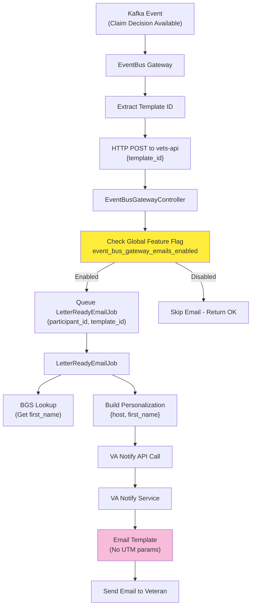
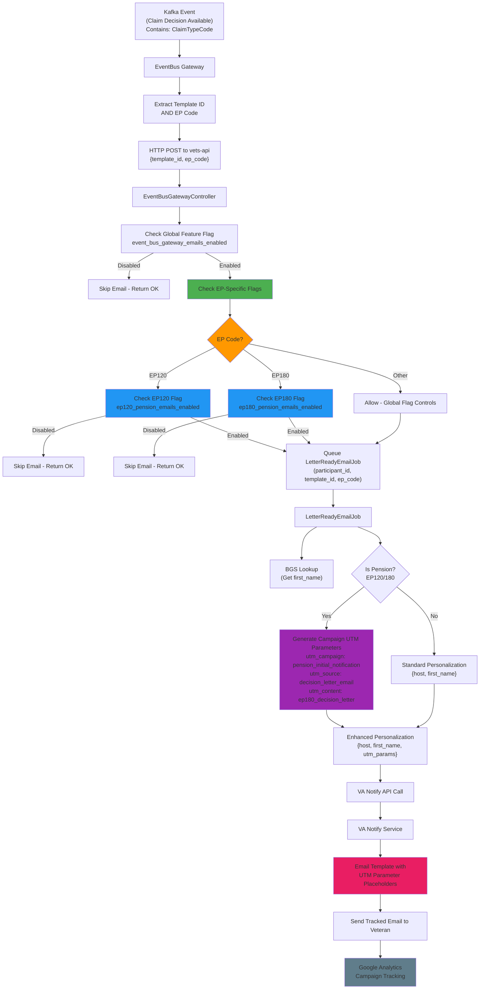

# Pension EP Codes Visual Implementation Guide
## Feature Flagging and Campaign Tracking by EP Code

## Summary and Intent

This implementation enables **granular control and analytics** for pension claim decision letter notifications by adding EP code awareness throughout the notification pipeline.

### Primary Goals:
1. **Individual EP Code Feature Flags**: Enable/disable EP120 and EP180 pension notifications independently from other claim types
2. **Campaign Tracking by EP Code**: Track Google Analytics campaigns separately for different pension claim types through personalization parameters
3. **Safe Rollout**: Deploy pension notifications gradually with proper monitoring and rollback capabilities

### Business Value:
- **Operational Control**: Independent management of pension vs. disability notifications
- **Analytics Insights**: Understand user engagement patterns by claim type  
- **Risk Mitigation**: Address edge cases (like survivor pension scenarios) through targeted controls

## Current State Architecture

### Current Decision Letter Notification Flow

### Current State Limitations

**What the current system does:**
- Processes all decision letter notifications through a single pipeline
- Uses one global feature flag for all claim types
- Sends basic personalization data (host domain, veteran's first name)
- Cannot differentiate between pension, disability, or other claim types
- No campaign tracking or analytics segmentation

**Key Problems:**
- **No Granular Control**: Cannot enable pension notifications without enabling all notifications
- **No EP Code Awareness**: System doesn't know what type of claim triggered the notification
- **No Campaign Differentiation**: All decision letters appear as the same campaign in Google Analytics
- **Limited Rollback Options**: Must disable all notifications if issues occur with any claim type

## What Needs to Change

### 1. EventBus Gateway Updates
**Location**: `eventbus-gateway/app/consumers/decision_letter_availability_consumer.rb`

**Changes Needed:**
- Extract the EP code from the original Kafka event (from the `ClaimTypeCode` field)
- Include the EP code when sending the HTTP request to vets-api
- Pass both `template_id` and `ep_code` in the request payload

### 2. vets-api Controller Updates  
**Location**: `app/controllers/v0/event_bus_gateway_controller.rb`

**Changes Needed:**
- Accept the new `ep_code` parameter in addition to `template_id`
- Add EP-specific feature flag logic that checks individual flags for EP120 and EP180
- Pass the EP code to the email job for processing
- Maintain backward compatibility for requests without EP codes

### 3. Email Job Enhancements
**Location**: `app/sidekiq/event_bus_gateway/letter_ready_email_job.rb`

**Changes Needed:**
- Accept the EP code parameter from the controller
- Generate campaign tracking parameters (UTM codes) based on the EP code
- Include campaign parameters in the personalization data sent to VA Notify
- Add enhanced logging and metrics tracking by EP code

### 4. VA Notify Email Template Updates
**Location**: VA Notify admin interface

**Changes Needed:**
- Add placeholders for UTM campaign parameters in the email template
- Update email links to include campaign tracking parameters
- Ensure template renders properly when campaign parameters are not provided (backward compatibility)

### 5. Feature Flag Configuration
**Location**: Flipper admin interface or configuration files

**Changes Needed:**
- Create two new feature flags:
  - `event_bus_gateway_ep120_pension_emails_enabled` (for reopened pension claims)
  - `event_bus_gateway_ep180_pension_emails_enabled` (for initial pension claims)
- Keep existing global flag for overall system control

## Future State Architecture

### Enhanced Decision Letter Notification Flow

### Future State Benefits

**Enhanced Control:**
- **Granular Feature Flags**: Enable/disable EP120 and EP180 independently
- **Safe Rollout**: Test pension notifications separately from disability claims
- **Risk Mitigation**: Address survivor pension edge cases through targeted EP120 controls

**Campaign Tracking:**
- **Segmented Analytics**: Track pension vs. disability claim engagement separately
- **UTM Parameter Generation**: Automatic campaign tracking based on EP code
- **Personalized Campaigns**: 
  - `pension_initial_decision_notification` for EP180
  - `pension_reopened_decision_notification` for EP120

**Operational Improvements:**
- **Enhanced Monitoring**: Metrics and logging by EP code
- **Backward Compatibility**: Existing functionality continues unchanged
- **Scalable Foundation**: Framework easily extends to additional EP codes

## Implementation Phases

### Phase 1: Foundation (EventBus Gateway + vets-api)
**Goal**: Add EP code parameter throughout the pipeline
- Update EventBus Gateway to extract and send EP codes
- Modify vets-api controller to accept and route EP codes
- Deploy with feature flags disabled for safety

### Phase 2: Email Job Enhancement 
**Goal**: Add campaign tracking and enhanced personalization
- Update LetterReadyEmailJob to generate UTM parameters
- Add metrics and logging by EP code
- Test campaign parameter generation

### Phase 3: Template Updates
**Goal**: Enable campaign tracking in emails
- Update VA Notify template with UTM placeholders
- Test email rendering with campaign parameters
- Validate backward compatibility

### Phase 4: Feature Flag Rollout
**Goal**: Gradually enable pension notifications
- Enable EP180 first (lower risk, initial pension claims)
- Monitor for 24-48 hours
- Enable EP120 with careful monitoring for edge cases

### Phase 5: Analytics Validation
**Goal**: Confirm campaign tracking works end-to-end
- Validate UTM parameters in Google Analytics
- Confirm segmentation between claim types
- Monitor campaign performance metrics

## Success Criteria

### Technical Success
- **Email Delivery**: >99% success rate for enabled EP codes
- **Feature Flag Performance**: <100ms response time for flag checks
- **Zero Impact**: No degradation to existing non-pension notifications

### Analytics Success  
- **Campaign Separation**: Clear segmentation between pension and disability claims in Google Analytics
- **UTM Parameter Accuracy**: 100% of pension emails include correct campaign tracking
- **Conversion Tracking**: Measurable click-through rates from email to decision letter viewing

### Business Success
- **Volume Targets**: 
  - EP180: ~614 notifications per week
  - EP120: ~147 notifications per week
- **User Experience**: Maintained or improved email engagement rates
- **Operational Control**: Ability to manage pension notifications independently

## Risk Mitigation

### Technical Risks
- **Backward Compatibility**: All changes maintain support for existing functionality
- **Feature Flag Safety**: Multiple layers of flags allow granular rollback
- **Monitoring**: Enhanced logging and metrics for rapid issue detection

### Business Risks  
- **Survivor Scenario**: EP120 feature flag allows careful management of survivor pension edge cases
- **Volume Management**: Independent flags prevent overwhelming veterans with notifications
- **Analytics Accuracy**: Campaign tracking doesn't affect core email delivery functionality

This implementation provides a robust foundation for managing pension claim notifications while enabling sophisticated analytics insights and maintaining operational safety.
