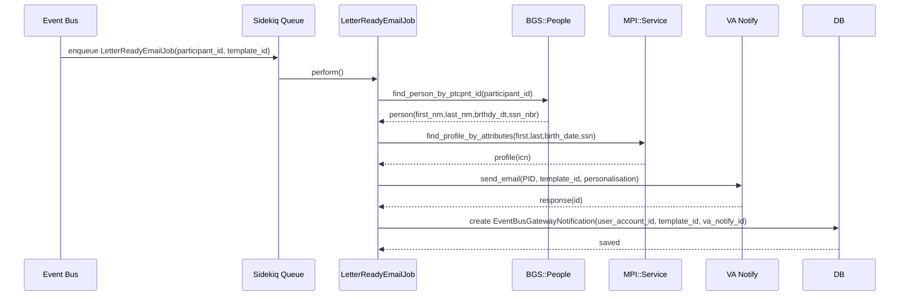
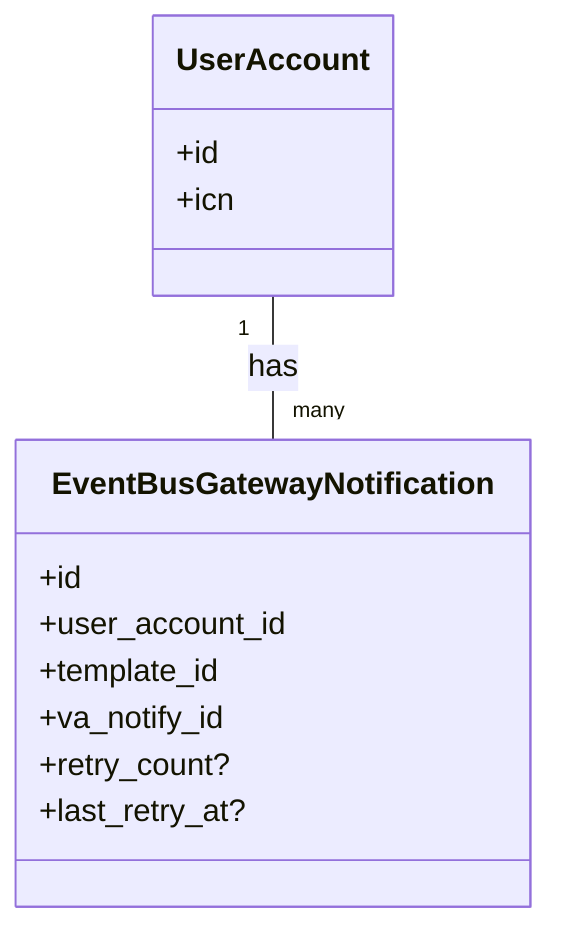

### PR Evaluation: Event Bus Gateway – Retry temporary-failure notifications (PR #23165)

Link: [PR #23165 – [Event Bus Gateway] Adds logic to retry temporary-failure notifications](https://github.com/department-of-veterans-affairs/vets-api/pull/23165)

---

## Overview

- **Goal**: Add retry logic for VA Notify email notifications marked as `temporary-failure` for Event Bus Gateway decision-letter emails.
- **Approach**:
  - Persist VA Notify `response.id` and `template_id` in a new model `EventBusGatewayNotification`, associated to a `UserAccount` (by ICN).
  - On VA Notify callback with `temporary-failure`, look up the prior notification by `va_notify_id`, resolve the Veteran’s `participant_id` via MPI using the stored ICN, and requeue the email job after a delay.
  - Wrap behavior behind a Flipper flag `event_bus_gateway_retry_emails`.
- **Status**: Open (Draft), CI green, mergeable_state: dirty (needs rebase/update).
- **Feature flag**: `event_bus_gateway_retry_emails` (enabled in development).

References: [PR #23165](https://github.com/department-of-veterans-affairs/vets-api/pull/23165)

---

## Visual Diagrams (Mermaid)

### End-to-end send flow (initial email)



### VA Notify callback and retry decision

```mermaid
sequenceDiagram
  participant VAN as VA Notify
  participant CB as VANotifyEmailStatusCallback
  participant DB as DB
  participant MPI as MPI::Service
  participant Q as Sidekiq Queue
  participant J as LetterReadyEmailJob

  VAN->>CB: POST callback (status=temporary-failure, id)
  CB->>CB: check Flipper(:event_bus_gateway_retry_emails)
  alt retry enabled
    CB->>DB: find_by(va_notify_id: id)
    DB-->>CB: ebg_noti
    CB->>MPI: find_profile_by_identifier(ICN)
    MPI-->>CB: profile(participant_id)
    CB->>Q: perform_in(1h, participant_id, template_id)
  else disabled or lookup failed
    CB->>CB: log + metrics; stop
  end
```

### Retry decision with guard rails

```mermaid
flowchart TD
  A[Notify callback received] --> B{status == temporary-failure?}
  B -- No --> Z[Log + metrics; stop]
  B -- Yes --> C{Feature flag enabled?}
  C -- No --> Z
  C -- Yes --> D[Find EBG by va_notify_id]
  D -->|not found| Z2[Log missing EBG; stop]
  D -->|found| E{user_account present?}
  E -- No --> Z3[Log missing user_account; stop]
  E -- Yes --> F[Find MPI profile by ICN]
  F -->|not found| Z4[Log MPI lookup failed; stop]
  F -->|found| G[perform_in 1h LetterReadyEmailJob(participant_id, template_id)]
```

### Minimal data model



## History and Timeline

- 2025-07-18 15:35 UTC: PR opened as Draft by @iandonovan. Notes reference a prior PR creating the table and call out PII concerns regarding storing `participant_id`.
- 2025-07-18 (day of opening):
  - Added `EventBusGatewayNotification` model and factory; updated CODEOWNERS after bot error flagged missing ownership.
  - Modified `LetterReadyEmailJob` to:
    - Fetch BGS person by `participant_id`, then find MPI profile by attributes (first/last/birth_date/ssn).
    - Send email via VA Notify and persist an `EventBusGatewayNotification` record with `va_notify_id` and `template_id`.
    - Log and StatsD on error.
  - Modified `VANotifyEmailStatusCallback` to:
    - When status is `temporary-failure` and feature flag enabled, locate matching `EventBusGatewayNotification` by `va_notify_id`, resolve ICN→participant_id via MPI, and re-queue the email job.
  - Reviewer questions raised:
    - Use `perform_in` to delay retries (avoid hammering transient incidents).
    - Add maximum retry count to avoid unbounded retries.
  - Author agreement to explore VA Notify guidance and added delay later.
- 2025-07-18 to 2025-07-21: Multiple merges from `master`, lint fix label added then removed post-fixes. CI green on head SHA `47ed0fca`.
- 2025-07-18 22:22 UTC: Commit “Uses perform_in to delay an hour” added (delay implemented).
- 2025-07-21 13:25 UTC: Bot deployment succeeded; conversation continues with retry delay rationale.
- 2025-08-12: PR referenced in a related investigation about duplicate event handling for decision letters.

Key artifacts: [PR #23165](https://github.com/department-of-veterans-affairs/vets-api/pull/23165)

---

## Files Changed (8)

- `.github/CODEOWNERS` – add entries for new model and factory.
- `app/models/event_bus_gateway_notification.rb` – new AR model; `belongs_to :user_account`.
- `app/sidekiq/event_bus_gateway/letter_ready_email_job.rb` – expanded to fetch BGS/MPI, send email, and persist EBG notification; memoized client/profile/person; improved error label; removed `SentryLogging` mixin.
- `app/sidekiq/event_bus_gateway/va_notify_email_status_callback.rb` – add `retry_email` path under feature flag; perform delayed job (`perform_in 1.hour`).
- `config/features.yml` – define `event_bus_gateway_retry_emails`.
- `spec/factories/event_bus_gateway_notifications.rb` – new factory with `user_account`, `template_id`, `va_notify_id`.
- `spec/sidekiq/event_bus_gateway/letter_ready_email_job_spec.rb` – broadened tests: success path persists EBG record; error paths for VA Notify, BGS not found, MPI failure; asserts no record on failure.
- `spec/sidekiq/event_bus_gateway/va_notify_email_status_callback_spec.rb` – tests for temporary-failure with feature flag disabled/enabled; when enabled, verifies `perform_in 1.hour` with resolved `participant_id`.

Source: [PR diff](https://github.com/department-of-veterans-affairs/vets-api/pull/23165/files)

---

## Detailed Code Evaluation

### Data model: `EventBusGatewayNotification`

- Minimal model: `belongs_to :user_account`.
- Missing concerns:
  - No validations (e.g., presence of `user_account`, `va_notify_id`, `template_id`).
  - No uniqueness/index on `va_notify_id`. Since callback lookup uses `va_notify_id`, add a unique index and validation to ensure 1:1 mapping per VA Notify send.
  - Schema details are in a prior PR; ensure columns exist with appropriate types and indexes.

### Job: `EventBusGateway::LetterReadyEmailJob`

- Behavior:
  - Resolves BGS person by `participant_id`. Raises when not found → prevents send.
  - Resolves MPI profile by attributes from BGS person. Raises when not found → prevents send.
  - Sends VA Notify email to recipient identifier `{ id_type: 'PID', id_value: participant_id }` and personalisation uses hostname and `first_name` from BGS.
  - On success, persists `EventBusGatewayNotification` linking to `UserAccount` (lookup by MPI ICN) with `template_id` and `va_notify_id` (Notify response id).
  - Errors funnel to `record_email_send_failure` which logs and emits StatsD.
- Positives:
  - Guarded sends; avoids storing `participant_id` (PII posture).
  - Memoization of client and upstream lookups within a single perform (saves duplicate calls).
  - Unit tests cover success and multiple failure modes.
- Gaps / risks:
  - `UserAccount.find_by(icn: ...)` may return nil. With `belongs_to` required by default, `create(...)` will fail validation and silently return an unsaved record. Because retries depend on this row, a missing `UserAccount` will break the retry path without visibility.
    - Recommendation: validate presence, handle failed save explicitly (log, metric), and short-circuit retry setup if save fails.
  - MPI attribute search assumes BGS returns normalized values and `brthdy_dt` is a date-like object supporting `strftime('%Y%m%d')`. In practice, BGS may return strings; add robust parsing/normalization and error handling.
  - Removed `SentryLogging`. Consider adding structured logging context or Sentry capture for quick triage.
  - Consider passing a stable Notify `reference` value to de-duplicate downstream (if supported) across retries.

### Callback: `EventBusGateway::VANotifyEmailStatusCallback`

- Behavior:
  - Adds metrics & non-delivered logging as before.
  - On `temporary-failure` and feature flag enabled, finds `EventBusGatewayNotification` by `va_notify_id`, retrieves ICN from `user_account`, resolves participant_id via `MPI::Service.find_profile_by_identifier(ICN)`, and re-enqueues `LetterReadyEmailJob` via `perform_in 1.hour`.
- Positives:
  - Retry delayed by 1 hour aligns with reviewer guidance to avoid hammering transient service issues.
  - Unit tests cover enabled/disabled flag branches and verify scheduling with resolved `participant_id`.
- Gaps / risks:
  - Missing nil guards:
    - If `EventBusGatewayNotification.find_by(va_notify_id: ...)` returns nil (e.g., save failed or race), `ebg_noti.user_account` will raise. Add guard/early return with logging and metric.
    - If `user_account` is nil or ICN missing, add guard.
    - If MPI lookup by ICN fails, add guard/logging.
  - No cap on retries. Repeated temporary failures can lead to repeated sends; introduce a retry counter with a maximum (e.g., 3) and include exponential backoff.
  - Potential duplicate emails in edge cases if: VA Notify marks `temporary-failure`, later succeeds on its own, and our retry also succeeds. Using a de-duplication strategy (Notify `reference`, idempotency key, or maintaining a send-state machine) would mitigate.

### Feature flag: `event_bus_gateway_retry_emails`

- Correctly scoped; enabled in development only by default config. Ensure production enablement is coordinated.

### Tests

- Good coverage for primary flows and errors. Additional tests recommended:
  - When `UserAccount` for ICN does not exist: ensure no EBG record is created; ensure error is logged; ensure retry path handles absence.
  - Callback when no `EventBusGatewayNotification` exists for a given Notify `id`.
  - Callback with missing `user_account` on the EBG record.
  - Retry cap behavior and backoff once implemented.

---

## Open Questions and Outstanding Issues

- Participant ID as PII
  - Author assumption: do not persist `participant_id` due to PII concerns. If policy allows storing `participant_id`, the BGS→MPI roundtrip and ICN dependency could be simplified by persisting `participant_id` directly on `EventBusGatewayNotification`.
  - Action: Confirm with privacy/security whether `participant_id` is permissible to store for operational retry purposes.

- Retry limits and strategy
  - Reviewers requested a cap on retries. Not yet implemented.
  - Action: Add `retry_count`, `last_retry_at` columns to `EventBusGatewayNotification` (or a separate retry tracking store) and enforce a max retry count with exponential backoff (e.g., 1h, 6h, 24h).

- Idempotency / duplicate sends
  - Without a de-duplication key, retries can lead to multiple deliveries in certain edge cases.
  - Action: If VA Notify supports a `reference` field, pass a stable reference combining claim/letter identifiers and participant/ICN to ensure deliver-once semantics. Alternatively, track a business idempotency key in our DB and short-circuit sends when already delivered.

- Robustness of upstream data assumptions
  - BGS types and MPI responses can vary. Guard and normalize: birth date parsing, name capitalization, and presence of SSN.
  - Action: Add normalization utility, broaden test fixtures to include string dates/nulls.

- Observability
  - Current logging is minimal; failures in saving EBG records or missing lookups may be silent.
  - Action: Add structured logs with key ids (`va_notify_id`, ICN, template_id, participant_id when available), StatsD counters for each guard path (e.g., `retry.missing_ebg_record`, `retry.missing_user_account`, `retry.mpi_lookup_failed`, `retry.capped`). Consider Sentry for exception capture.

- Data model constraints
  - Add DB unique index on `va_notify_id` and presence validations.
  - Consider non-null constraints (ICN must be present via `user_account_id`).

---

## CI and Deployment

- Jenkins PR checks: success on head SHA `47ed0fca`.
- Danger check: success.
- Several bot deployments to the PR environment succeeded.

Source: [PR #23165 status](https://github.com/department-of-veterans-affairs/vets-api/pull/23165)

---

## Recommendations (Action Plan)

1. Data integrity
   - Add presence validations (`user_account`, `va_notify_id`, `template_id`) and a unique DB index on `va_notify_id`.
   - Handle `EventBusGatewayNotification.create` failure: log error, increment metric, and consider failing the job to surface via monitoring.
2. Retry policy
   - Introduce `retry_count` with max attempts and exponential backoff; log and metric when capped.
3. Nil-safety in callback
   - Add guards when EBG record, `user_account`, or MPI profile is missing; log and metric each case.
4. Idempotency
   - Use VA Notify `reference` (if available) or internal idempotency to avoid duplicate deliveries.
5. Resilience and normalization
   - Normalize BGS date fields; handle nils and unexpected types. Add tests.
6. Observability
   - Expand logs/metrics across all failure/guard paths; consider Sentry capture for unexpected exceptions.
7. Documentation
   - Document retry behavior, cap, and de-duplication strategy in `eventbus-gateway` docs for ops awareness.

---

## Appendix: Notable Code Snippets (for context)

```ruby
# app/models/event_bus_gateway_notification.rb
class EventBusGatewayNotification < ApplicationRecord
  belongs_to :user_account
end
```

```ruby
# app/sidekiq/event_bus_gateway/letter_ready_email_job.rb (highlights)
response = notify_client.send_email(
  recipient_identifier: { id_value: participant_id, id_type: 'PID' },
  template_id: template_id,
  personalisation: {
    host: HOSTNAME_MAPPING[Settings.hostname] || Settings.hostname,
    first_name: get_first_name_from_participant_id(participant_id)
  }
)
EventBusGatewayNotification.create(
  user_account: user_account(participant_id),
  template_id: template_id,
  va_notify_id: response.id
)
```

```ruby
# app/sidekiq/event_bus_gateway/va_notify_email_status_callback.rb (retry path)
if notification.status == 'temporary-failure' && Flipper.enabled?(:event_bus_gateway_retry_emails)
  ebg_noti = EventBusGatewayNotification.find_by(va_notify_id: notification.id)
  icn = ebg_noti.user_account.icn
  profile = MPI::Service.new.find_profile_by_identifier(
    identifier: icn,
    identifier_type: MPI::Constants::ICN
  ).profile
  EventBusGateway::LetterReadyEmailJob.perform_in(1.hour, profile.participant_id, ebg_noti.template_id)
end
```

Full context: [PR files tab](https://github.com/department-of-veterans-affairs/vets-api/pull/23165/files)

---

## Ready-to-merge checklist

- [ ] Rebase/resolve mergeable_state: dirty
- [ ] Add validations and DB constraints
- [ ] Implement retry cap/backoff
- [ ] Add nil guards in callback and enhanced logging/metrics
- [ ] Decide and document PII posture for `participant_id`
- [ ] Consider idempotency strategy to prevent duplicate emails

References: [PR #23165](https://github.com/department-of-veterans-affairs/vets-api/pull/23165)

